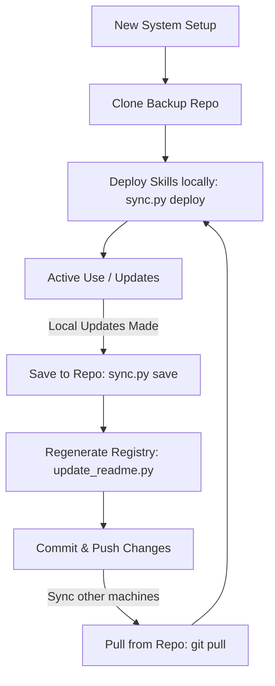

# Agent Skills Lifecycle & Operations Guide

> Last reviewed: 2026-07-22

This operational guide documents the lifecycle, management, synchronization, and deployment workflows for custom Agentic AI skills managed in this repository.

## The Skill Sync Cycle



## Setup & Deployment Workflows

### 1. Initial Setup on a New Machine

To install these skills onto a new workspace/system:

1. Clone this repository:
   ```bash
   git clone https://github.com/jsoehner/skills-backup.git ~/skills-backup
   ```
2. Navigate to the repository:
   ```bash
   cd ~/skills-backup
   ```
3. Deploy the skills to the local agentic runtime configuration directories (`~/.gemini/skills` and `~/.gemini/config/skills`):
   ```bash
   python3 sync.py deploy
   ```

> [!IMPORTANT]
> The `sync.py deploy` command will create the target local directories if they do not exist and copy the files from the repository to the active directories of the agent runtime.

---

### 2. Capturing and Saving Local Changes

When you or an agent modifies a skill locally or creates a new one:

1. Navigate to the backup repository:
   ```bash
   cd ~/skills-backup
   ```
2. Synchronize the local changes back to the backup repository:
   ```bash
   python3 sync.py save
   ```
3. Regenerate the catalog documentation in `README.md` to index the new/modified skills:
   ```bash
   python3 update_readme.py
   ```
4. Verify the changes using Git:
   ```bash
   git status
   git diff
   ```
5. Commit and push the changes:
   ```bash
   git add .
   git commit -m "feat(skills): update [skill-name] with [brief description]"
   git push origin main
   ```

---

### 3. Syncing Changes Across Systems (Continuous Lifecycle)

To keep multiple development systems aligned:

1. On a secondary system, fetch the latest backup repository state:
   ```bash
   cd ~/skills-backup
   git pull origin main
   ```
2. Redeploy the updated skills locally:
   ```bash
   python3 sync.py deploy
   ```

---

## Directory Mapping

The synchronization script (`sync.py`) maps files between the backup repository and your home directory:

| Repo Path | Local Destination Path | Type |
|---|---|---|
| `./` (Root subdirectories) | `~/.gemini/skills/[skill_name]` | User Custom Skills |
| `./config-skills/` | `~/.gemini/config/skills/[skill_name]` | System Configuration Skills |

---

## Script Reference

### `sync.py`
The utility to push/pull files between local runtime directories and this repo:
- **Save Changes (Local -> Repo)**: `python3 sync.py save`
- **Deploy Changes (Repo -> Local)**: `python3 sync.py deploy`
- **Category Filtering**: `python3 sync.py save -g databases_data`
- **List Categories**: `python3 sync.py -l`

### `update_readme.py`
Scans all skills in the repository, parses their frontmatter (`SKILL.md`), and updates the main [README.md](README.md) catalog.
- **Run**: `python3 update_readme.py`

---

> [!TIP]
> **Pro Tip for Active Iteration**:
> Always verify status and run tests locally before saving changes back to the repo. Pin action versions to explicit 40-character commit SHAs in workflows (as described in [github_actions_node24](tools/config-skills/github_actions_node24/SKILL.md)) to avoid security warnings.
