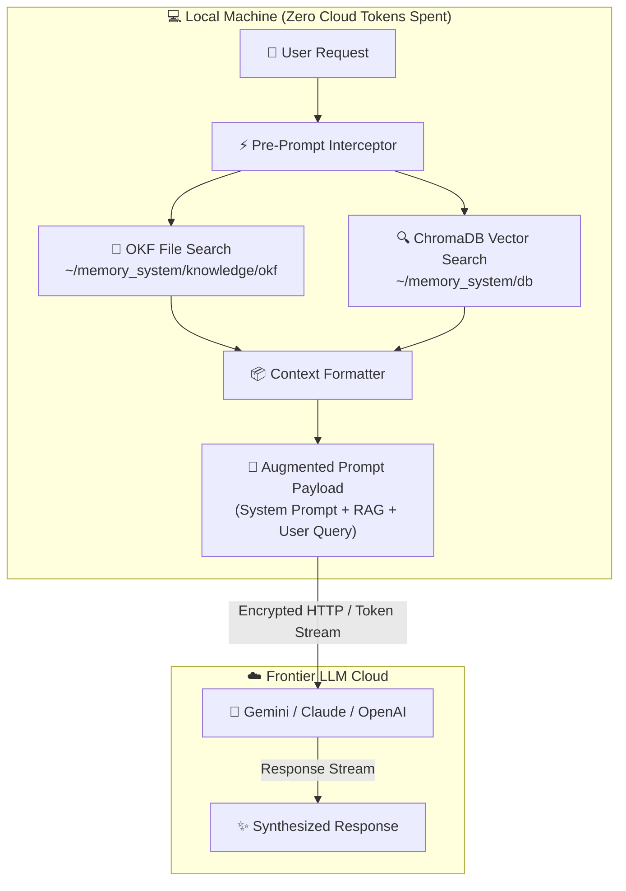

# YUV AI Skills Repository

This repository is a comprehensive collection of AI "skills" designed for various AI harnesses, including Pi-agent, Gemini, and Claude Code.

## Architecture

We use a dual-layered architecture to distinguish between fundamental building blocks and complex workflows:

### 1. Atomic Skills
**Location**: `tools/`
Atomic skills are self-contained, modular components. They do not depend on other skills within this repository. Examples include:
- `bash-pro`: Expert shell scripting.
- `python-pro`: Advanced Python development.
- `sql-pro`: SQL optimization and schema design.

### 2. Composite Skills
**Location**: Root directory (`yuv-skills-backup/`)
Composite skills are orchestrators or complex workflows that require one or more Atomic or other Composite skills to function.
- **Dependencies**: Each Composite skill includes a `manifest.json` file and explicitly lists its dependencies in its `SKILL.md` file.
- **Examples**:
    - `yuv-pilot`: The top-level orchestrator for YUV.AI brand work.
    - `ai-engineer`: A comprehensive suite for building LLM applications.
    - `video-edit`: A workflow for creating captioned showcase videos.

## Deployment

We provide a manifest-driven deployment system to package and deploy skills to different harnesses.

### Deployment Script
The `deploy_skills.py` script automates the following:
1. **Dependency Resolution**: Recursively identifies all required skills for a given harness.
2. **Package Generation**: Creates a deployment-ready directory (`deploy_package`) containing all necessary skills.
3. **Multi-Harness Support**: Supports `pi`, `gemini`, and `claude` configurations.

### Usage
To plan and generate a deployment package for the `pi` harness:
```bash
python3 deploy_skills.py --harness pi
```

## Project Structure
- `tools/`: Atomic skills categorized by domain.
- `manifest.json`: Machine-readable metadata for Composite skills.
- `audit_status.json`: Tracks the categorization and migration status of all skills.
- `deploy_skills.py`: The core deployment and packaging engine.
- `SKILL.md`: Documentation for every individual skill.

## Contributing
To add a new skill:
1. Determine if it is **Atomic** (add to `tools/`) or **Composite** (add to root).
2. Create a `SKILL.md` file describing the skill.
3. If Composite, create a `manifest.json` and list dependencies.
4. Update `audit_status.json` to reflect the new skill.


## 🧠 Local Memory RAG Architecture & Token Flow

The repository integrates a local Memory RAG framework (`~/memory_system`) using [`memory-capture`](tools/memory-capture). This system intercepts requests locally, retrieves policy/vector context, and injects it **before** tokens are transmitted to frontier LLMs.

### System Architecture & Data Flow



### Why & How This Functionality Is Organized

- **Deterministic Policy Routing (OKF)**: High-level architectural rules and security standards are stored as plain Markdown under `~/memory_system/knowledge/okf/` for exact, zero-hallucination regex matching.
- **Semantic Memory Indexing (ChromaDB)**: Troubleshooting notes, error logs, and code snippets are embedded locally into ChromaDB at `~/memory_system/db/` using local ONNX embeddings.
- **Automated Inbox Daemon**: Background service `memory-inbox.service` monitors `~/memory_system/inbox/` for new `.md` files and automatically indexes them.
- **Architectural Decision Record**: See [ADR 0005: Local Memory RAG Architecture](tools/adr/0005-local-memory-rag-architecture.md) for rationale.
- **Detailed Documentation**: See the complete [Memory RAG FAQ](memory_rag_faq.md) for step-by-step technical details.

### ⚠️ Gotchas & Operational Caveats

> [!WARNING]
> **Pre-Prompt Token Payload Overflow**: Ingesting raw logs or unchunked files directly into ChromaDB can inflate the injected context payload. Ensure log files are pre-filtered or split into 500–1000 token chunks before dropping into `~/memory_system/inbox/`.

> [!IMPORTANT]
> **Systemd User Daemon Required**: The inbox background watcher relies on `memory-inbox.service` running under `systemctl --user`. If the service is stopped or disabled, files dropped into `inbox/` will sit unprocessed until `python3 ~/memory_system/capture_knowledge.py <file>` is run manually.

> [!CAUTION]
> **OKF vs Chroma Routing Triggers**: Files intended for OKF (deterministic policies) **must** contain `# OKF Decision`, `Type: Policy`, or `Type: Architecture Standard` in their header. Without these exact header strings, `capture_knowledge.py` defaults to embedding the content into ChromaDB vector storage.

> [!NOTE]
> **Directory Tree Initializer**: If `~/memory_system` is missing or cleared, running `python3 ~/memory_system/init_storage.py` must be executed before ingestion to recreate required SQLite tables and collection schemas.

## 📚 Skill Catalog & Navigation

This repository manages **596** modular AI skills across 12 primary domains.

### Overview

| Category | Skills | Quick Link |
|---|---|---|
| [🎨 Design, Film & Video](#-design-film-video) | **54** | [Full Doc ↗](categories/design_film_video.md) |
| [📄 Document & Media Processing](#-document-media-processing) | **16** | [Full Doc ↗](categories/document_media_processing.md) |
| [📓 Notion Integration](#-notion-integration) | **8** | [Full Doc ↗](categories/notion_integration.md) |
| [🤖 AI, RAG & LLM Engineering](#-ai-llm-engineering) | **48** | [Full Doc ↗](categories/ai_llm_engineering.md) |
| [🗄️ Databases & Data Engineering](#-databases-data) | **94** | [Full Doc ↗](categories/databases_data.md) |
| [🔒 Security, Compliance & Hardening](#-security-compliance) | **36** | [Full Doc ↗](categories/security_compliance.md) |
| [☁️ DevOps, Cloud & Infrastructure](#-devops-cloud) | **60** | [Full Doc ↗](categories/devops_cloud.md) |
| [🏗️ Architecture & Engineering Practices](#-software-architecture) | **45** | [Full Doc ↗](categories/software_architecture.md) |
| [💻 Software Engineering & Frameworks](#-software-languages) | **74** | [Full Doc ↗](categories/software_languages.md) |
| [📈 Business, Finance & Strategy](#-business-finance) | **25** | [Full Doc ↗](categories/business_finance.md) |
| [🛠️ Development, Debugging & QA Workflows](#-development-testing) | **77** | [Full Doc ↗](categories/development_testing.md) |
| [💬 Productivity, Research & Communication](#-productivity-comms) | **21** | [Full Doc ↗](categories/productivity_comms.md) |
| [📦 Other User Skills](#-other-user-skills) | **38** | [Full Doc ↗](categories/other_user.md) |

---

### 🎨 Design, Film & Video
📁 *Full Documentation: [🎨 Design, Film & Video Document](categories/design_film_video.md) (54 skills)*

[`algorithmic-art`](tools/algorithmic-art) • [`article-illustrations`](tools/article-illustrations) • [`artifacts-builder`](tools/artifacts-builder) • [`brand-guidelines`](tools/brand-guidelines) • [`canvas-design`](tools/canvas-design) • [`debugging-toolkit-smart-debug`](tools/debugging-toolkit-smart-debug) • [`design-system-starter`](tools/design-system-starter) • [`director`](tools/director) • [`draw-io`](tools/draw-io) • [`error-diagnostics-smart-debug`](tools/error-diagnostics-smart-debug) • [`excalidraw`](tools/excalidraw) • [`helm-chart-scaffolding`](tools/helm-chart-scaffolding) • [`hyperframes`](hyperframes) • [`hyperframes-cli`](tools/hyperframes-cli) • [`hyperframes-registry`](tools/hyperframes-registry) • [`image-enhancer`](tools/image-enhancer) • [`incident-response-smart-fix`](tools/incident-response-smart-fix) • [`marp-slide`](tools/marp-slide) • [`meme-factory`](tools/meme-factory) • [`slack-gif-creator`](tools/slack-gif-creator) • [`startup-analyst`](tools/startup-analyst) • [`startup-business-analyst-business-case`](tools/startup-business-analyst-business-case) • [`startup-business-analyst-financial-projections`](tools/startup-business-analyst-financial-projections) • [`startup-business-analyst-market-opportunity`](startup-business-analyst-market-opportunity) • [`startup-financial-modeling`](tools/startup-financial-modeling) • [`startup-metrics-framework`](tools/startup-metrics-framework) • [`theme-factory`](tools/theme-factory) • [`video-content-orchestrator`](tools/video-content-orchestrator) • [`video-downloader`](tools/video-downloader) • [`video-edit`](tools/video-edit) • [`video-to-landing-page`](tools/video-to-landing-page) • [`yuv-brand-orchestrator`](tools/yuv-brand-orchestrator) • [`yuv-decks`](yuv-decks) • [`yuv-design-system`](tools/yuv-design-system) • [`yuv-pilot`](tools/yuv-pilot) • [`yuv-viral-video`](tools/yuv-viral-video)

### 📄 Document & Media Processing
📁 *Full Documentation: [📄 Document & Media Processing Document](categories/document_media_processing.md) (16 skills)*

[`api-documenter`](tools/api-documenter) • [`code-documentation-code-explain`](tools/code-documentation-code-explain) • [`code-documentation-doc-generate`](tools/code-documentation-doc-generate) • [`documentation-generation-doc-generate`](tools/documentation-generation-doc-generate) • [`invoice-organizer`](tools/invoice-organizer) • [`notion-research-documentation`](tools/notion-research-documentation) • [`pdf`](document-skills/pdf) • [`pptx`](document-skills/pptx) • [`resemble-detect`](tools/resemble-detect) • [`web-to-markdown`](tools/web-to-markdown) • [`xlsx`](document-skills/xlsx)

### 📓 Notion Integration
📁 *Full Documentation: [📓 Notion Integration Document](categories/notion_integration.md) (8 skills)*

[`notion-intelligence-orchestrator`](notion-intelligence-orchestrator) • [`notion-knowledge-capture`](tools/notion-knowledge-capture) • [`notion-meeting-intelligence`](tools/notion-meeting-intelligence) • [`notion-spec-to-implementation`](tools/notion-spec-to-implementation)

### 🤖 AI, RAG & LLM Engineering
📁 *Full Documentation: [🤖 AI, RAG & LLM Engineering Document](categories/ai_llm_engineering.md) (48 skills)*

[`agent-md-refactor`](tools/agent-md-refactor) • [`agent-orchestration-improve-agent`](tools/agent-orchestration-improve-agent) • [`agent-orchestration-multi-agent-optimize`](tools/agent-orchestration-multi-agent-optimize) • [`ai-engineer`](tools/ai-engineer) • [`cloud-sql-postgres-vectorassist`](tools/cloud-sql-postgres-vectorassist) • [`code-review-ai-ai-review`](tools/code-review-ai-ai-review) • [`embedding-strategies`](tools/embedding-strategies) • [`error-debugging-multi-agent-review`](tools/error-debugging-multi-agent-review) • [`gemini`](tools/gemini) • [`gepetto`](tools/gepetto) • [`hybrid-search-implementation`](tools/hybrid-search-implementation) • [`langchain-architecture`](tools/langchain-architecture) • [`llm-application-dev-ai-assistant`](tools/llm-application-dev-ai-assistant) • [`llm-application-dev-langchain-agent`](tools/llm-application-dev-langchain-agent) • [`llm-application-dev-prompt-optimize`](tools/llm-application-dev-prompt-optimize) • [`llm-evaluation`](tools/llm-evaluation) • [`machine-learning-ops-ml-pipeline`](tools/machine-learning-ops-ml-pipeline) • [`ml-best-practices`](tools/ml-best-practices) • [`ml-engineer`](tools/ml-engineer) • [`ml-pipeline-workflow`](tools/ml-pipeline-workflow) • [`mlops-engineer`](tools/mlops-engineer) • [`performance-testing-review-ai-review`](tools/performance-testing-review-ai-review) • [`performance-testing-review-multi-agent-review`](tools/performance-testing-review-multi-agent-review) • [`prompt-engineer`](tools/prompt-engineer) • [`prompt-engineering-patterns`](tools/prompt-engineering-patterns) • [`rag-implementation`](tools/rag-implementation) • [`similarity-search-patterns`](tools/similarity-search-patterns) • [`vector-database-engineer`](tools/vector-database-engineer) • [`vector-index-tuning`](tools/vector-index-tuning)

### 🗄️ Databases & Data Engineering
📁 *Full Documentation: [🗄️ Databases & Data Engineering Document](categories/databases_data.md) (94 skills)*

[`accidental-data-loss-prevention`](tools/accidental-data-loss-prevention) • [`airflow-dag-patterns`](tools/airflow-dag-patterns) • [`alloydb-omni-access-control`](tools/alloydb-omni-access-control) • [`alloydb-omni-container`](tools/alloydb-omni-container) • [`alloydb-omni-data`](tools/alloydb-omni-data) • [`alloydb-omni-health`](tools/alloydb-omni-health) • [`alloydb-omni-kubernetes`](tools/alloydb-omni-kubernetes) • [`alloydb-omni-monitor`](tools/alloydb-omni-monitor) • [`alloydb-omni-optimize`](tools/alloydb-omni-optimize) • [`alloydb-omni-performance`](tools/alloydb-omni-performance) • [`alloydb-omni-replication`](tools/alloydb-omni-replication) • [`alloydb-postgres-access-management`](tools/alloydb-postgres-access-management) • [`alloydb-postgres-admin`](tools/alloydb-postgres-admin) • [`alloydb-postgres-data`](tools/alloydb-postgres-data) • [`alloydb-postgres-health`](tools/alloydb-postgres-health) • [`alloydb-postgres-monitor`](tools/alloydb-postgres-monitor) • [`alloydb-postgres-optimize`](tools/alloydb-postgres-optimize) • [`alloydb-postgres-replication`](tools/alloydb-postgres-replication) • [`angular-migration`](tools/angular-migration) • [`bigquery`](tools/bigquery) • [`bigquery-data-transfer-service`](tools/bigquery-data-transfer-service) • [`building-data-apps`](tools/building-data-apps) • [`cloud-sql-mysql-admin`](tools/cloud-sql-mysql-admin) • [`cloud-sql-mysql-data`](tools/cloud-sql-mysql-data) • [`cloud-sql-mysql-lifecycle`](tools/cloud-sql-mysql-lifecycle) • [`cloud-sql-mysql-monitor`](tools/cloud-sql-mysql-monitor) • [`cloud-sql-postgres-admin`](tools/cloud-sql-postgres-admin) • [`cloud-sql-postgres-data`](tools/cloud-sql-postgres-data) • [`cloud-sql-postgres-health`](tools/cloud-sql-postgres-health) • [`cloud-sql-postgres-lifecycle`](tools/cloud-sql-postgres-lifecycle) • [`cloud-sql-postgres-monitor`](tools/cloud-sql-postgres-monitor) • [`cloud-sql-postgres-replication`](tools/cloud-sql-postgres-replication) • [`cloud-sql-postgres-view-config`](tools/cloud-sql-postgres-view-config) • [`cloud-sql-sqlserver-admin`](tools/cloud-sql-sqlserver-admin) • [`cloud-sql-sqlserver-data`](tools/cloud-sql-sqlserver-data) • [`cloud-sql-sqlserver-lifecycle`](tools/cloud-sql-sqlserver-lifecycle) • [`cloud-sql-sqlserver-monitor`](tools/cloud-sql-sqlserver-monitor) • [`data-autocleaning`](tools/data-autocleaning) • [`data-engineer`](tools/data-engineer) • [`data-engineering-data-driven-feature`](tools/data-engineering-data-driven-feature) • [`data-engineering-data-pipeline`](tools/data-engineering-data-pipeline) • [`data-quality-frameworks`](tools/data-quality-frameworks) • [`data-scientist`](tools/data-scientist) • [`data-storytelling`](tools/data-storytelling) • [`database-admin`](tools/database-admin) • [`database-architect`](tools/database-architect) • [`database-cloud-optimization-cost-optimize`](database-cloud-optimization-cost-optimize) • [`database-migration`](tools/database-migration) • [`database-migrations-migration-observability`](tools/database-migrations-migration-observability) • [`database-migrations-sql-migrations`](tools/database-migrations-sql-migrations) • [`database-optimizer`](database-optimizer) • [`database-schema-designer`](tools/database-schema-designer) • [`dataform-bigquery`](tools/dataform-bigquery) • [`dbt-bigquery`](tools/dbt-bigquery) • [`dbt-transformation-patterns`](tools/dbt-transformation-patterns) • [`discovering-gcp-data-assets`](discovering-gcp-data-assets) • [`federate-lakehouse-catalog`](tools/federate-lakehouse-catalog) • [`firestore-data`](tools/firestore-data) • [`framework-migration-code-migrate`](tools/framework-migration-code-migrate) • [`framework-migration-deps-upgrade`](tools/framework-migration-deps-upgrade) • [`framework-migration-legacy-modernize`](tools/framework-migration-legacy-modernize) • [`gcp-data-pipelines`](gcp-data-pipelines) • [`gcp-managed-airflow-migrations`](tools/gcp-managed-airflow-migrations) • [`gcp-spark`](gcp-spark) • [`gcs-security-assessment`](tools/gcs-security-assessment) • [`gdpr-data-handling`](tools/gdpr-data-handling) • [`postgresql`](tools/postgresql) • [`spanner-data`](tools/spanner-data) • [`spark-optimization`](tools/spark-optimization) • [`sql-optimization-patterns`](tools/sql-optimization-patterns) • [`sql-pro`](tools/sql-pro)

### 🔒 Security, Compliance & Hardening
📁 *Full Documentation: [🔒 Security, Compliance & Hardening Document](categories/security_compliance.md) (36 skills)*

[`accessibility-compliance-accessibility-audit`](tools/accessibility-compliance-accessibility-audit) • [`adr-authoring`](tools/adr-authoring) • [`anti-reversing-techniques`](tools/anti-reversing-techniques) • [`attack-tree-construction`](tools/attack-tree-construction) • [`auth-implementation-patterns`](tools/auth-implementation-patterns) • [`backend-security-coder`](tools/backend-security-coder) • [`binary-analysis-patterns`](tools/binary-analysis-patterns) • [`codebase-cleanup-deps-audit`](tools/codebase-cleanup-deps-audit) • [`dependency-management-deps-audit`](tools/dependency-management-deps-audit) • [`frontend-mobile-security-xss-scan`](tools/frontend-mobile-security-xss-scan) • [`frontend-security-coder`](tools/frontend-security-coder) • [`gcloud-auth-verification`](tools/gcloud-auth-verification) • [`k8s-security-policies`](tools/k8s-security-policies) • [`malware-analyst`](tools/malware-analyst) • [`mobile-security-coder`](tools/mobile-security-coder) • [`mtls-configuration`](tools/mtls-configuration) • [`pci-compliance`](tools/pci-compliance) • [`sast-configuration`](tools/sast-configuration) • [`secrets-management`](tools/secrets-management) • [`security-auditor`](tools/security-auditor) • [`security-compliance-compliance-check`](tools/security-compliance-compliance-check) • [`security-governance-orchestrator`](tools/security-governance-orchestrator) • [`security-requirement-extraction`](tools/security-requirement-extraction) • [`security-scanning-security-dependencies`](tools/security-scanning-security-dependencies) • [`security-scanning-security-hardening`](tools/security-scanning-security-hardening) • [`security-scanning-security-sast`](tools/security-scanning-security-sast) • [`seo-authority-builder`](tools/seo-authority-builder) • [`seo-content-auditor`](tools/seo-content-auditor) • [`solidity-security`](tools/solidity-security) • [`stride-analysis-patterns`](tools/stride-analysis-patterns) • [`threat-mitigation-mapping`](tools/threat-mitigation-mapping) • [`threat-modeling-expert`](tools/threat-modeling-expert) • [`wcag-audit-patterns`](tools/wcag-audit-patterns)

### ☁️ DevOps, Cloud & Infrastructure
📁 *Full Documentation: [☁️ DevOps, Cloud & Infrastructure Document](categories/devops_cloud.md) (60 skills)*

[`api-testing-observability-api-mock`](tools/api-testing-observability-api-mock) • [`bazel-build-optimization`](tools/bazel-build-optimization) • [`c4-container`](tools/c4-container) • [`cost-optimization`](tools/cost-optimization) • [`datadog-cli`](tools/datadog-cli) • [`deployment-engineer`](tools/deployment-engineer) • [`deployment-pipeline-design`](tools/deployment-pipeline-design) • [`deployment-validation-config-validate`](tools/deployment-validation-config-validate) • [`devops-troubleshooter`](tools/devops-troubleshooter) • [`distributed-tracing`](tools/distributed-tracing) • [`gcp-composer-troubleshooting`](tools/gcp-composer-troubleshooting) • [`gcp-dataflow`](tools/gcp-dataflow) • [`gcp-pipeline-orchestration`](tools/gcp-pipeline-orchestration) • [`gcp-pipeline-resource-provisioning`](tools/gcp-pipeline-resource-provisioning) • [`github-actions-node24`](tools/github-actions-node24) • [`github-actions-templates`](tools/github-actions-templates) • [`gitlab-ci-patterns`](tools/gitlab-ci-patterns) • [`gitops-workflow`](tools/gitops-workflow) • [`grafana-dashboards`](tools/grafana-dashboards) • [`hybrid-cloud-networking`](tools/hybrid-cloud-networking) • [`incident-responder`](tools/incident-responder) • [`incident-response-incident-response`](tools/incident-response-incident-response) • [`incident-runbook-templates`](tools/incident-runbook-templates) • [`istio-traffic-management`](tools/istio-traffic-management) • [`k8s-manifest-generator`](tools/k8s-manifest-generator) • [`kubernetes-architect`](kubernetes-architect) • [`linkerd-patterns`](tools/linkerd-patterns) • [`monorepo-architect`](tools/monorepo-architect) • [`monorepo-management`](tools/monorepo-management) • [`network-engineer`](network-engineer) • [`nx-workspace-patterns`](tools/nx-workspace-patterns) • [`observability-engineer`](observability-engineer) • [`observability-monitoring-monitor-setup`](tools/observability-monitoring-monitor-setup) • [`observability-monitoring-slo-implement`](tools/observability-monitoring-slo-implement) • [`on-call-handoff-patterns`](tools/on-call-handoff-patterns) • [`postmortem-writing`](tools/postmortem-writing) • [`prometheus-configuration`](tools/prometheus-configuration) • [`service-mesh-expert`](tools/service-mesh-expert) • [`service-mesh-observability`](tools/service-mesh-observability) • [`slo-implementation`](tools/slo-implementation) • [`terraform-module-library`](tools/terraform-module-library) • [`terraform-specialist`](tools/terraform-specialist) • [`turborepo-caching`](tools/turborepo-caching)

### 🏗️ Architecture & Engineering Practices
📁 *Full Documentation: [🏗️ Architecture & Engineering Practices Document](categories/software_architecture.md) (45 skills)*

[`architect-review`](tools/architect-review) • [`architecture-decision-records`](tools/architecture-decision-records) • [`architecture-governance-orchestrator`](tools/architecture-governance-orchestrator) • [`architecture-patterns`](tools/architecture-patterns) • [`backend-architect`](tools/backend-architect) • [`backend-development-feature-development`](tools/backend-development-feature-development) • [`c4-architecture`](tools/c4-architecture) • [`c4-architecture-c4-architecture`](tools/c4-architecture-c4-architecture) • [`c4-code`](tools/c4-code) • [`c4-component`](tools/c4-component) • [`c4-context`](tools/c4-context) • [`cloud-architect`](tools/cloud-architect) • [`content-governance-orchestrator`](tools/content-governance-orchestrator) • [`cqrs-implementation`](tools/cqrs-implementation) • [`docs-architect`](tools/docs-architect) • [`dotnet-architect`](tools/dotnet-architect) • [`event-sourcing-architect`](tools/event-sourcing-architect) • [`event-store-design`](tools/event-store-design) • [`frontend-to-backend-requirements`](tools/frontend-to-backend-requirements) • [`full-stack-orchestration-full-stack-feature`](full-stack-orchestration-full-stack-feature) • [`game-changing-features`](tools/game-changing-features) • [`git-pr-workflows-onboard`](git-pr-workflows-onboard) • [`graphql-architect`](tools/graphql-architect) • [`hybrid-cloud-architect`](tools/hybrid-cloud-architect) • [`microservices-patterns`](tools/microservices-patterns) • [`multi-cloud-architecture`](tools/multi-cloud-architecture) • [`react-native-architecture`](tools/react-native-architecture) • [`requirements-clarity`](tools/requirements-clarity) • [`saga-orchestration`](tools/saga-orchestration) • [`seo-structure-architect`](tools/seo-structure-architect) • [`systems-programming-rust-project`](tools/systems-programming-rust-project)

### 💻 Software Engineering & Frameworks
📁 *Full Documentation: [💻 Software Engineering & Frameworks Document](categories/software_languages.md) (74 skills)*

[`api-design-principles`](tools/api-design-principles) • [`arm-cortex-expert`](tools/arm-cortex-expert) • [`async-python-patterns`](tools/async-python-patterns) • [`backend-to-frontend-handoff-docs`](tools/backend-to-frontend-handoff-docs) • [`bash-defensive-patterns`](tools/bash-defensive-patterns) • [`bash-pro`](tools/bash-pro) • [`bats-testing-patterns`](tools/bats-testing-patterns) • [`blockchain-developer`](tools/blockchain-developer) • [`c-pro`](tools/c-pro) • [`cpp-pro`](tools/cpp-pro) • [`csharp-pro`](tools/csharp-pro) • [`defi-protocol-templates`](tools/defi-protocol-templates) • [`django-pro`](tools/django-pro) • [`dotnet-backend-patterns`](tools/dotnet-backend-patterns) • [`elixir-pro`](tools/elixir-pro) • [`fastapi-pro`](tools/fastapi-pro) • [`fastapi-templates`](tools/fastapi-templates) • [`firmware-analyst`](tools/firmware-analyst) • [`flutter-expert`](tools/flutter-expert) • [`frontend-developer`](frontend-developer) • [`frontend-mobile-development-component-scaffold`](tools/frontend-mobile-development-component-scaffold) • [`go-concurrency-patterns`](tools/go-concurrency-patterns) • [`godot-gdscript-patterns`](tools/godot-gdscript-patterns) • [`golang-pro`](tools/golang-pro) • [`haskell-pro`](tools/haskell-pro) • [`ios-developer`](tools/ios-developer) • [`java-pro`](tools/java-pro) • [`javascript-pro`](tools/javascript-pro) • [`javascript-testing-patterns`](tools/javascript-testing-patterns) • [`javascript-typescript-typescript-scaffold`](tools/javascript-typescript-typescript-scaffold) • [`managing-python-dependencies`](tools/managing-python-dependencies) • [`mobile-developer`](mobile-developer) • [`modern-javascript-patterns`](tools/modern-javascript-patterns) • [`mui`](tools/mui) • [`nextjs-app-router-patterns`](tools/nextjs-app-router-patterns) • [`nft-standards`](tools/nft-standards) • [`nodejs-backend-patterns`](tools/nodejs-backend-patterns) • [`openapi-spec-generation`](tools/openapi-spec-generation) • [`openapi-to-typescript`](tools/openapi-to-typescript) • [`php-pro`](tools/php-pro) • [`posix-shell-pro`](tools/posix-shell-pro) • [`python-development-python-scaffold`](tools/python-development-python-scaffold) • [`python-packaging`](tools/python-packaging) • [`python-performance-optimization`](tools/python-performance-optimization) • [`python-pro`](tools/python-pro) • [`python-testing-patterns`](tools/python-testing-patterns) • [`react-dev`](tools/react-dev) • [`react-modernization`](tools/react-modernization) • [`react-state-management`](tools/react-state-management) • [`react-useeffect`](tools/react-useeffect) • [`ruby-pro`](tools/ruby-pro) • [`rust-async-patterns`](tools/rust-async-patterns) • [`rust-pro`](tools/rust-pro) • [`scala-pro`](tools/scala-pro) • [`shellcheck-configuration`](tools/shellcheck-configuration) • [`tailwind-design-system`](tools/tailwind-design-system) • [`temporal-python-pro`](tools/temporal-python-pro) • [`temporal-python-testing`](tools/temporal-python-testing) • [`typescript-advanced-types`](tools/typescript-advanced-types) • [`typescript-pro`](tools/typescript-pro) • [`unity-developer`](tools/unity-developer) • [`unity-ecs-patterns`](tools/unity-ecs-patterns) • [`uv-package-manager`](tools/uv-package-manager) • [`web3-testing`](tools/web3-testing) • [`webapp-testing`](tools/webapp-testing)

### 📈 Business, Finance & Strategy
📁 *Full Documentation: [📈 Business, Finance & Strategy Document](categories/business_finance.md) (25 skills)*

[`billing-automation`](tools/billing-automation) • [`business-analyst`](tools/business-analyst) • [`content-marketer`](tools/content-marketer) • [`customer-support`](tools/customer-support) • [`employment-contract-templates`](tools/employment-contract-templates) • [`hr-pro`](tools/hr-pro) • [`legal-advisor`](tools/legal-advisor) • [`market-sizing-analysis`](tools/market-sizing-analysis) • [`payment-integration`](tools/payment-integration) • [`paypal-integration`](tools/paypal-integration) • [`quant-analyst`](tools/quant-analyst) • [`risk-manager`](risk-manager) • [`risk-metrics-calculation`](tools/risk-metrics-calculation) • [`sales-automator`](tools/sales-automator) • [`seo-cannibalization-detector`](tools/seo-cannibalization-detector) • [`seo-content-planner`](tools/seo-content-planner) • [`seo-content-refresher`](tools/seo-content-refresher) • [`seo-content-writer`](tools/seo-content-writer) • [`seo-keyword-strategist`](tools/seo-keyword-strategist) • [`seo-meta-optimizer`](tools/seo-meta-optimizer) • [`seo-snippet-hunter`](tools/seo-snippet-hunter) • [`stripe-integration`](tools/stripe-integration)

### 🛠️ Development, Debugging & QA Workflows
📁 *Full Documentation: [🛠️ Development, Debugging & QA Workflows Document](categories/development_testing.md) (77 skills)*

[`adr-discovery`](tools/adr-discovery) • [`adr-lifecycle-management`](tools/adr-lifecycle-management) • [`application-performance-performance-optimization`](tools/application-performance-performance-optimization) • [`backtesting-frameworks`](tools/backtesting-frameworks) • [`changelog-automation`](tools/changelog-automation) • [`changelog-generator`](tools/changelog-generator) • [`code-refactoring-context-restore`](tools/code-refactoring-context-restore) • [`code-refactoring-refactor-clean`](tools/code-refactoring-refactor-clean) • [`code-refactoring-tech-debt`](tools/code-refactoring-tech-debt) • [`code-review-excellence`](tools/code-review-excellence) • [`code-reviewer`](tools/code-reviewer) • [`codebase-cleanup-refactor-clean`](tools/codebase-cleanup-refactor-clean) • [`codebase-cleanup-tech-debt`](tools/codebase-cleanup-tech-debt) • [`commit-work`](tools/commit-work) • [`comprehensive-review-full-review`](tools/comprehensive-review-full-review) • [`comprehensive-review-pr-enhance`](tools/comprehensive-review-pr-enhance) • [`conductor-implement`](tools/conductor-implement) • [`conductor-manage`](tools/conductor-manage) • [`conductor-new-track`](tools/conductor-new-track) • [`conductor-revert`](tools/conductor-revert) • [`conductor-setup`](tools/conductor-setup) • [`conductor-status`](tools/conductor-status) • [`conductor-validator`](tools/conductor-validator) • [`context-driven-development`](tools/context-driven-development) • [`context-management-context-restore`](tools/context-management-context-restore) • [`context-management-context-save`](tools/context-management-context-save) • [`context-manager`](tools/context-manager) • [`custom-code-reviewer`](tools/custom-code-reviewer) • [`debugger`](tools/debugger) • [`debugging-strategies`](tools/debugging-strategies) • [`dependency-lifecycle-orchestrator`](tools/dependency-lifecycle-orchestrator) • [`dependency-updater`](tools/dependency-updater) • [`dependency-upgrade`](tools/dependency-upgrade) • [`distributed-debugging-debug-trace`](tools/distributed-debugging-debug-trace) • [`dx-optimizer`](tools/dx-optimizer) • [`e2e-testing-patterns`](tools/e2e-testing-patterns) • [`error-debugging-error-analysis`](tools/error-debugging-error-analysis) • [`error-debugging-error-trace`](tools/error-debugging-error-trace) • [`error-detective`](tools/error-detective) • [`error-diagnostics-error-analysis`](tools/error-diagnostics-error-analysis) • [`error-diagnostics-error-trace`](tools/error-diagnostics-error-trace) • [`error-diagnostics-orchestrator`](tools/error-diagnostics-orchestrator) • [`error-handling-patterns`](tools/error-handling-patterns) • [`git-pr-workflows-git-workflow`](tools/git-pr-workflows-git-workflow) • [`git-pr-workflows-pr-enhance`](tools/git-pr-workflows-pr-enhance) • [`install-adr-gatekeeper`](tools/install-adr-gatekeeper) • [`mcp-builder`](tools/mcp-builder) • [`memory-capture`](tools/memory-capture) • [`memory-forensics`](tools/memory-forensics) • [`memory-safety-patterns`](tools/memory-safety-patterns) • [`performance-engineer`](tools/performance-engineer) • [`performance-optimization-orchestrator`](tools/performance-optimization-orchestrator) • [`qa-test-planner`](tools/qa-test-planner) • [`reducing-entropy`](tools/reducing-entropy) • [`screen-reader-testing`](tools/screen-reader-testing) • [`skill-creator`](tools/skill-creator) • [`skill-judge`](tools/skill-judge) • [`skill-repair`](tools/skill-repair) • [`tdd-orchestrator`](tools/tdd-orchestrator) • [`tdd-workflows-tdd-cycle`](tools/tdd-workflows-tdd-cycle) • [`tdd-workflows-tdd-green`](tools/tdd-workflows-tdd-green) • [`tdd-workflows-tdd-red`](tools/tdd-workflows-tdd-red) • [`tdd-workflows-tdd-refactor`](tools/tdd-workflows-tdd-refactor) • [`team-collaboration-issue`](tools/team-collaboration-issue) • [`template-skill`](tools/template-skill) • [`test-automator`](tools/test-automator) • [`unit-testing-test-generate`](tools/unit-testing-test-generate)

### 💬 Productivity, Research & Communication
📁 *Full Documentation: [💬 Productivity, Research & Communication Document](categories/productivity_comms.md) (21 skills)*

[`content-research-writer`](tools/content-research-writer) • [`daily-meeting-update`](tools/daily-meeting-update) • [`difficult-workplace-conversations`](tools/difficult-workplace-conversations) • [`domain-name-brainstormer`](tools/domain-name-brainstormer) • [`feedback-mastery`](tools/feedback-mastery) • [`file-organizer`](tools/file-organizer) • [`humanizer`](tools/humanizer) • [`internal-comms`](tools/internal-comms) • [`lead-research-assistant`](tools/lead-research-assistant) • [`lesson-learned`](tools/lesson-learned) • [`meeting-insights-analyzer`](tools/meeting-insights-analyzer) • [`naming-analyzer`](tools/naming-analyzer) • [`professional-communication`](tools/professional-communication) • [`raffle-winner-picker`](tools/raffle-winner-picker) • [`session-handoff`](tools/session-handoff) • [`team-collaboration-standup-notes`](tools/team-collaboration-standup-notes) • [`tutorial-engineer`](tools/tutorial-engineer) • [`writing-clearly-and-concisely`](tools/writing-clearly-and-concisely)

### 📦 Other User Skills
📁 *Full Documentation: [Other User Skills Document](categories/other_user.md) (38 skills)*

[`cicd-automation-workflow-automate`](tools/cicd-automation-workflow-automate) • [`codex`](tools/codex) • [`command-creator`](tools/command-creator) • [`competitive-ads-extractor`](tools/competitive-ads-extractor) • [`competitive-landscape`](tools/competitive-landscape) • [`crafting-effective-readmes`](tools/crafting-effective-readmes) • [`git-advanced-workflows`](tools/git-advanced-workflows) • [`jira`](tools/jira) • [`julia-pro`](tools/julia-pro) • [`kpi-dashboard-design`](tools/kpi-dashboard-design) • [`legacy-modernizer`](tools/legacy-modernizer) • [`mermaid-diagrams`](tools/mermaid-diagrams) • [`mermaid-expert`](tools/mermaid-expert) • [`minecraft-bukkit-pro`](tools/minecraft-bukkit-pro) • [`multi-platform-apps-multi-platform`](multi-platform-apps-multi-platform) • [`nano-banana-pro`](tools/nano-banana-pro) • [`notebook-guidance`](tools/notebook-guidance) • [`parallax-landing-page`](tools/parallax-landing-page) • [`perplexity`](tools/perplexity) • [`plugin-forge`](tools/plugin-forge) • [`projection-patterns`](tools/projection-patterns) • [`protocol-reverse-engineering`](tools/protocol-reverse-engineering) • [`reference-builder`](tools/reference-builder) • [`reverse-engineer`](tools/reverse-engineer) • [`search-specialist`](tools/search-specialist) • [`ship-learn-next`](tools/ship-learn-next) • [`team-composition-analysis`](tools/team-composition-analysis) • [`track-management`](tools/track-management) • [`ui-ux-designer`](tools/ui-ux-designer) • [`ui-visual-validator`](tools/ui-visual-validator) • [`workflow-orchestration-patterns`](tools/workflow-orchestration-patterns) • [`workflow-patterns`](tools/workflow-patterns)

