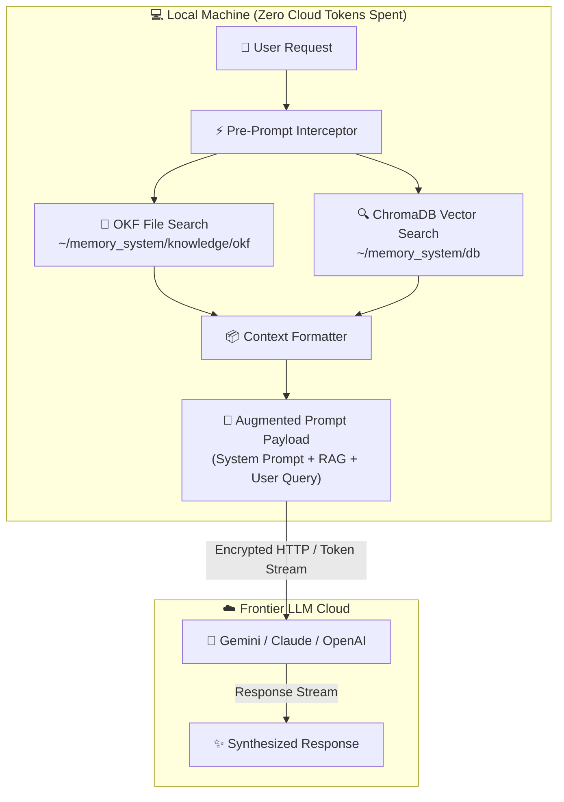

# YUV AI Skills Repository

This repository is a comprehensive collection of AI "skills" designed for various AI harnesses, including Pi-agent, Gemini, and Claude Code.

## Architecture

We use a dual-layered architecture to distinguish between fundamental building blocks and complex workflows:

### 1. Atomic Skills
**Location**: `tools/`
Atomic skills are self-contained, modular components. They do not depend on other skills within this repository. Examples include:
- `bash-pro`: Expert shell scripting.
- `python-pro`: Advanced Python development.
- `sql-pro`: SQL optimization and schema design.

### 2. Composite Skills
**Location**: Root directory (`yuv-skills-backup/`)
Composite skills are orchestrators or complex workflows that require one or more Atomic or other Composite skills to function.
- **Dependencies**: Each Composite skill includes a `manifest.json` file and explicitly lists its dependencies in its `SKILL.md` file.
- **Examples**:
    - `yuv-pilot`: The top-level orchestrator for YUV.AI brand work.
    - `ai-engineer`: A comprehensive suite for building LLM applications.
    - `video-edit`: A workflow for creating captioned showcase videos.

## Deployment

We provide a manifest-driven deployment system to package and deploy skills to different harnesses.

### Deployment Script
The `deploy_skills.py` script automates the following:
1. **Dependency Resolution**: Recursively identifies all required skills for a given harness.
2. **Package Generation**: Creates a deployment-ready directory (`deploy_package`) containing all necessary skills.
3. **Multi-Harness Support**: Supports `pi`, `gemini`, and `claude` configurations.

### Usage
To plan and generate a deployment package for the `pi` harness:
```bash
python3 deploy_skills.py --harness pi
```

## Project Structure
- `tools/`: Atomic skills categorized by domain.
- `manifest.json`: Machine-readable metadata for Composite skills.
- `audit_status.json`: Tracks the categorization and migration status of all skills.
- `deploy_skills.py`: The core deployment and packaging engine.
- `SKILL.md`: Documentation for every individual skill.

## Contributing
To add a new skill:
1. Determine if it is **Atomic** (add to `tools/`) or **Composite** (add to root).
2. Create a `SKILL.md` file describing the skill.
3. If Composite, create a `manifest.json` and list dependencies.
4. Update `audit_status.json` to reflect the new skill.


## 🧠 Local Memory RAG Architecture & Token Flow

The repository integrates a local Memory RAG framework (`~/memory_system`) using [`memory-capture`](tools/memory-capture). This system intercepts requests locally, retrieves policy/vector context, and injects it **before** tokens are transmitted to frontier LLMs.

### System Architecture & Data Flow



### Why & How This Functionality Is Organized

- **Deterministic Policy Routing (OKF)**: High-level architectural rules and security standards are stored as plain Markdown under `~/memory_system/knowledge/okf/` for exact, zero-hallucination regex matching.
- **Semantic Memory Indexing (ChromaDB)**: Troubleshooting notes, error logs, and code snippets are embedded locally into ChromaDB at `~/memory_system/db/` using local ONNX embeddings.
- **Automated Inbox Daemon**: Background service `memory-inbox.service` monitors `~/memory_system/inbox/` for new `.md` files and automatically indexes them.
- **Architectural Decision Record**: See [ADR 0005: Local Memory RAG Architecture](tools/adr/0005-local-memory-rag-architecture.md) for rationale.
- **Detailed Documentation**: See the complete [Memory RAG FAQ](memory_rag_faq.md) for step-by-step technical details.

### ⚠️ Gotchas & Operational Caveats

> [!WARNING]
> **Pre-Prompt Token Payload Overflow**: Ingesting raw logs or unchunked files directly into ChromaDB can inflate the injected context payload. Ensure log files are pre-filtered or split into 500–1000 token chunks before dropping into `~/memory_system/inbox/`.

> [!IMPORTANT]
> **Systemd User Daemon Required**: The inbox background watcher relies on `memory-inbox.service` running under `systemctl --user`. If the service is stopped or disabled, files dropped into `inbox/` will sit unprocessed until `python3 ~/memory_system/capture_knowledge.py <file>` is run manually.

> [!CAUTION]
> **OKF vs Chroma Routing Triggers**: Files intended for OKF (deterministic policies) **must** contain `# OKF Decision`, `Type: Policy`, or `Type: Architecture Standard` in their header. Without these exact header strings, `capture_knowledge.py` defaults to embedding the content into ChromaDB vector storage.

> [!NOTE]
> **Directory Tree Initializer**: If `~/memory_system` is missing or cleared, running `python3 ~/memory_system/init_storage.py` must be executed before ingestion to recreate required SQLite tables and collection schemas.

## 📚 Skill Catalog & Navigation

This repository manages **597** modular AI skills across 12 primary domains.

### Overview

| Category | Skills | Quick Link |
|---|---|---|
| [🎨 Design, Film & Video](#-design-film-video) | **54** | [Full Doc ↗](categories/design_film_video.md) |
| [📄 Document & Media Processing](#-document-media-processing) | **16** | [Full Doc ↗](categories/document_media_processing.md) |
| [📓 Notion Integration](#-notion-integration) | **8** | [Full Doc ↗](categories/notion_integration.md) |
| [🤖 AI, RAG & LLM Engineering](#-ai-llm-engineering) | **48** | [Full Doc ↗](categories/ai_llm_engineering.md) |
| [🗄️ Databases & Data Engineering](#-databases-data) | **94** | [Full Doc ↗](categories/databases_data.md) |
| [🔒 Security, Compliance & Hardening](#-security-compliance) | **37** | [Full Doc ↗](categories/security_compliance.md) |
| [☁️ DevOps, Cloud & Infrastructure](#-devops-cloud) | **60** | [Full Doc ↗](categories/devops_cloud.md) |
| [🏗️ Architecture & Engineering Practices](#-software-architecture) | **45** | [Full Doc ↗](categories/software_architecture.md) |
| [💻 Software Engineering & Frameworks](#-software-languages) | **74** | [Full Doc ↗](categories/software_languages.md) |
| [📈 Business, Finance & Strategy](#-business-finance) | **25** | [Full Doc ↗](categories/business_finance.md) |
| [🛠️ Development, Debugging & QA Workflows](#-development-testing) | **77** | [Full Doc ↗](categories/development_testing.md) |
| [💬 Productivity, Research & Communication](#-productivity-comms) | **21** | [Full Doc ↗](categories/productivity_comms.md) |
| [📦 Other User Skills](#-other-user-skills) | **38** | [Full Doc ↗](categories/other_user.md) |

---

### 🎨 Design, Film & Video
📁 *Full Documentation: [🎨 Design, Film & Video Document](categories/design_film_video.md) (54 skills)*

[`algorithmic-art`](algorithmic-art/SKILL.md) • [`article-illustrations`](tools/article-illustrations/SKILL.md) • [`artifacts-builder`](tools/artifacts-builder/SKILL.md) • [`brand-guidelines`](tools/brand-guidelines/SKILL.md) • [`canvas-design`](tools/canvas-design/SKILL.md) • [`debugging-toolkit-smart-debug`](tools/debugging-toolkit-smart-debug/SKILL.md) • [`design-system-starter`](design-system-starter/SKILL.md) • [`director`](tools/director/SKILL.md) • [`draw-io`](tools/draw-io/SKILL.md) • [`error-diagnostics-smart-debug`](tools/error-diagnostics-smart-debug/SKILL.md) • [`excalidraw`](tools/excalidraw/SKILL.md) • [`helm-chart-scaffolding`](tools/helm-chart-scaffolding/SKILL.md) • [`hyperframes`](hyperframes/SKILL.md) • [`hyperframes-cli`](tools/hyperframes-cli/SKILL.md) • [`hyperframes-registry`](tools/hyperframes-registry/SKILL.md) • [`image-enhancer`](tools/image-enhancer/SKILL.md) • [`incident-response-smart-fix`](incident-response-smart-fix/SKILL.md) • [`marp-slide`](tools/marp-slide/SKILL.md) • [`meme-factory`](tools/meme-factory/SKILL.md) • [`slack-gif-creator`](tools/slack-gif-creator/SKILL.md) • [`startup-analyst`](startup-analyst/SKILL.md) • [`startup-business-analyst-business-case`](startup-business-analyst-business-case/SKILL.md) • [`startup-business-analyst-financial-projections`](startup-business-analyst-financial-projections/SKILL.md) • [`startup-business-analyst-market-opportunity`](startup-business-analyst-market-opportunity/SKILL.md) • [`startup-financial-modeling`](startup-financial-modeling/SKILL.md) • [`startup-metrics-framework`](startup-metrics-framework/SKILL.md) • [`theme-factory`](tools/theme-factory/SKILL.md) • [`video-content-orchestrator`](tools/video-content-orchestrator/SKILL.md) • [`video-downloader`](tools/video-downloader/SKILL.md) • [`video-edit`](tools/video-edit/SKILL.md) • [`video-to-landing-page`](tools/video-to-landing-page/SKILL.md) • [`yuv-brand-orchestrator`](tools/yuv-brand-orchestrator/SKILL.md) • [`yuv-decks`](tools/yuv-decks/SKILL.md) • [`yuv-design-system`](tools/yuv-design-system/SKILL.md) • [`yuv-pilot`](tools/yuv-pilot/SKILL.md) • [`yuv-viral-video`](tools/yuv-viral-video/SKILL.md)

### 📄 Document & Media Processing
📁 *Full Documentation: [📄 Document & Media Processing Document](categories/document_media_processing.md) (16 skills)*

[`api-documenter`](tools/api-documenter/SKILL.md) • [`code-documentation-code-explain`](tools/code-documentation-code-explain/SKILL.md) • [`code-documentation-doc-generate`](tools/code-documentation-doc-generate/SKILL.md) • [`documentation-generation-doc-generate`](documentation-generation-doc-generate/SKILL.md) • [`invoice-organizer`](tools/invoice-organizer/SKILL.md) • [`notion-research-documentation`](notion-research-documentation/SKILL.md) • [`pdf`](document-skills/pdf/SKILL.md) • [`pptx`](document-skills/pptx/SKILL.md) • [`resemble-detect`](tools/resemble-detect/SKILL.md) • [`web-to-markdown`](tools/web-to-markdown/SKILL.md) • [`xlsx`](document-skills/xlsx/SKILL.md)

### 📓 Notion Integration
📁 *Full Documentation: [📓 Notion Integration Document](categories/notion_integration.md) (8 skills)*

[`notion-intelligence-orchestrator`](notion-intelligence-orchestrator/SKILL.md) • [`notion-knowledge-capture`](notion-knowledge-capture/SKILL.md) • [`notion-meeting-intelligence`](notion-meeting-intelligence/SKILL.md) • [`notion-spec-to-implementation`](notion-spec-to-implementation/SKILL.md)

### 🤖 AI, RAG & LLM Engineering
📁 *Full Documentation: [🤖 AI, RAG & LLM Engineering Document](categories/ai_llm_engineering.md) (48 skills)*

[`agent-md-refactor`](tools/agent-md-refactor/SKILL.md) • [`agent-orchestration-improve-agent`](tools/agent-orchestration-improve-agent/SKILL.md) • [`agent-orchestration-multi-agent-optimize`](tools/agent-orchestration-multi-agent-optimize/SKILL.md) • [`ai-engineer`](ai-engineer/SKILL.md) • [`cloud-sql-postgres-vectorassist`](tools/cloud-sql-postgres-vectorassist/SKILL.md) • [`code-review-ai-ai-review`](tools/code-review-ai-ai-review/SKILL.md) • [`embedding-strategies`](tools/embedding-strategies/SKILL.md) • [`error-debugging-multi-agent-review`](error-debugging-multi-agent-review/SKILL.md) • [`gemini`](gemini/SKILL.md) • [`gepetto`](gepetto/SKILL.md) • [`hybrid-search-implementation`](tools/hybrid-search-implementation/SKILL.md) • [`langchain-architecture`](langchain-architecture/SKILL.md) • [`llm-application-dev-ai-assistant`](llm-application-dev-ai-assistant/SKILL.md) • [`llm-application-dev-langchain-agent`](llm-application-dev-langchain-agent/SKILL.md) • [`llm-application-dev-prompt-optimize`](llm-application-dev-prompt-optimize/SKILL.md) • [`llm-evaluation`](llm-evaluation/SKILL.md) • [`machine-learning-ops-ml-pipeline`](machine-learning-ops-ml-pipeline/SKILL.md) • [`ml-best-practices`](ml-best-practices/SKILL.md) • [`ml-engineer`](ml-engineer/SKILL.md) • [`ml-pipeline-workflow`](ml-pipeline-workflow/SKILL.md) • [`mlops-engineer`](mlops-engineer/SKILL.md) • [`performance-testing-review-ai-review`](performance-testing-review-ai-review/SKILL.md) • [`performance-testing-review-multi-agent-review`](performance-testing-review-multi-agent-review/SKILL.md) • [`prompt-engineer`](prompt-engineer/SKILL.md) • [`prompt-engineering-patterns`](tools/prompt-engineering-patterns/SKILL.md) • [`rag-implementation`](rag-implementation/SKILL.md) • [`similarity-search-patterns`](tools/similarity-search-patterns/SKILL.md) • [`vector-database-engineer`](tools/vector-database-engineer/SKILL.md) • [`vector-index-tuning`](tools/vector-index-tuning/SKILL.md)

### 🗄️ Databases & Data Engineering
📁 *Full Documentation: [🗄️ Databases & Data Engineering Document](categories/databases_data.md) (94 skills)*

[`accidental-data-loss-prevention`](tools/accidental-data-loss-prevention/SKILL.md) • [`airflow-dag-patterns`](tools/airflow-dag-patterns/SKILL.md) • [`alloydb-omni-access-control`](tools/alloydb-omni-access-control/SKILL.md) • [`alloydb-omni-container`](tools/alloydb-omni-container/SKILL.md) • [`alloydb-omni-data`](tools/alloydb-omni-data/SKILL.md) • [`alloydb-omni-health`](tools/alloydb-omni-health/SKILL.md) • [`alloydb-omni-kubernetes`](tools/alloydb-omni-kubernetes/SKILL.md) • [`alloydb-omni-monitor`](tools/alloydb-omni-monitor/SKILL.md) • [`alloydb-omni-optimize`](tools/alloydb-omni-optimize/SKILL.md) • [`alloydb-omni-performance`](tools/alloydb-omni-performance/SKILL.md) • [`alloydb-omni-replication`](tools/alloydb-omni-replication/SKILL.md) • [`alloydb-postgres-access-management`](tools/alloydb-postgres-access-management/SKILL.md) • [`alloydb-postgres-admin`](tools/alloydb-postgres-admin/SKILL.md) • [`alloydb-postgres-data`](tools/alloydb-postgres-data/SKILL.md) • [`alloydb-postgres-health`](tools/alloydb-postgres-health/SKILL.md) • [`alloydb-postgres-monitor`](tools/alloydb-postgres-monitor/SKILL.md) • [`alloydb-postgres-optimize`](tools/alloydb-postgres-optimize/SKILL.md) • [`alloydb-postgres-replication`](tools/alloydb-postgres-replication/SKILL.md) • [`angular-migration`](tools/angular-migration/SKILL.md) • [`bigquery`](tools/bigquery/SKILL.md) • [`bigquery-data-transfer-service`](tools/bigquery-data-transfer-service/SKILL.md) • [`building-data-apps`](tools/building-data-apps/SKILL.md) • [`cloud-sql-mysql-admin`](tools/cloud-sql-mysql-admin/SKILL.md) • [`cloud-sql-mysql-data`](tools/cloud-sql-mysql-data/SKILL.md) • [`cloud-sql-mysql-lifecycle`](tools/cloud-sql-mysql-lifecycle/SKILL.md) • [`cloud-sql-mysql-monitor`](tools/cloud-sql-mysql-monitor/SKILL.md) • [`cloud-sql-postgres-admin`](tools/cloud-sql-postgres-admin/SKILL.md) • [`cloud-sql-postgres-data`](tools/cloud-sql-postgres-data/SKILL.md) • [`cloud-sql-postgres-health`](tools/cloud-sql-postgres-health/SKILL.md) • [`cloud-sql-postgres-lifecycle`](tools/cloud-sql-postgres-lifecycle/SKILL.md) • [`cloud-sql-postgres-monitor`](tools/cloud-sql-postgres-monitor/SKILL.md) • [`cloud-sql-postgres-replication`](tools/cloud-sql-postgres-replication/SKILL.md) • [`cloud-sql-postgres-view-config`](tools/cloud-sql-postgres-view-config/SKILL.md) • [`cloud-sql-sqlserver-admin`](tools/cloud-sql-sqlserver-admin/SKILL.md) • [`cloud-sql-sqlserver-data`](tools/cloud-sql-sqlserver-data/SKILL.md) • [`cloud-sql-sqlserver-lifecycle`](tools/cloud-sql-sqlserver-lifecycle/SKILL.md) • [`cloud-sql-sqlserver-monitor`](tools/cloud-sql-sqlserver-monitor/SKILL.md) • [`data-autocleaning`](tools/data-autocleaning/SKILL.md) • [`data-engineer`](data-engineer/SKILL.md) • [`data-engineering-data-driven-feature`](data-engineering-data-driven-feature/SKILL.md) • [`data-engineering-data-pipeline`](data-engineering-data-pipeline/SKILL.md) • [`data-quality-frameworks`](data-quality-frameworks/SKILL.md) • [`data-scientist`](data-scientist/SKILL.md) • [`data-storytelling`](data-storytelling/SKILL.md) • [`database-admin`](database-admin/SKILL.md) • [`database-architect`](database-architect/SKILL.md) • [`database-cloud-optimization-cost-optimize`](database-cloud-optimization-cost-optimize/SKILL.md) • [`database-migration`](database-migration/SKILL.md) • [`database-migrations-migration-observability`](database-migrations-migration-observability/SKILL.md) • [`database-migrations-sql-migrations`](database-migrations-sql-migrations/SKILL.md) • [`database-optimizer`](database-optimizer/SKILL.md) • [`database-schema-designer`](database-schema-designer/SKILL.md) • [`dataform-bigquery`](dataform-bigquery/SKILL.md) • [`dbt-bigquery`](dbt-bigquery/SKILL.md) • [`dbt-transformation-patterns`](dbt-transformation-patterns/SKILL.md) • [`discovering-gcp-data-assets`](discovering-gcp-data-assets/SKILL.md) • [`federate-lakehouse-catalog`](tools/federate-lakehouse-catalog/SKILL.md) • [`firestore-data`](tools/firestore-data/SKILL.md) • [`framework-migration-code-migrate`](framework-migration-code-migrate/SKILL.md) • [`framework-migration-deps-upgrade`](framework-migration-deps-upgrade/SKILL.md) • [`framework-migration-legacy-modernize`](framework-migration-legacy-modernize/SKILL.md) • [`gcp-data-pipelines`](gcp-data-pipelines/SKILL.md) • [`gcp-managed-airflow-migrations`](tools/gcp-managed-airflow-migrations/SKILL.md) • [`gcp-spark`](gcp-spark/SKILL.md) • [`gcs-security-assessment`](tools/gcs-security-assessment/SKILL.md) • [`gdpr-data-handling`](tools/gdpr-data-handling/SKILL.md) • [`postgresql`](tools/postgresql/SKILL.md) • [`spanner-data`](tools/spanner-data/SKILL.md) • [`spark-optimization`](tools/spark-optimization/SKILL.md) • [`sql-optimization-patterns`](tools/sql-optimization-patterns/SKILL.md) • [`sql-pro`](tools/sql-pro/SKILL.md)

### 🔒 Security, Compliance & Hardening
📁 *Full Documentation: [🔒 Security, Compliance & Hardening Document](categories/security_compliance.md) (37 skills)*

[`accessibility-compliance-accessibility-audit`](tools/accessibility-compliance-accessibility-audit/SKILL.md) • [`adr-authoring`](tools/adr-authoring/SKILL.md) • [`anti-reversing-techniques`](tools/anti-reversing-techniques/SKILL.md) • [`attack-tree-construction`](tools/attack-tree-construction/SKILL.md) • [`auth-implementation-patterns`](tools/auth-implementation-patterns/SKILL.md) • [`backend-security-coder`](tools/backend-security-coder/SKILL.md) • [`binary-analysis-patterns`](tools/binary-analysis-patterns/SKILL.md) • [`codebase-cleanup-deps-audit`](tools/codebase-cleanup-deps-audit/SKILL.md) • [`dependency-management-deps-audit`](dependency-management-deps-audit/SKILL.md) • [`frontend-mobile-security-xss-scan`](tools/frontend-mobile-security-xss-scan/SKILL.md) • [`frontend-security-coder`](tools/frontend-security-coder/SKILL.md) • [`gcloud-auth-verification`](tools/gcloud-auth-verification/SKILL.md) • [`k8s-security-policies`](tools/k8s-security-policies/SKILL.md) • [`malware-analyst`](tools/malware-analyst/SKILL.md) • [`mobile-security-coder`](tools/mobile-security-coder/SKILL.md) • [`mtls-configuration`](tools/mtls-configuration/SKILL.md) • [`pci-compliance`](tools/pci-compliance/SKILL.md) • [`sast-configuration`](tools/sast-configuration/SKILL.md) • [`secrets-management`](tools/secrets-management/SKILL.md) • [`security-auditor`](security-auditor/SKILL.md) • [`security-compliance-compliance-check`](tools/security-compliance-compliance-check/SKILL.md) • [`security-governance-orchestrator`](security-governance-orchestrator/SKILL.md) • [`security-requirement-extraction`](tools/security-requirement-extraction/SKILL.md) • [`security-scanning-security-dependencies`](tools/security-scanning-security-dependencies/SKILL.md) • [`security-scanning-security-hardening`](tools/security-scanning-security-hardening/SKILL.md) • [`security-scanning-security-sast`](tools/security-scanning-security-sast/SKILL.md) • [`security-tech-debt`](tools/security-tech-debt/SKILL.md) • [`seo-authority-builder`](tools/seo-authority-builder/SKILL.md) • [`seo-content-auditor`](tools/seo-content-auditor/SKILL.md) • [`solidity-security`](tools/solidity-security/SKILL.md) • [`stride-analysis-patterns`](tools/stride-analysis-patterns/SKILL.md) • [`threat-mitigation-mapping`](tools/threat-mitigation-mapping/SKILL.md) • [`threat-modeling-expert`](tools/threat-modeling-expert/SKILL.md) • [`wcag-audit-patterns`](tools/wcag-audit-patterns/SKILL.md)

### ☁️ DevOps, Cloud & Infrastructure
📁 *Full Documentation: [☁️ DevOps, Cloud & Infrastructure Document](categories/devops_cloud.md) (60 skills)*

[`api-testing-observability-api-mock`](tools/api-testing-observability-api-mock/SKILL.md) • [`bazel-build-optimization`](tools/bazel-build-optimization/SKILL.md) • [`c4-container`](tools/c4-container/SKILL.md) • [`cost-optimization`](tools/cost-optimization/SKILL.md) • [`datadog-cli`](datadog-cli/SKILL.md) • [`deployment-engineer`](deployment-engineer/SKILL.md) • [`deployment-pipeline-design`](deployment-pipeline-design/SKILL.md) • [`deployment-validation-config-validate`](deployment-validation-config-validate/SKILL.md) • [`devops-troubleshooter`](devops-troubleshooter/SKILL.md) • [`distributed-tracing`](distributed-tracing/SKILL.md) • [`gcp-composer-troubleshooting`](tools/gcp-composer-troubleshooting/SKILL.md) • [`gcp-dataflow`](gcp-dataflow/SKILL.md) • [`gcp-pipeline-orchestration`](gcp-pipeline-orchestration/SKILL.md) • [`gcp-pipeline-resource-provisioning`](tools/gcp-pipeline-resource-provisioning/SKILL.md) • [`github-actions-node24`](tools/github-actions-node24/SKILL.md) • [`github-actions-templates`](tools/github-actions-templates/SKILL.md) • [`gitlab-ci-patterns`](tools/gitlab-ci-patterns/SKILL.md) • [`gitops-workflow`](gitops-workflow/SKILL.md) • [`grafana-dashboards`](tools/grafana-dashboards/SKILL.md) • [`hybrid-cloud-networking`](tools/hybrid-cloud-networking/SKILL.md) • [`incident-responder`](incident-responder/SKILL.md) • [`incident-response-incident-response`](incident-response-incident-response/SKILL.md) • [`incident-runbook-templates`](tools/incident-runbook-templates/SKILL.md) • [`istio-traffic-management`](tools/istio-traffic-management/SKILL.md) • [`k8s-manifest-generator`](tools/k8s-manifest-generator/SKILL.md) • [`kubernetes-architect`](kubernetes-architect/SKILL.md) • [`linkerd-patterns`](tools/linkerd-patterns/SKILL.md) • [`monorepo-architect`](monorepo-architect/SKILL.md) • [`monorepo-management`](monorepo-management/SKILL.md) • [`network-engineer`](network-engineer/SKILL.md) • [`nx-workspace-patterns`](tools/nx-workspace-patterns/SKILL.md) • [`observability-engineer`](observability-engineer/SKILL.md) • [`observability-monitoring-monitor-setup`](tools/observability-monitoring-monitor-setup/SKILL.md) • [`observability-monitoring-slo-implement`](tools/observability-monitoring-slo-implement/SKILL.md) • [`on-call-handoff-patterns`](tools/on-call-handoff-patterns/SKILL.md) • [`postmortem-writing`](tools/postmortem-writing/SKILL.md) • [`prometheus-configuration`](tools/prometheus-configuration/SKILL.md) • [`service-mesh-expert`](service-mesh-expert/SKILL.md) • [`service-mesh-observability`](tools/service-mesh-observability/SKILL.md) • [`slo-implementation`](tools/slo-implementation/SKILL.md) • [`terraform-module-library`](tools/terraform-module-library/SKILL.md) • [`terraform-specialist`](tools/terraform-specialist/SKILL.md) • [`turborepo-caching`](tools/turborepo-caching/SKILL.md)

### 🏗️ Architecture & Engineering Practices
📁 *Full Documentation: [🏗️ Architecture & Engineering Practices Document](categories/software_architecture.md) (45 skills)*

[`architect-review`](tools/architect-review/SKILL.md) • [`architecture-decision-records`](tools/architecture-decision-records/SKILL.md) • [`architecture-governance-orchestrator`](architecture-governance-orchestrator/SKILL.md) • [`architecture-patterns`](tools/architecture-patterns/SKILL.md) • [`backend-architect`](backend-architect/SKILL.md) • [`backend-development-feature-development`](backend-development-feature-development/SKILL.md) • [`c4-architecture`](tools/c4-architecture/SKILL.md) • [`c4-architecture-c4-architecture`](tools/c4-architecture-c4-architecture/SKILL.md) • [`c4-code`](tools/c4-code/SKILL.md) • [`c4-component`](tools/c4-component/SKILL.md) • [`c4-context`](tools/c4-context/SKILL.md) • [`cloud-architect`](tools/cloud-architect/SKILL.md) • [`content-governance-orchestrator`](tools/content-governance-orchestrator/SKILL.md) • [`cqrs-implementation`](tools/cqrs-implementation/SKILL.md) • [`docs-architect`](docs-architect/SKILL.md) • [`dotnet-architect`](dotnet-architect/SKILL.md) • [`event-sourcing-architect`](tools/event-sourcing-architect/SKILL.md) • [`event-store-design`](tools/event-store-design/SKILL.md) • [`frontend-to-backend-requirements`](tools/frontend-to-backend-requirements/SKILL.md) • [`full-stack-orchestration-full-stack-feature`](full-stack-orchestration-full-stack-feature/SKILL.md) • [`game-changing-features`](game-changing-features/SKILL.md) • [`git-pr-workflows-onboard`](git-pr-workflows-onboard/SKILL.md) • [`graphql-architect`](graphql-architect/SKILL.md) • [`hybrid-cloud-architect`](hybrid-cloud-architect/SKILL.md) • [`microservices-patterns`](microservices-patterns/SKILL.md) • [`multi-cloud-architecture`](multi-cloud-architecture/SKILL.md) • [`react-native-architecture`](react-native-architecture/SKILL.md) • [`requirements-clarity`](tools/requirements-clarity/SKILL.md) • [`saga-orchestration`](saga-orchestration/SKILL.md) • [`seo-structure-architect`](tools/seo-structure-architect/SKILL.md) • [`systems-programming-rust-project`](tools/systems-programming-rust-project/SKILL.md)

### 💻 Software Engineering & Frameworks
📁 *Full Documentation: [💻 Software Engineering & Frameworks Document](categories/software_languages.md) (74 skills)*

[`api-design-principles`](tools/api-design-principles/SKILL.md) • [`arm-cortex-expert`](tools/arm-cortex-expert/SKILL.md) • [`async-python-patterns`](tools/async-python-patterns/SKILL.md) • [`backend-to-frontend-handoff-docs`](tools/backend-to-frontend-handoff-docs/SKILL.md) • [`bash-defensive-patterns`](tools/bash-defensive-patterns/SKILL.md) • [`bash-pro`](tools/bash-pro/SKILL.md) • [`bats-testing-patterns`](tools/bats-testing-patterns/SKILL.md) • [`blockchain-developer`](tools/blockchain-developer/SKILL.md) • [`c-pro`](tools/c-pro/SKILL.md) • [`cpp-pro`](tools/cpp-pro/SKILL.md) • [`csharp-pro`](tools/csharp-pro/SKILL.md) • [`defi-protocol-templates`](tools/defi-protocol-templates/SKILL.md) • [`django-pro`](django-pro/SKILL.md) • [`dotnet-backend-patterns`](dotnet-backend-patterns/SKILL.md) • [`elixir-pro`](tools/elixir-pro/SKILL.md) • [`fastapi-pro`](tools/fastapi-pro/SKILL.md) • [`fastapi-templates`](tools/fastapi-templates/SKILL.md) • [`firmware-analyst`](tools/firmware-analyst/SKILL.md) • [`flutter-expert`](tools/flutter-expert/SKILL.md) • [`frontend-developer`](frontend-developer/SKILL.md) • [`frontend-mobile-development-component-scaffold`](tools/frontend-mobile-development-component-scaffold/SKILL.md) • [`go-concurrency-patterns`](tools/go-concurrency-patterns/SKILL.md) • [`godot-gdscript-patterns`](tools/godot-gdscript-patterns/SKILL.md) • [`golang-pro`](tools/golang-pro/SKILL.md) • [`haskell-pro`](tools/haskell-pro/SKILL.md) • [`ios-developer`](ios-developer/SKILL.md) • [`java-pro`](tools/java-pro/SKILL.md) • [`javascript-pro`](tools/javascript-pro/SKILL.md) • [`javascript-testing-patterns`](tools/javascript-testing-patterns/SKILL.md) • [`javascript-typescript-typescript-scaffold`](tools/javascript-typescript-typescript-scaffold/SKILL.md) • [`managing-python-dependencies`](tools/managing-python-dependencies/SKILL.md) • [`mobile-developer`](mobile-developer/SKILL.md) • [`modern-javascript-patterns`](tools/modern-javascript-patterns/SKILL.md) • [`mui`](tools/mui/SKILL.md) • [`nextjs-app-router-patterns`](tools/nextjs-app-router-patterns/SKILL.md) • [`nft-standards`](tools/nft-standards/SKILL.md) • [`nodejs-backend-patterns`](tools/nodejs-backend-patterns/SKILL.md) • [`openapi-spec-generation`](tools/openapi-spec-generation/SKILL.md) • [`openapi-to-typescript`](tools/openapi-to-typescript/SKILL.md) • [`php-pro`](tools/php-pro/SKILL.md) • [`posix-shell-pro`](tools/posix-shell-pro/SKILL.md) • [`python-development-python-scaffold`](tools/python-development-python-scaffold/SKILL.md) • [`python-packaging`](tools/python-packaging/SKILL.md) • [`python-performance-optimization`](tools/python-performance-optimization/SKILL.md) • [`python-pro`](tools/python-pro/SKILL.md) • [`python-testing-patterns`](tools/python-testing-patterns/SKILL.md) • [`react-dev`](react-dev/SKILL.md) • [`react-modernization`](react-modernization/SKILL.md) • [`react-state-management`](react-state-management/SKILL.md) • [`react-useeffect`](tools/react-useeffect/SKILL.md) • [`ruby-pro`](tools/ruby-pro/SKILL.md) • [`rust-async-patterns`](tools/rust-async-patterns/SKILL.md) • [`rust-pro`](tools/rust-pro/SKILL.md) • [`scala-pro`](tools/scala-pro/SKILL.md) • [`shellcheck-configuration`](tools/shellcheck-configuration/SKILL.md) • [`tailwind-design-system`](tools/tailwind-design-system/SKILL.md) • [`temporal-python-pro`](tools/temporal-python-pro/SKILL.md) • [`temporal-python-testing`](tools/temporal-python-testing/SKILL.md) • [`typescript-advanced-types`](tools/typescript-advanced-types/SKILL.md) • [`typescript-pro`](tools/typescript-pro/SKILL.md) • [`unity-developer`](tools/unity-developer/SKILL.md) • [`unity-ecs-patterns`](tools/unity-ecs-patterns/SKILL.md) • [`uv-package-manager`](tools/uv-package-manager/SKILL.md) • [`web3-testing`](tools/web3-testing/SKILL.md) • [`webapp-testing`](tools/webapp-testing/SKILL.md)

### 📈 Business, Finance & Strategy
📁 *Full Documentation: [📈 Business, Finance & Strategy Document](categories/business_finance.md) (25 skills)*

[`billing-automation`](tools/billing-automation/SKILL.md) • [`business-analyst`](tools/business-analyst/SKILL.md) • [`content-marketer`](tools/content-marketer/SKILL.md) • [`customer-support`](tools/customer-support/SKILL.md) • [`employment-contract-templates`](tools/employment-contract-templates/SKILL.md) • [`hr-pro`](tools/hr-pro/SKILL.md) • [`legal-advisor`](tools/legal-advisor/SKILL.md) • [`market-sizing-analysis`](tools/market-sizing-analysis/SKILL.md) • [`payment-integration`](payment-integration/SKILL.md) • [`paypal-integration`](tools/paypal-integration/SKILL.md) • [`quant-analyst`](tools/quant-analyst/SKILL.md) • [`risk-manager`](risk-manager/SKILL.md) • [`risk-metrics-calculation`](tools/risk-metrics-calculation/SKILL.md) • [`sales-automator`](tools/sales-automator/SKILL.md) • [`seo-cannibalization-detector`](tools/seo-cannibalization-detector/SKILL.md) • [`seo-content-planner`](tools/seo-content-planner/SKILL.md) • [`seo-content-refresher`](tools/seo-content-refresher/SKILL.md) • [`seo-content-writer`](tools/seo-content-writer/SKILL.md) • [`seo-keyword-strategist`](tools/seo-keyword-strategist/SKILL.md) • [`seo-meta-optimizer`](tools/seo-meta-optimizer/SKILL.md) • [`seo-snippet-hunter`](tools/seo-snippet-hunter/SKILL.md) • [`stripe-integration`](stripe-integration/SKILL.md)

### 🛠️ Development, Debugging & QA Workflows
📁 *Full Documentation: [🛠️ Development, Debugging & QA Workflows Document](categories/development_testing.md) (77 skills)*

[`adr-discovery`](tools/adr-discovery/SKILL.md) • [`adr-lifecycle-management`](tools/adr-lifecycle-management/SKILL.md) • [`application-performance-performance-optimization`](tools/application-performance-performance-optimization/SKILL.md) • [`backtesting-frameworks`](tools/backtesting-frameworks/SKILL.md) • [`changelog-automation`](tools/changelog-automation/SKILL.md) • [`changelog-generator`](tools/changelog-generator/SKILL.md) • [`code-refactoring-context-restore`](tools/code-refactoring-context-restore/SKILL.md) • [`code-refactoring-refactor-clean`](tools/code-refactoring-refactor-clean/SKILL.md) • [`code-refactoring-tech-debt`](tools/code-refactoring-tech-debt/SKILL.md) • [`code-review-excellence`](tools/code-review-excellence/SKILL.md) • [`code-reviewer`](tools/code-reviewer/SKILL.md) • [`codebase-cleanup-refactor-clean`](tools/codebase-cleanup-refactor-clean/SKILL.md) • [`codebase-cleanup-tech-debt`](tools/codebase-cleanup-tech-debt/SKILL.md) • [`commit-work`](tools/commit-work/SKILL.md) • [`comprehensive-review-full-review`](tools/comprehensive-review-full-review/SKILL.md) • [`comprehensive-review-pr-enhance`](tools/comprehensive-review-pr-enhance/SKILL.md) • [`conductor-implement`](tools/conductor-implement/SKILL.md) • [`conductor-manage`](tools/conductor-manage/SKILL.md) • [`conductor-new-track`](tools/conductor-new-track/SKILL.md) • [`conductor-revert`](tools/conductor-revert/SKILL.md) • [`conductor-setup`](tools/conductor-setup/SKILL.md) • [`conductor-status`](tools/conductor-status/SKILL.md) • [`conductor-validator`](tools/conductor-validator/SKILL.md) • [`context-driven-development`](tools/context-driven-development/SKILL.md) • [`context-management-context-restore`](tools/context-management-context-restore/SKILL.md) • [`context-management-context-save`](tools/context-management-context-save/SKILL.md) • [`context-manager`](tools/context-manager/SKILL.md) • [`custom-code-reviewer`](tools/custom-code-reviewer/SKILL.md) • [`debugger`](tools/debugger/SKILL.md) • [`debugging-strategies`](tools/debugging-strategies/SKILL.md) • [`dependency-lifecycle-orchestrator`](dependency-lifecycle-orchestrator/SKILL.md) • [`dependency-updater`](dependency-updater/SKILL.md) • [`dependency-upgrade`](dependency-upgrade/SKILL.md) • [`distributed-debugging-debug-trace`](distributed-debugging-debug-trace/SKILL.md) • [`dx-optimizer`](tools/dx-optimizer/SKILL.md) • [`e2e-testing-patterns`](tools/e2e-testing-patterns/SKILL.md) • [`error-debugging-error-analysis`](tools/error-debugging-error-analysis/SKILL.md) • [`error-debugging-error-trace`](tools/error-debugging-error-trace/SKILL.md) • [`error-detective`](tools/error-detective/SKILL.md) • [`error-diagnostics-error-analysis`](tools/error-diagnostics-error-analysis/SKILL.md) • [`error-diagnostics-error-trace`](tools/error-diagnostics-error-trace/SKILL.md) • [`error-diagnostics-orchestrator`](error-diagnostics-orchestrator/SKILL.md) • [`error-handling-patterns`](tools/error-handling-patterns/SKILL.md) • [`git-pr-workflows-git-workflow`](git-pr-workflows-git-workflow/SKILL.md) • [`git-pr-workflows-pr-enhance`](git-pr-workflows-pr-enhance/SKILL.md) • [`install-adr-gatekeeper`](tools/install-adr-gatekeeper/SKILL.md) • [`mcp-builder`](tools/mcp-builder/SKILL.md) • [`memory-capture`](tools/memory-capture/SKILL.md) • [`memory-forensics`](tools/memory-forensics/SKILL.md) • [`memory-safety-patterns`](tools/memory-safety-patterns/SKILL.md) • [`performance-engineer`](performance-engineer/SKILL.md) • [`performance-optimization-orchestrator`](performance-optimization-orchestrator/SKILL.md) • [`qa-test-planner`](tools/qa-test-planner/SKILL.md) • [`reducing-entropy`](tools/reducing-entropy/SKILL.md) • [`screen-reader-testing`](tools/screen-reader-testing/SKILL.md) • [`skill-creator`](tools/skill-creator/SKILL.md) • [`skill-judge`](tools/skill-judge/SKILL.md) • [`skill-repair`](tools/skill-repair/SKILL.md) • [`tdd-orchestrator`](tdd-orchestrator/SKILL.md) • [`tdd-workflows-tdd-cycle`](tools/tdd-workflows-tdd-cycle/SKILL.md) • [`tdd-workflows-tdd-green`](tools/tdd-workflows-tdd-green/SKILL.md) • [`tdd-workflows-tdd-red`](tools/tdd-workflows-tdd-red/SKILL.md) • [`tdd-workflows-tdd-refactor`](tools/tdd-workflows-tdd-refactor/SKILL.md) • [`team-collaboration-issue`](tools/team-collaboration-issue/SKILL.md) • [`template-skill`](tools/template-skill/SKILL.md) • [`test-automator`](tools/test-automator/SKILL.md) • [`unit-testing-test-generate`](tools/unit-testing-test-generate/SKILL.md)

### 💬 Productivity, Research & Communication
📁 *Full Documentation: [💬 Productivity, Research & Communication Document](categories/productivity_comms.md) (21 skills)*

[`content-research-writer`](tools/content-research-writer/SKILL.md) • [`daily-meeting-update`](daily-meeting-update/SKILL.md) • [`difficult-workplace-conversations`](difficult-workplace-conversations/SKILL.md) • [`domain-name-brainstormer`](domain-name-brainstormer/SKILL.md) • [`feedback-mastery`](tools/feedback-mastery/SKILL.md) • [`file-organizer`](tools/file-organizer/SKILL.md) • [`humanizer`](tools/humanizer/SKILL.md) • [`internal-comms`](tools/internal-comms/SKILL.md) • [`lead-research-assistant`](tools/lead-research-assistant/SKILL.md) • [`lesson-learned`](tools/lesson-learned/SKILL.md) • [`meeting-insights-analyzer`](tools/meeting-insights-analyzer/SKILL.md) • [`naming-analyzer`](tools/naming-analyzer/SKILL.md) • [`professional-communication`](tools/professional-communication/SKILL.md) • [`raffle-winner-picker`](tools/raffle-winner-picker/SKILL.md) • [`session-handoff`](tools/session-handoff/SKILL.md) • [`team-collaboration-standup-notes`](tools/team-collaboration-standup-notes/SKILL.md) • [`tutorial-engineer`](tools/tutorial-engineer/SKILL.md) • [`writing-clearly-and-concisely`](tools/writing-clearly-and-concisely/SKILL.md)

### 📦 Other User Skills
📁 *Full Documentation: [Other User Skills Document](categories/other_user.md) (38 skills)*

[`cicd-automation-workflow-automate`](tools/cicd-automation-workflow-automate/SKILL.md) • [`codex`](tools/codex/SKILL.md) • [`command-creator`](tools/command-creator/SKILL.md) • [`competitive-ads-extractor`](tools/competitive-ads-extractor/SKILL.md) • [`competitive-landscape`](tools/competitive-landscape/SKILL.md) • [`crafting-effective-readmes`](tools/crafting-effective-readmes/SKILL.md) • [`git-advanced-workflows`](tools/git-advanced-workflows/SKILL.md) • [`jira`](tools/jira/SKILL.md) • [`julia-pro`](tools/julia-pro/SKILL.md) • [`kpi-dashboard-design`](tools/kpi-dashboard-design/SKILL.md) • [`legacy-modernizer`](legacy-modernizer/SKILL.md) • [`mermaid-diagrams`](tools/mermaid-diagrams/SKILL.md) • [`mermaid-expert`](tools/mermaid-expert/SKILL.md) • [`minecraft-bukkit-pro`](tools/minecraft-bukkit-pro/SKILL.md) • [`multi-platform-apps-multi-platform`](multi-platform-apps-multi-platform/SKILL.md) • [`nano-banana-pro`](tools/nano-banana-pro/SKILL.md) • [`notebook-guidance`](tools/notebook-guidance/SKILL.md) • [`parallax-landing-page`](tools/parallax-landing-page/SKILL.md) • [`perplexity`](tools/perplexity/SKILL.md) • [`plugin-forge`](tools/plugin-forge/SKILL.md) • [`projection-patterns`](tools/projection-patterns/SKILL.md) • [`protocol-reverse-engineering`](tools/protocol-reverse-engineering/SKILL.md) • [`reference-builder`](tools/reference-builder/SKILL.md) • [`reverse-engineer`](reverse-engineer/SKILL.md) • [`search-specialist`](tools/search-specialist/SKILL.md) • [`ship-learn-next`](tools/ship-learn-next/SKILL.md) • [`team-composition-analysis`](tools/team-composition-analysis/SKILL.md) • [`track-management`](tools/track-management/SKILL.md) • [`ui-ux-designer`](tools/ui-ux-designer/SKILL.md) • [`ui-visual-validator`](tools/ui-visual-validator/SKILL.md) • [`workflow-orchestration-patterns`](tools/workflow-orchestration-patterns/SKILL.md) • [`workflow-patterns`](tools/workflow-patterns/SKILL.md)

