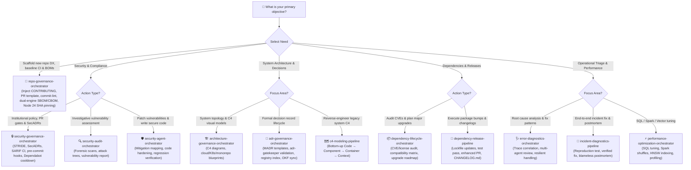
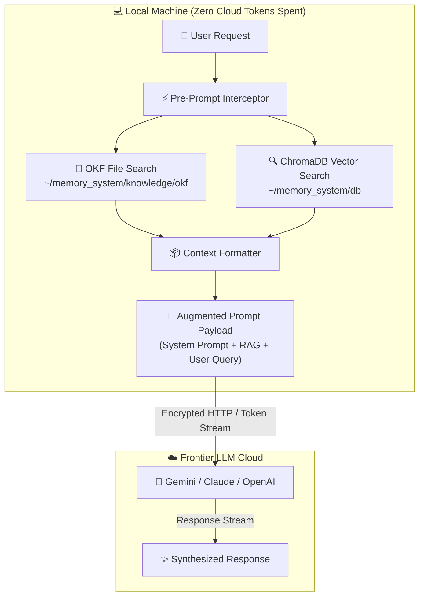

# My Skills Repository

This repository is a comprehensive collection of AI "skills" designed for various AI harnesses, including Pi-agent, Gemini, and AI coding agent.

## Architecture

We use a dual-layered architecture to distinguish between fundamental building blocks and complex workflows:

### 1. Atomic Skills
**Location**: `skills/`
Atomic skills are self-contained, modular components. They do not depend on other skills within this repository. Examples include:
- `bash-pro`: Expert shell scripting.
- `python-pro`: Advanced Python development.
- `sql-pro`: SQL optimization and schema design.

### 2. Composite Skills
**Location**: Root directory (`yuv-skills-backup/`)
Composite skills are orchestrators or complex workflows that require one or more Atomic or other Composite skills to function.
- **Dependencies**: Each Composite skill includes a `manifest.json` file and explicitly lists its dependencies in its `SKILL.md` file.
- **Examples**:
    - `yuv-pilot`: The top-level orchestrator for YUV.AI brand work.
    - `ai-engineer`: A comprehensive suite for building LLM applications.
    - `video-edit`: A workflow for creating captioned showcase videos.

## Quick Start & Setup

The repository provides cross-platform setup scripts for restoring skills, inspecting status, and exploring the catalog.

### Setup & Installation
```bash
# Bash (macOS/Linux)
./setup.sh --client pi        # Restores to ~/.pi/agent/skills
./setup.sh --client gemini    # Restores to ~/.gemini/config/skills
./setup.sh --client claude    # Restores to ~/.claude/skills
./setup.sh --client opencode  # Restores to ~/.opencode/skills
```

```powershell
# Windows PowerShell
.\setup.ps1 -Client pi
.\setup.ps1 -Client gemini
.\setup.ps1 -Client claude
.\setup.ps1 -Client opencode
```

### Inspect New vs. Existing Skills
Check which skills in the repository are already installed versus new/uninstalled in your local environment:
```bash
./setup.sh --status --client gemini     # Full status comparison
./setup.sh --new --client gemini        # List only new skills available
./setup.sh --installed --client gemini  # List only existing/installed skills
```

### Browse Skill Catalog
Explore available skills with descriptions, categories, and keyword search:
```bash
./setup.sh --catalog                    # Full catalog by category
./setup.sh --catalog -g databases_data  # Filter by category
./setup.sh --catalog -q postgres        # Search skills by keyword
./setup.sh --categories                 # List all categories and counts
```

### Inspect Local Memory System
Inspect host directories, RAG storage presence, search stored policies/context, and inspect full memory documents:
```bash
./setup.sh --memory                     # Inspect memory status and list stored OKF & ChromaDB records
./setup.sh --memory -q <keyword>        # Search stored memories across policies and vector contexts
./setup.sh --memory --details           # Display full document contents for memory items
python3 scripts/inspect_memory.py --json # Export structured JSON for agent harnesses
```

```powershell
.\setup.ps1 -Memory                     # Windows PowerShell
.\setup.ps1 -Memory -Search <keyword>   # Search stored memories
.\setup.ps1 -Memory -Details            # Display full document contents
```

## Deployment & Synchronization

The repository provides multi-tiered deployment workflows ranging from automated one-command client installation to bidirectional synchronization and manifest-driven composite packaging.

### 1. Supported Target Runtimes

All skills are automatically flattened and deployed directly into each client's canonical skill directory:

| Client Runtime | Target Directory | CLI Flag | Description |
|---|---|---|---|
| **Pi Agent** | `~/.pi/agent/skills` | `pi` | Default local lightweight agent runtime |
| **Gemini CLI** | `~/.gemini/config/skills` | `gemini` | Google DeepMind Gemini agent harness |
| **Claude Code** | `~/.claude/skills` | `claude` | Anthropic Claude agent skill directory |
| **OpenCode** | `~/.opencode/skills` | `opencode` | OpenCode community runtime |

---

### 2. Quick Deployment & Environment Restoration

The primary deployment method restores and flattens all repository skills into your target client with automatic directory creation and path containment checks:

#### Automated CLI Scripts (Recommended)
```bash
# macOS / Linux (Bash)
./setup.sh --client gemini      # Deploy/restore all skills to Gemini
./setup.sh --client pi          # Deploy/restore all skills to Pi
./setup.sh --client claude      # Deploy/restore all skills to Claude
./setup.sh --client opencode    # Deploy/restore all skills to OpenCode
```

```powershell
# Windows PowerShell
.\setup.ps1 -Client gemini      # Deploy/restore all skills to Gemini
.\setup.ps1 -Client pi          # Deploy/restore all skills to Pi
.\setup.ps1 -Client claude      # Deploy/restore all skills to Claude
.\setup.ps1 -Client opencode    # Deploy/restore all skills to OpenCode
```

#### Direct Python Restoration
```bash
python3 scripts/restore_skills.py . --client gemini
```

**Deployment Guarantees:**
- **Flattening**: Eliminates nested directories. All skills reside strictly at the top level of the target client's skills folder.
- **Path Containment & Security**: Enforces `is_safe_subpath` checks and blocks symlink traversal to prevent directory escape attacks.
- **Client Customization Preservation**: Existing client-only skills not tracked in the repository are preserved and never deleted.

---

### 3. Bidirectional Environment Synchronization

When authoring or modifying skills directly within an active agent environment, use `scripts/sync.py` to keep your local client and the repository in sync:

```bash
# Deploy changes from repository to agent client
python3 scripts/sync.py deploy --client gemini

# Save new/edited skills from agent client back into the repository
python3 scripts/sync.py save --client gemini
```

- **`deploy`**: Copies updated skills from `skills/` and `config-skills/` into the client environment.
- **`save`**: Discovers new or edited skills in the client directory, automatically determines their category via frontmatter analysis, and copies them back into the proper repository folder.

---

### 4. Manifest-Driven Composite Deployment

For complex, multi-skill workflows, `scripts/deploy_skills.py` provides manifest-based dependency resolution and deployment planning:

```bash
# Plan and preview dependencies for a specific harness
python3 scripts/deploy_skills.py --harness pi --dry-run

# Generate the deployment package
python3 scripts/deploy_skills.py --harness gemini
```

- **Recursive Dependency Resolution**: Inspects `manifest.json` files in composite skills and automatically includes all dependent atomic tools.
- **Target Packaging**: Generates a self-contained deployment package ready for air-gapped or containerized distribution.

---

### 5. Pre-Flight Inspection & Verification

Before and after deploying, verify the deployment status across your runtimes:

```bash
./setup.sh --status --client gemini     # Compare repository vs installed skills
./setup.sh --new --client gemini        # View only uninstalled / new skills
./setup.sh --installed --client gemini  # View only currently active skills
```

## Project Structure
- `skills/`: User skills categorized by domain.
- `config-skills/`: System configuration skills.
- `categories/`: Dynamic markdown catalog per category.
- `docs/`: Technical documentation and architecture records.
  - `docs/adr/`: Architecture Decision Records (ADRs) and Governance Strategy.
- `scripts/`:
  - `restore_skills.py`: Core restoration logic for agent clients.
  - `catalog.py`: Skills catalog engine and status inspector.
  - `sync.py`: Selective bidirectional synchronization.
  - `update_readme.py`: Catalog and documentation generator.
  - `deploy_skills.py`: Manifest-driven deployment packager.
- `setup.sh`: Bash setup, status check, and catalog CLI.
- `setup.ps1`: Windows PowerShell setup, status check, and catalog CLI.
- `manifest.json`: Machine-readable metadata for Composite skills.
- `audit_status.json`: Tracks the categorization and migration status of all skills.
- `CHANGELOG.md`: History of updates and new skills.
- `SKILL.md`: Documentation for every individual skill.

## Contributing

To add a new skill:
1. Determine if it is **Atomic** (add to `skills/`) or **Composite** (add to root).
2. Create a `SKILL.md` file describing the skill.
3. If Composite, create a `manifest.json` and list dependencies.
4. Update `audit_status.json` to reflect the new skill.
5. Run `python3 scripts/update_readme.py` to update the catalog documentation.

## 🔗 Composite Pipeline Orchestrators & Governance Decision Matrix

This repository provides single-call pipeline orchestrators designed to trigger complete, multi-stage workflows across dependent skills. When an agent harness executes one of these grouped skills, each dependent skill is triggered in strict sequential order, passing outputs, reports, and artifacts down the chain.

Use this unified decision matrix to identify the right composite skill, its triggering conditions, execution flow, and delivered artifacts:

| Orchestrator Skill | Category / Domain | When to Invoke (Trigger) | Sequential Workflow & Core Actions | Output Artifacts & Enforced Guardrails |
|---|---|---|---|---|
| [`repo-governance-orchestrator`](skills/repo-governance-orchestrator/SKILL.md) | Repository Scaffolding & Supply Chain DX | New repo setup, batch standardizing repo DX, or scaffolding dual-engine BOM/CBOM scanning | Injects Gold Standard governance suite (`CONTRIBUTING.md`, `PULL_REQUEST_TEMPLATE.md`, `commit-lint.yml`, dual-engine `sbom.yml`, `security-testing.yml`, Node 24 SHA pinning) | Standardized Repo Governance Suite $\rightarrow$ CycloneDX & SPDX SBOMs $\rightarrow$ CycloneDX CBOM & AST Reconciliation $\rightarrow$ CI Test Verification $\rightarrow$ PQC Scorecard |
| [`security-governance-orchestrator`](skills/security-governance-orchestrator/SKILL.md) | Security & Compliance | Onboarding to SOC2/OWASP/CIS, setting up PR security gates, or establishing repository security policies | Executes 6-phase SDLC security lifecycle: STRIDE threat modeling $\rightarrow$ SecADRs $\rightarrow$ SARIF SAST/CVE scans $\rightarrow$ Dependabot 7-day cooldowns $\rightarrow$ pre-commit hooks | `security-governance.yml`, `dependabot.yml`, `Security_ADR_Template.md`, `adr_security_gatekeeper.py`, `pre_commit.py`, `SECURITY_POSTURE.md` & Memory Sync |
| [`security-audit-orchestrator`](skills/security-audit-orchestrator/SKILL.md) | Security Assessment | Pre-deployment security audits, periodic compliance assessments, or vulnerability discovery | Scans repo for vulnerabilities, builds attack trees, runs memory forensics, and compiles findings | Threat model matrix, SAST scans, forensic analysis report, unified vulnerability report with CVSS ratings |
| [`security-agent-orchestrator`](skills/security-agent-orchestrator/SKILL.md) | Security Remediation | Fixing known security vulnerabilities, hardening endpoints, or implementing secure auth flows | Derives mitigations from threat models, writes hardened code, patches dependencies, and verifies with SAST | Hardened source files, patch diffs, sanitized input handlers, compliance verification report |
| [`architecture-governance-orchestrator`](skills/architecture-governance-orchestrator/SKILL.md) | Macro Architecture Governance | Architectural redesign, multi-cloud migrations, or establishing macro-level design consistency | Generates visual C4 models, formulates cloud/K8s/monorepo blueprints, and links decisions to ADRs | C4 Context/Container/Component diagrams, cloud/K8s infrastructure blueprints, ADR alignment matrix, OKF policy sync |
| [`adr-governance-orchestrator`](skills/adr-governance-orchestrator/SKILL.md) | Decision Lifecycle Governance | Making significant architectural choices, superseding decisions, or auditing decision records | Auto-provisions `docs/adr/`, checks for overlapping decisions, drafts MADR/Nygard templates, and enforces gatekeeping | Validated ADRs (`docs/adr/`), updated index (`docs/adr/README.md`), gatekeeper compliance logs, OKF policy sync |
| [`c4-modeling-pipeline`](skills/c4-modeling-pipeline/SKILL.md) | Architecture Reverse-Engineering | Documenting existing or legacy systems lacking architectural documentation | Analyzes code structure bottom-up: Code $\rightarrow$ Component $\rightarrow$ Container $\rightarrow$ Context $\rightarrow$ ADR linkage | Complete C4 Mermaid diagrams, system boundary documentation, initial ADR catalog |
| [`dependency-lifecycle-orchestrator`](skills/dependency-lifecycle-orchestrator/SKILL.md) | Strategic Dependency Governance | Auditing library vulnerabilities, evaluating licenses, or planning complex framework upgrades | Audits dependencies, assesses breaking changes, and formulates staged upgrade and rollback roadmaps | Dependency health report, CVE vulnerability list, staged migration & rollback plan |
| [`dependency-release-pipeline`](skills/dependency-release-pipeline/SKILL.md) | Dependency Release Execution | Executing verified dependency bumps and publishing changelog entries | Upgrades packages, regenerates lockfiles, executes test suites, and opens comprehensive PRs | Updated lockfiles & migrated syntax, passing test logs, enhanced PR description, `CHANGELOG.md` entry |
| [`conductor-pipeline-orchestrator`](skills/conductor-pipeline-orchestrator/SKILL.md) | Context-Driven Development | Driving structured multi-phase feature development via Conductor methodology | Scaffolds product context, writes `spec.md` & `plan.md`, executes TDD cycles, and records phase checkpoints | `conductor/` tracks, task-level verified git commits, track status registries |
| [`tdd-pipeline-orchestrator`](skills/tdd-pipeline-orchestrator/SKILL.md) | Test-Driven Development | Writing reliable features or bug fixes following strict Red-Green-Refactor cycles | Writes failing test suites (Red), implements minimal passing code (Green), and refactors for quality (Refactor) | Unit/integration test suites, minimal clean implementation, refactored production code |
| [`incident-diagnostics-pipeline`](skills/incident-diagnostics-pipeline/SKILL.md) | Production Incident Triage | Live production incidents, recurring bug reports, or post-incident reviews | Correlates telemetry/logs, constructs minimal reproduction test, implements fix, and writes postmortem | RCA document, reproduction test case, verified code fix, blameless postmortem |
| [`error-diagnostics-orchestrator`](skills/error-diagnostics-orchestrator/SKILL.md) | Error Diagnostics & Resilience | Systematic error debugging, root cause analysis, and resilient exception handling | Failure analysis $\rightarrow$ Telemetry & distributed tracing $\rightarrow$ Multi-agent review $\rightarrow$ Resilient error-handling patterns | Root Cause Analysis (RCA), distributed trace map, multi-perspective review notes, hardened error handling code |
| [`performance-optimization-orchestrator`](skills/performance-optimization-orchestrator/SKILL.md) | Full-Stack Performance Tuning | Profiling and resolving latency, query, memory, or throughput bottlenecks across stack | Multi-tier performance optimization: SQL queries $\rightarrow$ Spark job partitioning/shuffles $\rightarrow$ Vector index tuning (HNSW) $\rightarrow$ Application runtime profiling | Optimized SQL queries, tuned Spark DAGs, benchmarked vector indices, profiling bottleneck reports |
| [`content-governance-orchestrator`](skills/content-governance-orchestrator/SKILL.md) | Multi-Format Content Governance | Multi-modal content delivery and technical documentation authoring | Multi-modal content delivery: Technical documentation $\rightarrow$ Office documents (PDF/DOCX/PPTX/XLSX) $\rightarrow$ E-E-A-T & SEO quality governance | Technical tutorials & reference guides, formatted office documents, E-E-A-T audit & structured schema |
| [`data-platform-orchestrator`](skills/data-platform-orchestrator/SKILL.md) | Data Platform & Engineering | End-to-end data engineering, data modeling, and validation pipeline setup | End-to-end data engineering: Database schema design $\rightarrow$ dbt model transformations $\rightarrow$ Data quality testing $\rightarrow$ Analytical optimization | Database schema DDL, dbt transformation models, data quality test suites, validation reports |
| [`mlops-pipeline-orchestrator`](skills/mlops-pipeline-orchestrator/SKILL.md) | Production MLOps Lifecycle | Moving machine learning pipelines from training into production serving and observability | Production ML lifecycle: Model training $\rightarrow$ Deployment packaging & serving config $\rightarrow$ Drift monitoring & alerts | Model training artifacts, deployment configuration, drift detection rules, monitoring alerts |
| [`frontend-design-system-orchestrator`](skills/frontend-design-system-orchestrator/SKILL.md) | Frontend & Design Systems | Scaffolding, standardizing, and validating design tokens and UI components | UI/UX and design system consistency: UX design alignment $\rightarrow$ Design tokens $\rightarrow$ Accessible React components $\rightarrow$ Visual validation | Design tokens, accessible React components, visual validation test reports |
| [`video-brand-pipeline-orchestrator`](skills/video-brand-pipeline-orchestrator/SKILL.md) | Video Branding & Social Content | Production of viral short-form videos and branded landing pages | Video downloading, brand design tokens, motion editing, viral shorts, and hero landing pages | Raw media & audio stem, brand visual tokens, edited video with kinetic captions, vertical viral MP4, scroll-driven hero landing page |
| [`multimedia-production-orchestrator`](skills/multimedia-production-orchestrator/SKILL.md) | End-to-End Multimedia Production | Multi-channel media production across video, HyperFrames, and web | Multimedia production: Download $\rightarrow$ Brand $\rightarrow$ Edit $\rightarrow$ Render $\rightarrow$ Landing Page | Raw media, brand tokens, edited video, HyperFrames compositions, published landing page |
| [`seo-content-pipeline`](skills/seo-content-pipeline/SKILL.md) | SEO Content & SERP Dominance | Planning, drafting, and optimizing high-ranking organic search content | Keyword strategy, article writing, structural/schema optimization, snippet formatting, and E-E-A-T auditing | Article outline & search intent, keyword density & LSI matrix, draft Markdown copy, heading hierarchy & schema, meta titles & snippet blocks, E-E-A-T audit scorecard |
| [`feature-delivery-pipeline`](skills/feature-delivery-pipeline/SKILL.md) | Full-Stack Feature Delivery | Multi-phase contract-driven full-stack feature delivery | Contract-driven full-stack delivery: Database schema $\rightarrow$ API contracts $\rightarrow$ Frontend hierarchy $\rightarrow$ Implementation $\rightarrow$ E2E tests | Database schema & migrations, OpenAPI/GraphQL contracts, component tree & API client, integrated full-stack code, passing E2E test report |
| [`startup-strategy-orchestrator`](skills/startup-strategy-orchestrator/SKILL.md) | Startup Strategy & Financial Modeling | Startup planning, headcount modeling, and investor-ready business case generation | Startup planning and financial modeling: Market opportunity $\rightarrow$ Financial projections $\rightarrow$ Headcount & operations $\rightarrow$ Synthesis | Market sizing, financial model, headcount plan, executive business case |
| [`startup-business-pipeline`](skills/startup-business-pipeline/SKILL.md) | Investor Opportunity Pipeline | Comprehensive startup market sizing, unit economics, and pitch packaging | Market sizing (TAM/SAM/SOM), opportunity analysis, headcount planning, 3-5y financials, competitive analysis, and investor business case | TAM/SAM/SOM calculations, customer ICP & opportunity analysis, phased headcount model, 3-5 year financial forecast, competitive matrix, investor-ready business case |

## 🛡️ Repository Governance & Composite Orchestrator Taxonomy

As a codebase evolves, different governance needs arise at different points in the software development lifecycle (SDLC). To prevent overlap and clarify tool selection, the repository organizes composite skills into dedicated functional tiers.

### How Composite Skills Differ: Deep Dive & Comparison

#### 1. Baseline Scaffolding vs. Continuous Security Governance

| Dimension | [`repo-governance-orchestrator`](skills/repo-governance-orchestrator/SKILL.md) | [`security-governance-orchestrator`](skills/security-governance-orchestrator/SKILL.md) |
|---|---|---|
| **Primary Scope** | **Developer Experience (DX) & CI/CD Scaffolding** | **Institutional Security Posture & Compliance Gatekeeping** |
| **Operational Mode** | Batch initializer / setup script across target repos. | Continuous SDLC policy enforcement, threat modeling, and PR gatekeeping. |
| **Injected Assets** | `CONTRIBUTING.md`, `PULL_REQUEST_TEMPLATE.md`, `commit-lint.yml`, `sbom.yml`, baseline `security-testing.yml`, Node 24 SHA pinning. | STRIDE threat models, Security ADRs (`Security_ADR_Template.md`), `security-governance.yml` with SARIF upload, Dependabot 7-day cooldowns, pre-commit git hooks (`pre_commit.py`), and `adr_security_gatekeeper.py`. |
| **When to Use** | Bootstrapping a new repository or retrofitting a fleet of repos with standard contribution guides, commit linting, and basic SBOM/SAST workflows. | Onboarding repos to organizational security compliance (SOC2/OWASP/CIS), authoring security ADRs, or blocking PRs that bypass security architecture reviews. |

#### 2. Security Governance vs. Security Auditing vs. Security Remediation

| Dimension | [`security-governance-orchestrator`](skills/security-governance-orchestrator/SKILL.md) | [`security-audit-orchestrator`](skills/security-audit-orchestrator/SKILL.md) | [`security-agent-orchestrator`](skills/security-agent-orchestrator/SKILL.md) |
|---|---|---|---|
| **Primary Role** | **Policy & Gatekeeping Orchestrator** | **Forensic & Vulnerability Diagnostic** | **Hands-On Code Remediation Engine** |
| **Execution Trigger** | Establishing institutional guardrails, PR gatekeeper checks, or compliance onboarding. | Periodic security review, pre-audit assessment, or incident investigation. | Active vulnerability remediation sprint, fixing flagged SAST/CVE issues in code. |
| **Modifies Code?** | Configures workflows, hooks, ADR templates, and policies. | **No** (read-only audit, scans, and forensic inspection). | **Yes** (modifies source code, sanitizes inputs, hardens endpoints, patches deps). |
| **Key Deliverable** | CI/CD gatekeeper scripts, Dependabot cooldown, pre-commit hooks, `SECURITY_POSTURE.md`. | Comprehensive vulnerability & forensic audit report with CVSS severity ratings. | Hardened source files, passing SAST regression suite, and verified compliance certificate. |

#### 3. Macro Architecture vs. ADR Lifecycle Management

| Dimension | [`architecture-governance-orchestrator`](skills/architecture-governance-orchestrator/SKILL.md) | [`adr-governance-orchestrator`](skills/adr-governance-orchestrator/SKILL.md) | [`c4-modeling-pipeline`](skills/c4-modeling-pipeline/SKILL.md) |
|---|---|---|---|
| **Primary Scope** | **Macro-Level System Topology & Strategy** | **Micro-Level Decision Record Integrity** | **Bottom-Up Architecture Reverse-Engineering** |
| **Core Function** | Visualizes system boundaries, cloud/K8s blueprints, monorepo structures, and links to ADRs. | Manages the full lifecycle of ADRs: template choice (MADR/Nygard), gatekeeping compliance, indexing, and superseding. | Scans existing codebases bottom-up (Code $\rightarrow$ Component $\rightarrow$ Container $\rightarrow$ Context) to synthesize architecture models. |
| **When to Use** | Designing a new distributed system, refactoring across cloud providers, or aligning monorepo boundaries. | Recording a significant technical decision (e.g. database choice, auth provider, protocol change). | Documenting or onboarding onto an undocumented legacy codebase to produce C4 diagrams. |
| **Gatekeeper** | Validates consistency between cloud architecture, K8s manifests, and codebase structure. | Enforces strict ADR standards via `adr-gatekeeper` (unique IDs, consequences, non-deletion, memory sync). | Verifies component and container diagrams against physical package imports. |

#### 4. Dependency Governance vs. Dependency Release Execution

| Dimension | [`dependency-lifecycle-orchestrator`](skills/dependency-lifecycle-orchestrator/SKILL.md) | [`dependency-release-pipeline`](skills/dependency-release-pipeline/SKILL.md) |
|---|---|---|
| **Primary Scope** | **Strategic Dependency Health & Upgrade Planning** | **Tactical Upgrade Execution & Release Publishing** |
| **Core Function** | Scans dependencies for CVEs, license conflicts, breaking change impacts, and creates staged rollout plans. | Bumps versions, updates lockfiles, runs unit/integration tests, authors enhanced PRs, and updates `CHANGELOG.md`. |
| **When to Use** | Assessing dependency risks across a repository, evaluating library health, or planning major framework upgrades. | Executing the actual version bump PR, verifying tests pass, and generating the release changelog entry. |

#### 5. Diagnostics, Performance, and Content Governance

- **[`error-diagnostics-orchestrator`](skills/error-diagnostics-orchestrator/SKILL.md)**: Coordinates error analysis, distributed tracing, and multi-agent reviews to isolate root causes and formulate resilient error-handling patterns.
- **[`incident-diagnostics-pipeline`](skills/incident-diagnostics-pipeline/SKILL.md)**: The end-to-end incident response lifecycle—correlates telemetry, reproduces bugs via test cases, deploys verified code fixes, and writes blameless postmortems.
- **[`performance-optimization-orchestrator`](skills/performance-optimization-orchestrator/SKILL.md)**: Coordinates performance profiling across SQL queries, Spark jobs, vector index tuning (HNSW/IVF), and CPU/memory bottlenecks.
- **[`content-governance-orchestrator`](skills/content-governance-orchestrator/SKILL.md)**: Governs multi-format technical documentation (tutorials, references, API guides) and office document generation (PDF, DOCX, PPTX, XLSX) while enforcing E-E-A-T and style rules.

---

### 🌳 Decision Tree: Choosing the Right Governance Skill


```mermaid
flowchart TD
    Start["🎯 What is your primary objective?"] --> Objective{Select Need}

    Objective -->|"Scaffold new repo DX, baseline CI & BOMs"| RepoGov["🚀 repo-governance-orchestrator<br/>(Inject CONTRIBUTING, PR template, commit-lint, dual-engine SBOM/CBOM, Node 24 SHA pinning)"]

    Objective -->|"Security & Compliance"| SecBranch{Action Type?}
    SecBranch -->|"Institutional policy, PR gates & SecADRs"| SecGov["🔒 security-governance-orchestrator<br/>(STRIDE, SecADRs, SARIF CI, pre-commit hooks, Dependabot cooldown)"]
    SecBranch -->|"Investigative vulnerability assessment"| SecAudit["🔍 security-audit-orchestrator<br/>(Forensic scans, attack trees, vulnerability report)"]
    SecBranch -->|"Patch vulnerabilities & write secure code"| SecRemed["🛡️ security-agent-orchestrator<br/>(Mitigation mapping, code hardening, regression verification)"]

    Objective -->|"System Architecture & Decisions"| ArchBranch{Focus Area?}
    ArchBranch -->|"System topology & C4 visual models"| ArchGov["🏗️ architecture-governance-orchestrator<br/>(C4 diagrams, cloud/K8s/monorepo blueprints)"]
    ArchBranch -->|"Formal decision record lifecycle"| AdrGov["📜 adr-governance-orchestrator<br/>(MADR templates, adr-gatekeeper validation, registry index, OKF sync)"]
    ArchBranch -->|"Reverse-engineer legacy system C4"| C4Pipe["🗺️ c4-modeling-pipeline<br/>(Bottom-up Code → Component → Container → Context)"]

    Objective -->|"Dependencies & Releases"| DepBranch{Action Type?}
    DepBranch -->|"Audit CVEs & plan major upgrades"| DepLife["📦 dependency-lifecycle-orchestrator<br/>(CVE/license audit, compatibility matrix, upgrade roadmap)"]
    DepBranch -->|"Execute package bumps & changelogs"| DepRel["🚀 dependency-release-pipeline<br/>(Lockfile updates, test pass, enhanced PR, CHANGELOG.md)"]

    Objective -->|"Operational Triage & Performance"| OpsBranch{Focus Area?}
    OpsBranch -->|"Root cause analysis & fix patterns"| ErrDiag["🩺 error-diagnostics-orchestrator<br/>(Trace correlation, multi-agent review, resilient handling)"]
    OpsBranch -->|"End-to-end incident fix & postmortem"| IncDiag["🚨 incident-diagnostics-pipeline<br/>(Reproduction test, verified fix, blameless postmortem)"]
    OpsBranch -->|"SQL / Spark / Vector tuning"| PerfOpt["⚡ performance-optimization-orchestrator<br/>(SQL tuning, Spark shuffles, HNSW indexing, profiling)"]
```


## 🧠 Local Memory RAG Architecture & Token Flow

The repository integrates a local Memory RAG framework (`~/memory_system`) using [`memory-capture`](memory-capture). This system intercepts requests locally, retrieves policy/vector context, and injects it **before** tokens are transmitted to frontier LLMs.

### System Architecture & Data Flow


```mermaid
flowchart TD
    subgraph LocalMachine["💻 Local Machine (Zero Cloud Tokens Spent)"]
        UserReq["👤 User Request"] --> PrePrompt["⚡ Pre-Prompt Interceptor"]
        PrePrompt --> OKFSearch["📄 OKF File Search<br/>~/memory_system/knowledge/okf"]
        PrePrompt --> ChromaSearch["🔍 ChromaDB Vector Search<br/>~/memory_system/db"]
        OKFSearch --> ContextFormat["📦 Context Formatter"]
        ChromaSearch --> ContextFormat
        ContextFormat --> AugmentedPayload["📝 Augmented Prompt Payload<br/>(System Prompt + RAG + User Query)"]
    end

    subgraph CloudModel["☁️ Frontier LLM Cloud"]
        AugmentedPayload -->|"Encrypted HTTP / Token Stream"| FrontierLLM["🤖 Gemini / Claude / OpenAI"]
        FrontierLLM -->|"Response Stream"| AgentResponse["✨ Synthesized Response"]
    end
```

### Why & How This Functionality Is Organized

- **Deterministic Policy Routing (OKF)**: High-level architectural rules and security standards are stored as plain Markdown under `~/memory_system/knowledge/okf/` for exact, zero-hallucination regex matching.
- **Semantic Memory Indexing (ChromaDB)**: Troubleshooting notes, error logs, and code snippets are embedded locally into ChromaDB at `~/memory_system/db/` using local ONNX embeddings.
- **Automated Inbox Daemon**: Background service `memory-inbox.service` monitors `~/memory_system/inbox/` for new `.md` files and automatically indexes them.
- **Architectural Decision Record**: See [ADR 0005: Local Memory RAG Architecture](docs/adr/0005-local-memory-rag-architecture.md) for rationale.
- **Detailed Documentation**: See the complete [Memory RAG FAQ](memory_rag_faq.md) for step-by-step technical details.

### ⚠️ Gotchas & Operational Caveats

> [!WARNING]
> **Pre-Prompt Token Payload Overflow**: Ingesting raw logs or unchunked files directly into ChromaDB can inflate the injected context payload. Ensure log files are pre-filtered or split into 500–1000 token chunks before dropping into `~/memory_system/inbox/`.

> [!IMPORTANT]
> **Systemd User Daemon Required**: The inbox background watcher relies on `memory-inbox.service` running under `systemctl --user`. If the service is stopped or disabled, files dropped into `inbox/` will sit unprocessed until `python3 ~/memory_system/capture_knowledge.py <file>` is run manually.

> [!CAUTION]
> **OKF vs Chroma Routing Triggers**: Files intended for OKF (deterministic policies) **must** contain `# OKF Decision`, `Type: Policy`, or `Type: Architecture Standard` in their header. Without these exact header strings, `capture_knowledge.py` defaults to embedding the content into ChromaDB vector storage.

> [!NOTE]
> **Directory Tree Initializer**: If `~/memory_system` is missing or cleared, running `python3 ~/memory_system/init_storage.py` must be executed before ingestion to recreate required SQLite tables and collection schemas.

## 📚 Skill Catalog & Navigation

This repository manages **858** modular AI skills across 12 primary domains.

### Overview

| Category | Skills | Quick Link |
|---|---|---|
| [🎨 Design, Film & Video](#-design-film-video) | **39** | [Full Doc ↗](categories/design_film_video.md) |
| [📄 Document & Media Processing](#-document-media-processing) | **12** | [Full Doc ↗](categories/document_media_processing.md) |
| [📓 Notion Integration](#-notion-integration) | **4** | [Full Doc ↗](categories/notion_integration.md) |
| [🤖 AI, RAG & LLM Engineering](#-ai-llm-engineering) | **30** | [Full Doc ↗](categories/ai_llm_engineering.md) |
| [🗄️ Databases & Data Engineering](#-databases-data) | **72** | [Full Doc ↗](categories/databases_data.md) |
| [🔒 Security, Compliance & Hardening](#-security-compliance) | **38** | [Full Doc ↗](categories/security_compliance.md) |
| [☁️ DevOps, Cloud & Infrastructure](#-devops-cloud) | **44** | [Full Doc ↗](categories/devops_cloud.md) |
| [🏗️ Architecture & Engineering Practices](#-software-architecture) | **35** | [Full Doc ↗](categories/software_architecture.md) |
| [💻 Software Engineering & Frameworks](#-software-languages) | **66** | [Full Doc ↗](categories/software_languages.md) |
| [📈 Business, Finance & Strategy](#-business-finance) | **23** | [Full Doc ↗](categories/business_finance.md) |
| [🛠️ Development, Debugging & QA Workflows](#-development-testing) | **132** | [Full Doc ↗](categories/development_testing.md) |

---

### 🎨 Design, Film & Video
📁 *Full Documentation: [🎨 Design, Film & Video Document](categories/design_film_video.md) (39 skills)*

[`algorithmic-art`](skills/algorithmic-art/SKILL.md) • [`article-illustrations`](skills/article-illustrations/SKILL.md) • [`artifacts-builder`](skills/artifacts-builder/SKILL.md) • [`brand-guidelines`](skills/brand-guidelines/SKILL.md) • [`canvas-design`](skills/canvas-design/SKILL.md) • [`debugging-toolkit-smart-debug`](skills/debugging-toolkit-smart-debug/SKILL.md) • [`design-system-starter`](skills/design-system-starter/SKILL.md) • [`director`](skills/director/SKILL.md) • [`draw-io`](skills/draw-io/SKILL.md) • [`error-diagnostics-smart-debug`](skills/error-diagnostics-smart-debug/SKILL.md) • [`excalidraw`](skills/excalidraw/SKILL.md) • [`helm-chart-scaffolding`](skills/helm-chart-scaffolding/SKILL.md) • [`hyperframes`](skills/hyperframes/SKILL.md) • [`hyperframes-cli`](skills/hyperframes-cli/SKILL.md) • [`hyperframes-registry`](skills/hyperframes-registry/SKILL.md) • [`image-enhancer`](skills/image-enhancer/SKILL.md) • [`incident-response-smart-fix`](skills/incident-response-smart-fix/SKILL.md) • [`marp-slide`](skills/marp-slide/SKILL.md) • [`meme-factory`](skills/meme-factory/SKILL.md) • [`slack-gif-creator`](skills/slack-gif-creator/SKILL.md) • [`startup-analyst`](skills/startup-analyst/SKILL.md) • [`startup-business-analyst-business-case`](skills/startup-business-analyst-business-case/SKILL.md) • [`startup-business-analyst-financial-projections`](skills/startup-business-analyst-financial-projections/SKILL.md) • [`startup-business-analyst-market-opportunity`](skills/startup-business-analyst-market-opportunity/SKILL.md) • [`startup-business-pipeline`](skills/startup-business-pipeline/SKILL.md) • [`startup-financial-modeling`](skills/startup-financial-modeling/SKILL.md) • [`startup-metrics-framework`](skills/startup-metrics-framework/SKILL.md) • [`startup-strategy-orchestrator`](skills/startup-strategy-orchestrator/SKILL.md) • [`theme-factory`](skills/theme-factory/SKILL.md) • [`video-brand-pipeline-orchestrator`](skills/video-brand-pipeline-orchestrator/SKILL.md) • [`video-content-orchestrator`](skills/video-content-orchestrator/SKILL.md) • [`video-downloader`](skills/video-downloader/SKILL.md) • [`video-edit`](skills/video-edit/SKILL.md) • [`video-to-landing-page`](skills/video-to-landing-page/SKILL.md) • [`yuv-brand-orchestrator`](skills/yuv-brand-orchestrator/SKILL.md) • [`yuv-decks`](skills/yuv-decks/SKILL.md) • [`yuv-design-system`](skills/yuv-design-system/SKILL.md) • [`yuv-pilot`](skills/yuv-pilot/SKILL.md) • [`yuv-viral-video`](skills/yuv-viral-video/SKILL.md)

### 📄 Document & Media Processing
📁 *Full Documentation: [📄 Document & Media Processing Document](categories/document_media_processing.md) (12 skills)*

[`api-documenter`](skills/api-documenter/SKILL.md) • [`code-documentation-code-explain`](skills/code-documentation-code-explain/SKILL.md) • [`code-documentation-doc-generate`](skills/code-documentation-doc-generate/SKILL.md) • [`documentation-generation-doc-generate`](skills/documentation-generation-doc-generate/SKILL.md) • [`docx`](skills/docx/SKILL.md) • [`invoice-organizer`](skills/invoice-organizer/SKILL.md) • [`notion-research-documentation`](skills/notion-research-documentation/SKILL.md) • [`pdf`](skills/pdf/SKILL.md) • [`pptx`](skills/pptx/SKILL.md) • [`resemble-detect`](skills/resemble-detect/SKILL.md) • [`web-to-markdown`](skills/web-to-markdown/SKILL.md) • [`xlsx`](skills/xlsx/SKILL.md)

### 📓 Notion Integration
📁 *Full Documentation: [📓 Notion Integration Document](categories/notion_integration.md) (4 skills)*

[`notion-intelligence-orchestrator`](skills/notion-intelligence-orchestrator/SKILL.md) • [`notion-knowledge-capture`](skills/notion-knowledge-capture/SKILL.md) • [`notion-meeting-intelligence`](skills/notion-meeting-intelligence/SKILL.md) • [`notion-spec-to-implementation`](skills/notion-spec-to-implementation/SKILL.md)

### 🤖 AI, RAG & LLM Engineering
📁 *Full Documentation: [🤖 AI, RAG & LLM Engineering Document](categories/ai_llm_engineering.md) (30 skills)*

[`agent-md-refactor`](skills/agent-md-refactor/SKILL.md) • [`agent-orchestration-improve-agent`](skills/agent-orchestration-improve-agent/SKILL.md) • [`agent-orchestration-multi-agent-optimize`](skills/agent-orchestration-multi-agent-optimize/SKILL.md) • [`ai-engineer`](skills/ai-engineer/SKILL.md) • [`cloud-sql-postgres-vectorassist`](skills/cloud-sql-postgres-vectorassist/SKILL.md) • [`code-review-ai-ai-review`](skills/code-review-ai-ai-review/SKILL.md) • [`embedding-strategies`](skills/embedding-strategies/SKILL.md) • [`error-debugging-multi-agent-review`](skills/error-debugging-multi-agent-review/SKILL.md) • [`gemini`](skills/gemini/SKILL.md) • [`gepetto`](skills/gepetto/SKILL.md) • [`hybrid-search-implementation`](skills/hybrid-search-implementation/SKILL.md) • [`langchain-architecture`](skills/langchain-architecture/SKILL.md) • [`llm-application-dev-ai-assistant`](skills/llm-application-dev-ai-assistant/SKILL.md) • [`llm-application-dev-langchain-agent`](skills/llm-application-dev-langchain-agent/SKILL.md) • [`llm-application-dev-prompt-optimize`](skills/llm-application-dev-prompt-optimize/SKILL.md) • [`llm-evaluation`](skills/llm-evaluation/SKILL.md) • [`machine-learning-ops-ml-pipeline`](skills/machine-learning-ops-ml-pipeline/SKILL.md) • [`ml-best-practices`](skills/ml-best-practices/SKILL.md) • [`ml-engineer`](skills/ml-engineer/SKILL.md) • [`ml-pipeline-workflow`](skills/ml-pipeline-workflow/SKILL.md) • [`mlops-engineer`](skills/mlops-engineer/SKILL.md) • [`mlops-pipeline-orchestrator`](skills/mlops-pipeline-orchestrator/SKILL.md) • [`performance-testing-review-ai-review`](skills/performance-testing-review-ai-review/SKILL.md) • [`performance-testing-review-multi-agent-review`](skills/performance-testing-review-multi-agent-review/SKILL.md) • [`prompt-engineer`](skills/prompt-engineer/SKILL.md) • [`prompt-engineering-patterns`](skills/prompt-engineering-patterns/SKILL.md) • [`rag-implementation`](skills/rag-implementation/SKILL.md) • [`similarity-search-patterns`](skills/similarity-search-patterns/SKILL.md) • [`vector-database-engineer`](skills/vector-database-engineer/SKILL.md) • [`vector-index-tuning`](skills/vector-index-tuning/SKILL.md)

### 🗄️ Databases & Data Engineering
📁 *Full Documentation: [🗄️ Databases & Data Engineering Document](categories/databases_data.md) (72 skills)*

[`accidental-data-loss-prevention`](skills/accidental-data-loss-prevention/SKILL.md) • [`airflow-dag-patterns`](skills/airflow-dag-patterns/SKILL.md) • [`alloydb-omni-access-control`](skills/alloydb-omni-access-control/SKILL.md) • [`alloydb-omni-container`](skills/alloydb-omni-container/SKILL.md) • [`alloydb-omni-data`](skills/alloydb-omni-data/SKILL.md) • [`alloydb-omni-health`](skills/alloydb-omni-health/SKILL.md) • [`alloydb-omni-kubernetes`](skills/alloydb-omni-kubernetes/SKILL.md) • [`alloydb-omni-monitor`](skills/alloydb-omni-monitor/SKILL.md) • [`alloydb-omni-optimize`](skills/alloydb-omni-optimize/SKILL.md) • [`alloydb-omni-performance`](skills/alloydb-omni-performance/SKILL.md) • [`alloydb-omni-replication`](skills/alloydb-omni-replication/SKILL.md) • [`alloydb-postgres-access-management`](skills/alloydb-postgres-access-management/SKILL.md) • [`alloydb-postgres-admin`](skills/alloydb-postgres-admin/SKILL.md) • [`alloydb-postgres-data`](skills/alloydb-postgres-data/SKILL.md) • [`alloydb-postgres-health`](skills/alloydb-postgres-health/SKILL.md) • [`alloydb-postgres-monitor`](skills/alloydb-postgres-monitor/SKILL.md) • [`alloydb-postgres-optimize`](skills/alloydb-postgres-optimize/SKILL.md) • [`alloydb-postgres-replication`](skills/alloydb-postgres-replication/SKILL.md) • [`angular-migration`](skills/angular-migration/SKILL.md) • [`bigquery`](skills/bigquery/SKILL.md) • [`bigquery-data-transfer-service`](skills/bigquery-data-transfer-service/SKILL.md) • [`building-data-apps`](skills/building-data-apps/SKILL.md) • [`cloud-sql-mysql-admin`](skills/cloud-sql-mysql-admin/SKILL.md) • [`cloud-sql-mysql-data`](skills/cloud-sql-mysql-data/SKILL.md) • [`cloud-sql-mysql-lifecycle`](skills/cloud-sql-mysql-lifecycle/SKILL.md) • [`cloud-sql-mysql-monitor`](skills/cloud-sql-mysql-monitor/SKILL.md) • [`cloud-sql-postgres-admin`](skills/cloud-sql-postgres-admin/SKILL.md) • [`cloud-sql-postgres-data`](skills/cloud-sql-postgres-data/SKILL.md) • [`cloud-sql-postgres-health`](skills/cloud-sql-postgres-health/SKILL.md) • [`cloud-sql-postgres-lifecycle`](skills/cloud-sql-postgres-lifecycle/SKILL.md) • [`cloud-sql-postgres-monitor`](skills/cloud-sql-postgres-monitor/SKILL.md) • [`cloud-sql-postgres-replication`](skills/cloud-sql-postgres-replication/SKILL.md) • [`cloud-sql-postgres-view-config`](skills/cloud-sql-postgres-view-config/SKILL.md) • [`cloud-sql-sqlserver-admin`](skills/cloud-sql-sqlserver-admin/SKILL.md) • [`cloud-sql-sqlserver-data`](skills/cloud-sql-sqlserver-data/SKILL.md) • [`cloud-sql-sqlserver-lifecycle`](skills/cloud-sql-sqlserver-lifecycle/SKILL.md) • [`cloud-sql-sqlserver-monitor`](skills/cloud-sql-sqlserver-monitor/SKILL.md) • [`data-autocleaning`](skills/data-autocleaning/SKILL.md) • [`data-engineer`](skills/data-engineer/SKILL.md) • [`data-engineering-data-driven-feature`](skills/data-engineering-data-driven-feature/SKILL.md) • [`data-engineering-data-pipeline`](skills/data-engineering-data-pipeline/SKILL.md) • [`data-platform-orchestrator`](skills/data-platform-orchestrator/SKILL.md) • [`data-quality-frameworks`](skills/data-quality-frameworks/SKILL.md) • [`data-scientist`](skills/data-scientist/SKILL.md) • [`data-storytelling`](skills/data-storytelling/SKILL.md) • [`database-admin`](skills/database-admin/SKILL.md) • [`database-architect`](skills/database-architect/SKILL.md) • [`database-cloud-optimization-cost-optimize`](skills/database-cloud-optimization-cost-optimize/SKILL.md) • [`database-migration`](skills/database-migration/SKILL.md) • [`database-migrations-migration-observability`](skills/database-migrations-migration-observability/SKILL.md) • [`database-migrations-sql-migrations`](skills/database-migrations-sql-migrations/SKILL.md) • [`database-optimizer`](skills/database-optimizer/SKILL.md) • [`database-schema-designer`](skills/database-schema-designer/SKILL.md) • [`dataform-bigquery`](skills/dataform-bigquery/SKILL.md) • [`dbt-bigquery`](skills/dbt-bigquery/SKILL.md) • [`dbt-transformation-patterns`](skills/dbt-transformation-patterns/SKILL.md) • [`discovering-gcp-data-assets`](skills/discovering-gcp-data-assets/SKILL.md) • [`federate-lakehouse-catalog`](skills/federate-lakehouse-catalog/SKILL.md) • [`firestore-data`](skills/firestore-data/SKILL.md) • [`framework-migration-code-migrate`](skills/framework-migration-code-migrate/SKILL.md) • [`framework-migration-deps-upgrade`](skills/framework-migration-deps-upgrade/SKILL.md) • [`framework-migration-legacy-modernize`](skills/framework-migration-legacy-modernize/SKILL.md) • [`gcp-data-pipelines`](skills/gcp-data-pipelines/SKILL.md) • [`gcp-managed-airflow-migrations`](skills/gcp-managed-airflow-migrations/SKILL.md) • [`gcp-spark`](skills/gcp-spark/SKILL.md) • [`gcs-security-assessment`](skills/gcs-security-assessment/SKILL.md) • [`gdpr-data-handling`](skills/gdpr-data-handling/SKILL.md) • [`postgresql`](skills/postgresql/SKILL.md) • [`spanner-data`](skills/spanner-data/SKILL.md) • [`spark-optimization`](skills/spark-optimization/SKILL.md) • [`sql-optimization-patterns`](skills/sql-optimization-patterns/SKILL.md) • [`sql-pro`](skills/sql-pro/SKILL.md)

### 🔒 Security, Compliance & Hardening
📁 *Full Documentation: [🔒 Security, Compliance & Hardening Document](categories/security_compliance.md) (38 skills)*

[`accessibility-compliance-accessibility-audit`](skills/accessibility-compliance-accessibility-audit/SKILL.md) • [`adr-authoring`](skills/adr-authoring/SKILL.md) • [`anti-reversing-techniques`](skills/anti-reversing-techniques/SKILL.md) • [`attack-tree-construction`](skills/attack-tree-construction/SKILL.md) • [`auth-implementation-patterns`](skills/auth-implementation-patterns/SKILL.md) • [`backend-security-coder`](skills/backend-security-coder/SKILL.md) • [`binary-analysis-patterns`](skills/binary-analysis-patterns/SKILL.md) • [`codebase-cleanup-deps-audit`](skills/codebase-cleanup-deps-audit/SKILL.md) • [`dependency-management-deps-audit`](skills/dependency-management-deps-audit/SKILL.md) • [`dependency-security-audit`](skills/dependency-security-audit/SKILL.md) • [`frontend-mobile-security-xss-scan`](skills/frontend-mobile-security-xss-scan/SKILL.md) • [`frontend-security-coder`](skills/frontend-security-coder/SKILL.md) • [`gcloud-auth-verification`](skills/gcloud-auth-verification/SKILL.md) • [`k8s-security-policies`](skills/k8s-security-policies/SKILL.md) • [`malware-analyst`](skills/malware-analyst/SKILL.md) • [`mobile-security-coder`](skills/mobile-security-coder/SKILL.md) • [`mtls-configuration`](skills/mtls-configuration/SKILL.md) • [`pci-compliance`](skills/pci-compliance/SKILL.md) • [`sast-configuration`](skills/sast-configuration/SKILL.md) • [`sbom-cbom-generator`](skills/sbom-cbom-generator/SKILL.md) • [`secrets-management`](skills/secrets-management/SKILL.md) • [`security-agent-orchestrator`](skills/security-agent-orchestrator/SKILL.md) • [`security-audit-orchestrator`](skills/security-audit-orchestrator/SKILL.md) • [`security-auditor`](skills/security-auditor/SKILL.md) • [`security-compliance-compliance-check`](skills/security-compliance-compliance-check/SKILL.md) • [`security-governance-orchestrator`](skills/security-governance-orchestrator/SKILL.md) • [`security-requirement-extraction`](skills/security-requirement-extraction/SKILL.md) • [`security-scanning-security-dependencies`](skills/security-scanning-security-dependencies/SKILL.md) • [`security-scanning-security-hardening`](skills/security-scanning-security-hardening/SKILL.md) • [`security-scanning-security-sast`](skills/security-scanning-security-sast/SKILL.md) • [`security-tech-debt`](skills/security-tech-debt/SKILL.md) • [`seo-authority-builder`](skills/seo-authority-builder/SKILL.md) • [`seo-content-auditor`](skills/seo-content-auditor/SKILL.md) • [`solidity-security`](skills/solidity-security/SKILL.md) • [`stride-analysis-patterns`](skills/stride-analysis-patterns/SKILL.md) • [`threat-mitigation-mapping`](skills/threat-mitigation-mapping/SKILL.md) • [`threat-modeling-expert`](skills/threat-modeling-expert/SKILL.md) • [`wcag-audit-patterns`](skills/wcag-audit-patterns/SKILL.md)

### ☁️ DevOps, Cloud & Infrastructure
📁 *Full Documentation: [☁️ DevOps, Cloud & Infrastructure Document](categories/devops_cloud.md) (44 skills)*

[`api-testing-observability-api-mock`](skills/api-testing-observability-api-mock/SKILL.md) • [`bazel-build-optimization`](skills/bazel-build-optimization/SKILL.md) • [`c4-container`](skills/c4-container/SKILL.md) • [`cost-optimization`](skills/cost-optimization/SKILL.md) • [`datadog-cli`](skills/datadog-cli/SKILL.md) • [`deployment-engineer`](skills/deployment-engineer/SKILL.md) • [`deployment-pipeline-design`](skills/deployment-pipeline-design/SKILL.md) • [`deployment-validation-config-validate`](skills/deployment-validation-config-validate/SKILL.md) • [`devops-troubleshooter`](skills/devops-troubleshooter/SKILL.md) • [`distributed-tracing`](skills/distributed-tracing/SKILL.md) • [`gcp-composer-troubleshooting`](skills/gcp-composer-troubleshooting/SKILL.md) • [`gcp-dataflow`](skills/gcp-dataflow/SKILL.md) • [`gcp-pipeline-orchestration`](skills/gcp-pipeline-orchestration/SKILL.md) • [`gcp-pipeline-resource-provisioning`](skills/gcp-pipeline-resource-provisioning/SKILL.md) • [`github-actions-node24`](skills/github-actions-node24/SKILL.md) • [`github-actions-templates`](skills/github-actions-templates/SKILL.md) • [`gitlab-ci-patterns`](skills/gitlab-ci-patterns/SKILL.md) • [`gitops-workflow`](skills/gitops-workflow/SKILL.md) • [`grafana-dashboards`](skills/grafana-dashboards/SKILL.md) • [`hybrid-cloud-networking`](skills/hybrid-cloud-networking/SKILL.md) • [`incident-diagnostics-pipeline`](skills/incident-diagnostics-pipeline/SKILL.md) • [`incident-responder`](skills/incident-responder/SKILL.md) • [`incident-response-incident-response`](skills/incident-response-incident-response/SKILL.md) • [`incident-runbook-templates`](skills/incident-runbook-templates/SKILL.md) • [`istio-traffic-management`](skills/istio-traffic-management/SKILL.md) • [`k8s-manifest-generator`](skills/k8s-manifest-generator/SKILL.md) • [`kubernetes-architect`](skills/kubernetes-architect/SKILL.md) • [`linkerd-patterns`](skills/linkerd-patterns/SKILL.md) • [`monorepo-architect`](skills/monorepo-architect/SKILL.md) • [`monorepo-management`](skills/monorepo-management/SKILL.md) • [`network-engineer`](skills/network-engineer/SKILL.md) • [`nx-workspace-patterns`](skills/nx-workspace-patterns/SKILL.md) • [`observability-engineer`](skills/observability-engineer/SKILL.md) • [`observability-monitoring-monitor-setup`](skills/observability-monitoring-monitor-setup/SKILL.md) • [`observability-monitoring-slo-implement`](skills/observability-monitoring-slo-implement/SKILL.md) • [`on-call-handoff-patterns`](skills/on-call-handoff-patterns/SKILL.md) • [`postmortem-writing`](skills/postmortem-writing/SKILL.md) • [`prometheus-configuration`](skills/prometheus-configuration/SKILL.md) • [`service-mesh-expert`](skills/service-mesh-expert/SKILL.md) • [`service-mesh-observability`](skills/service-mesh-observability/SKILL.md) • [`slo-implementation`](skills/slo-implementation/SKILL.md) • [`terraform-module-library`](skills/terraform-module-library/SKILL.md) • [`terraform-specialist`](skills/terraform-specialist/SKILL.md) • [`turborepo-caching`](skills/turborepo-caching/SKILL.md)

### 🏗️ Architecture & Engineering Practices
📁 *Full Documentation: [🏗️ Architecture & Engineering Practices Document](categories/software_architecture.md) (35 skills)*

[`adr-governance-orchestrator`](skills/adr-governance-orchestrator/SKILL.md) • [`architect-review`](skills/architect-review/SKILL.md) • [`architecture-decision-records`](skills/architecture-decision-records/SKILL.md) • [`architecture-governance-orchestrator`](skills/architecture-governance-orchestrator/SKILL.md) • [`architecture-patterns`](skills/architecture-patterns/SKILL.md) • [`backend-architect`](skills/backend-architect/SKILL.md) • [`backend-development-feature-development`](skills/backend-development-feature-development/SKILL.md) • [`c4-architecture`](skills/c4-architecture/SKILL.md) • [`c4-architecture-c4-architecture`](skills/c4-architecture-c4-architecture/SKILL.md) • [`c4-code`](skills/c4-code/SKILL.md) • [`c4-component`](skills/c4-component/SKILL.md) • [`c4-context`](skills/c4-context/SKILL.md) • [`c4-modeling-pipeline`](skills/c4-modeling-pipeline/SKILL.md) • [`cloud-architect`](skills/cloud-architect/SKILL.md) • [`content-governance-orchestrator`](skills/content-governance-orchestrator/SKILL.md) • [`cqrs-implementation`](skills/cqrs-implementation/SKILL.md) • [`docs-architect`](skills/docs-architect/SKILL.md) • [`dotnet-architect`](skills/dotnet-architect/SKILL.md) • [`event-sourcing-architect`](skills/event-sourcing-architect/SKILL.md) • [`event-store-design`](skills/event-store-design/SKILL.md) • [`feature-delivery-pipeline`](skills/feature-delivery-pipeline/SKILL.md) • [`frontend-to-backend-requirements`](skills/frontend-to-backend-requirements/SKILL.md) • [`full-stack-orchestration-full-stack-feature`](skills/full-stack-orchestration-full-stack-feature/SKILL.md) • [`game-changing-features`](skills/game-changing-features/SKILL.md) • [`git-pr-workflows-onboard`](skills/git-pr-workflows-onboard/SKILL.md) • [`graphql-architect`](skills/graphql-architect/SKILL.md) • [`hybrid-cloud-architect`](skills/hybrid-cloud-architect/SKILL.md) • [`microservices-patterns`](skills/microservices-patterns/SKILL.md) • [`multi-cloud-architecture`](skills/multi-cloud-architecture/SKILL.md) • [`react-native-architecture`](skills/react-native-architecture/SKILL.md) • [`repo-governance-orchestrator`](skills/repo-governance-orchestrator/SKILL.md) • [`requirements-clarity`](skills/requirements-clarity/SKILL.md) • [`saga-orchestration`](skills/saga-orchestration/SKILL.md) • [`seo-structure-architect`](skills/seo-structure-architect/SKILL.md) • [`systems-programming-rust-project`](skills/systems-programming-rust-project/SKILL.md)

### 💻 Software Engineering & Frameworks
📁 *Full Documentation: [💻 Software Engineering & Frameworks Document](categories/software_languages.md) (66 skills)*

[`api-design-principles`](skills/api-design-principles/SKILL.md) • [`arm-cortex-expert`](skills/arm-cortex-expert/SKILL.md) • [`async-python-patterns`](skills/async-python-patterns/SKILL.md) • [`backend-to-frontend-handoff-docs`](skills/backend-to-frontend-handoff-docs/SKILL.md) • [`bash-defensive-patterns`](skills/bash-defensive-patterns/SKILL.md) • [`bash-pro`](skills/bash-pro/SKILL.md) • [`bats-testing-patterns`](skills/bats-testing-patterns/SKILL.md) • [`blockchain-developer`](skills/blockchain-developer/SKILL.md) • [`c-pro`](skills/c-pro/SKILL.md) • [`cpp-pro`](skills/cpp-pro/SKILL.md) • [`csharp-pro`](skills/csharp-pro/SKILL.md) • [`defi-protocol-templates`](skills/defi-protocol-templates/SKILL.md) • [`django-pro`](skills/django-pro/SKILL.md) • [`dotnet-backend-patterns`](skills/dotnet-backend-patterns/SKILL.md) • [`elixir-pro`](skills/elixir-pro/SKILL.md) • [`fastapi-pro`](skills/fastapi-pro/SKILL.md) • [`fastapi-templates`](skills/fastapi-templates/SKILL.md) • [`firmware-analyst`](skills/firmware-analyst/SKILL.md) • [`flutter-expert`](skills/flutter-expert/SKILL.md) • [`frontend-design-system-orchestrator`](skills/frontend-design-system-orchestrator/SKILL.md) • [`frontend-developer`](skills/frontend-developer/SKILL.md) • [`frontend-mobile-development-component-scaffold`](skills/frontend-mobile-development-component-scaffold/SKILL.md) • [`go-concurrency-patterns`](skills/go-concurrency-patterns/SKILL.md) • [`godot-gdscript-patterns`](skills/godot-gdscript-patterns/SKILL.md) • [`golang-pro`](skills/golang-pro/SKILL.md) • [`haskell-pro`](skills/haskell-pro/SKILL.md) • [`ios-developer`](skills/ios-developer/SKILL.md) • [`java-pro`](skills/java-pro/SKILL.md) • [`javascript-pro`](skills/javascript-pro/SKILL.md) • [`javascript-testing-patterns`](skills/javascript-testing-patterns/SKILL.md) • [`javascript-typescript-typescript-scaffold`](skills/javascript-typescript-typescript-scaffold/SKILL.md) • [`managing-python-dependencies`](skills/managing-python-dependencies/SKILL.md) • [`mobile-developer`](skills/mobile-developer/SKILL.md) • [`modern-javascript-patterns`](skills/modern-javascript-patterns/SKILL.md) • [`mui`](skills/mui/SKILL.md) • [`nextjs-app-router-patterns`](skills/nextjs-app-router-patterns/SKILL.md) • [`nft-standards`](skills/nft-standards/SKILL.md) • [`nodejs-backend-patterns`](skills/nodejs-backend-patterns/SKILL.md) • [`openapi-spec-generation`](skills/openapi-spec-generation/SKILL.md) • [`openapi-to-typescript`](skills/openapi-to-typescript/SKILL.md) • [`php-pro`](skills/php-pro/SKILL.md) • [`posix-shell-pro`](skills/posix-shell-pro/SKILL.md) • [`python-development-python-scaffold`](skills/python-development-python-scaffold/SKILL.md) • [`python-packaging`](skills/python-packaging/SKILL.md) • [`python-performance-optimization`](skills/python-performance-optimization/SKILL.md) • [`python-pro`](skills/python-pro/SKILL.md) • [`python-testing-patterns`](skills/python-testing-patterns/SKILL.md) • [`react-dev`](skills/react-dev/SKILL.md) • [`react-modernization`](skills/react-modernization/SKILL.md) • [`react-state-management`](skills/react-state-management/SKILL.md) • [`react-useeffect`](skills/react-useeffect/SKILL.md) • [`ruby-pro`](skills/ruby-pro/SKILL.md) • [`rust-async-patterns`](skills/rust-async-patterns/SKILL.md) • [`rust-pro`](skills/rust-pro/SKILL.md) • [`scala-pro`](skills/scala-pro/SKILL.md) • [`shellcheck-configuration`](skills/shellcheck-configuration/SKILL.md) • [`tailwind-design-system`](skills/tailwind-design-system/SKILL.md) • [`temporal-python-pro`](skills/temporal-python-pro/SKILL.md) • [`temporal-python-testing`](skills/temporal-python-testing/SKILL.md) • [`typescript-advanced-types`](skills/typescript-advanced-types/SKILL.md) • [`typescript-pro`](skills/typescript-pro/SKILL.md) • [`unity-developer`](skills/unity-developer/SKILL.md) • [`unity-ecs-patterns`](skills/unity-ecs-patterns/SKILL.md) • [`uv-package-manager`](skills/uv-package-manager/SKILL.md) • [`web3-testing`](skills/web3-testing/SKILL.md) • [`webapp-testing`](skills/webapp-testing/SKILL.md)

### 📈 Business, Finance & Strategy
📁 *Full Documentation: [📈 Business, Finance & Strategy Document](categories/business_finance.md) (23 skills)*

[`billing-automation`](skills/billing-automation/SKILL.md) • [`business-analyst`](skills/business-analyst/SKILL.md) • [`content-marketer`](skills/content-marketer/SKILL.md) • [`customer-support`](skills/customer-support/SKILL.md) • [`employment-contract-templates`](skills/employment-contract-templates/SKILL.md) • [`hr-pro`](skills/hr-pro/SKILL.md) • [`legal-advisor`](skills/legal-advisor/SKILL.md) • [`market-sizing-analysis`](skills/market-sizing-analysis/SKILL.md) • [`payment-integration`](skills/payment-integration/SKILL.md) • [`paypal-integration`](skills/paypal-integration/SKILL.md) • [`quant-analyst`](skills/quant-analyst/SKILL.md) • [`risk-manager`](skills/risk-manager/SKILL.md) • [`risk-metrics-calculation`](skills/risk-metrics-calculation/SKILL.md) • [`sales-automator`](skills/sales-automator/SKILL.md) • [`seo-cannibalization-detector`](skills/seo-cannibalization-detector/SKILL.md) • [`seo-content-pipeline`](skills/seo-content-pipeline/SKILL.md) • [`seo-content-planner`](skills/seo-content-planner/SKILL.md) • [`seo-content-refresher`](skills/seo-content-refresher/SKILL.md) • [`seo-content-writer`](skills/seo-content-writer/SKILL.md) • [`seo-keyword-strategist`](skills/seo-keyword-strategist/SKILL.md) • [`seo-meta-optimizer`](skills/seo-meta-optimizer/SKILL.md) • [`seo-snippet-hunter`](skills/seo-snippet-hunter/SKILL.md) • [`stripe-integration`](skills/stripe-integration/SKILL.md)

### 🛠️ Development, Debugging & QA Workflows
📁 *Full Documentation: [🛠️ Development, Debugging & QA Workflows Document](categories/development_testing.md) (132 skills)*

[`adr-discovery`](skills/adr-discovery/SKILL.md) • [`adr-gatekeeper`](skills/adr-gatekeeper/SKILL.md) • [`adr-lifecycle-management`](skills/adr-lifecycle-management/SKILL.md) • [`advisor`](skills/advisor/SKILL.md) • [`application-performance-performance-optimization`](skills/application-performance-performance-optimization/SKILL.md) • [`backtesting-frameworks`](skills/backtesting-frameworks/SKILL.md) • [`changelog-automation`](skills/changelog-automation/SKILL.md) • [`changelog-generator`](skills/changelog-generator/SKILL.md) • [`cicd-automation-workflow-automate`](skills/cicd-automation-workflow-automate/SKILL.md) • [`code-refactoring-context-restore`](skills/code-refactoring-context-restore/SKILL.md) • [`code-refactoring-refactor-clean`](skills/code-refactoring-refactor-clean/SKILL.md) • [`code-refactoring-tech-debt`](skills/code-refactoring-tech-debt/SKILL.md) • [`code-review-excellence`](skills/code-review-excellence/SKILL.md) • [`code-reviewer`](skills/code-reviewer/SKILL.md) • [`codebase-cleanup-refactor-clean`](skills/codebase-cleanup-refactor-clean/SKILL.md) • [`codebase-cleanup-tech-debt`](skills/codebase-cleanup-tech-debt/SKILL.md) • [`codex`](skills/codex/SKILL.md) • [`command-creator`](skills/command-creator/SKILL.md) • [`commit-work`](skills/commit-work/SKILL.md) • [`competitive-ads-extractor`](skills/competitive-ads-extractor/SKILL.md) • [`competitive-landscape`](skills/competitive-landscape/SKILL.md) • [`comprehensive-review-full-review`](skills/comprehensive-review-full-review/SKILL.md) • [`comprehensive-review-pr-enhance`](skills/comprehensive-review-pr-enhance/SKILL.md) • [`conductor-implement`](skills/conductor-implement/SKILL.md) • [`conductor-manage`](skills/conductor-manage/SKILL.md) • [`conductor-new-track`](skills/conductor-new-track/SKILL.md) • [`conductor-pipeline-orchestrator`](skills/conductor-pipeline-orchestrator/SKILL.md) • [`conductor-revert`](skills/conductor-revert/SKILL.md) • [`conductor-setup`](skills/conductor-setup/SKILL.md) • [`conductor-status`](skills/conductor-status/SKILL.md) • [`conductor-validator`](skills/conductor-validator/SKILL.md) • [`content-research-writer`](skills/content-research-writer/SKILL.md) • [`context-builder`](skills/context-builder/SKILL.md) • [`context-driven-development`](skills/context-driven-development/SKILL.md) • [`context-management-context-restore`](skills/context-management-context-restore/SKILL.md) • [`context-management-context-save`](skills/context-management-context-save/SKILL.md) • [`context-manager`](skills/context-manager/SKILL.md) • [`crafting-effective-readmes`](skills/crafting-effective-readmes/SKILL.md) • [`custom-code-reviewer`](skills/custom-code-reviewer/SKILL.md) • [`daily-meeting-update`](skills/daily-meeting-update/SKILL.md) • [`debugger`](skills/debugger/SKILL.md) • [`debugging-strategies`](skills/debugging-strategies/SKILL.md) • [`delegate`](skills/delegate/SKILL.md) • [`dependency-lifecycle-orchestrator`](skills/dependency-lifecycle-orchestrator/SKILL.md) • [`dependency-release-pipeline`](skills/dependency-release-pipeline/SKILL.md) • [`dependency-updater`](skills/dependency-updater/SKILL.md) • [`dependency-upgrade`](skills/dependency-upgrade/SKILL.md) • [`difficult-workplace-conversations`](skills/difficult-workplace-conversations/SKILL.md) • [`distributed-debugging-debug-trace`](skills/distributed-debugging-debug-trace/SKILL.md) • [`domain-name-brainstormer`](skills/domain-name-brainstormer/SKILL.md) • [`dx-optimizer`](skills/dx-optimizer/SKILL.md) • [`e2e-testing-patterns`](skills/e2e-testing-patterns/SKILL.md) • [`elite-code-reviewer`](skills/elite-code-reviewer/SKILL.md) • [`error-debugging-error-analysis`](skills/error-debugging-error-analysis/SKILL.md) • [`error-debugging-error-trace`](skills/error-debugging-error-trace/SKILL.md) • [`error-detective`](skills/error-detective/SKILL.md) • [`error-diagnostics-error-analysis`](skills/error-diagnostics-error-analysis/SKILL.md) • [`error-diagnostics-error-trace`](skills/error-diagnostics-error-trace/SKILL.md) • [`error-diagnostics-orchestrator`](skills/error-diagnostics-orchestrator/SKILL.md) • [`error-handling-patterns`](skills/error-handling-patterns/SKILL.md) • [`feedback-mastery`](skills/feedback-mastery/SKILL.md) • [`file-organizer`](skills/file-organizer/SKILL.md) • [`git-advanced-workflows`](skills/git-advanced-workflows/SKILL.md) • [`git-pr-workflows-git-workflow`](skills/git-pr-workflows-git-workflow/SKILL.md) • [`git-pr-workflows-pr-enhance`](skills/git-pr-workflows-pr-enhance/SKILL.md) • [`humanizer`](skills/humanizer/SKILL.md) • [`install-adr-gatekeeper`](skills/install-adr-gatekeeper/SKILL.md) • [`internal-comms`](skills/internal-comms/SKILL.md) • [`jira`](skills/jira/SKILL.md) • [`julia-pro`](skills/julia-pro/SKILL.md) • [`kpi-dashboard-design`](skills/kpi-dashboard-design/SKILL.md) • [`lead-research-assistant`](skills/lead-research-assistant/SKILL.md) • [`legacy-modernizer`](skills/legacy-modernizer/SKILL.md) • [`lesson-learned`](skills/lesson-learned/SKILL.md) • [`mcp-builder`](skills/mcp-builder/SKILL.md) • [`meeting-insights-analyzer`](skills/meeting-insights-analyzer/SKILL.md) • [`memory-capture`](skills/memory-capture/SKILL.md) • [`memory-forensics`](skills/memory-forensics/SKILL.md) • [`memory-safety-patterns`](skills/memory-safety-patterns/SKILL.md) • [`mermaid-diagrams`](skills/mermaid-diagrams/SKILL.md) • [`mermaid-expert`](skills/mermaid-expert/SKILL.md) • [`minecraft-bukkit-pro`](skills/minecraft-bukkit-pro/SKILL.md) • [`multi-platform-apps-multi-platform`](skills/multi-platform-apps-multi-platform/SKILL.md) • [`multimedia-production-orchestrator`](skills/multimedia-production-orchestrator/SKILL.md) • [`naming-analyzer`](skills/naming-analyzer/SKILL.md) • [`nano-banana-pro`](skills/nano-banana-pro/SKILL.md) • [`notebook-guidance`](skills/notebook-guidance/SKILL.md) • [`oracle`](skills/oracle/SKILL.md) • [`parallax-landing-page`](skills/parallax-landing-page/SKILL.md) • [`performance-engineer`](skills/performance-engineer/SKILL.md) • [`performance-optimization-orchestrator`](skills/performance-optimization-orchestrator/SKILL.md) • [`perplexity`](skills/perplexity/SKILL.md) • [`planner`](skills/planner/SKILL.md) • [`plugin-forge`](skills/plugin-forge/SKILL.md) • [`professional-communication`](skills/professional-communication/SKILL.md) • [`projection-patterns`](skills/projection-patterns/SKILL.md) • [`protocol-reverse-engineering`](skills/protocol-reverse-engineering/SKILL.md) • [`qa-test-planner`](skills/qa-test-planner/SKILL.md) • [`raffle-winner-picker`](skills/raffle-winner-picker/SKILL.md) • [`reducing-entropy`](skills/reducing-entropy/SKILL.md) • [`reference-builder`](skills/reference-builder/SKILL.md) • [`researcher`](skills/researcher/SKILL.md) • [`reverse-engineer`](skills/reverse-engineer/SKILL.md) • [`reviewer`](skills/reviewer/SKILL.md) • [`scout`](skills/scout/SKILL.md) • [`screen-reader-testing`](skills/screen-reader-testing/SKILL.md) • [`search-specialist`](skills/search-specialist/SKILL.md) • [`session-handoff`](skills/session-handoff/SKILL.md) • [`ship-learn-next`](skills/ship-learn-next/SKILL.md) • [`skill-creator`](skills/skill-creator/SKILL.md) • [`skill-judge`](skills/skill-judge/SKILL.md) • [`skill-repair`](skills/skill-repair/SKILL.md) • [`tdd-orchestrator`](skills/tdd-orchestrator/SKILL.md) • [`tdd-pipeline-orchestrator`](skills/tdd-pipeline-orchestrator/SKILL.md) • [`tdd-workflows-tdd-cycle`](skills/tdd-workflows-tdd-cycle/SKILL.md) • [`tdd-workflows-tdd-green`](skills/tdd-workflows-tdd-green/SKILL.md) • [`tdd-workflows-tdd-red`](skills/tdd-workflows-tdd-red/SKILL.md) • [`tdd-workflows-tdd-refactor`](skills/tdd-workflows-tdd-refactor/SKILL.md) • [`team-collaboration-issue`](skills/team-collaboration-issue/SKILL.md) • [`team-collaboration-standup-notes`](skills/team-collaboration-standup-notes/SKILL.md) • [`team-composition-analysis`](skills/team-composition-analysis/SKILL.md) • [`template-skill`](skills/template-skill/SKILL.md) • [`test-automator`](skills/test-automator/SKILL.md) • [`track-management`](skills/track-management/SKILL.md) • [`tutorial-engineer`](skills/tutorial-engineer/SKILL.md) • [`ui-ux-designer`](skills/ui-ux-designer/SKILL.md) • [`ui-visual-validator`](skills/ui-visual-validator/SKILL.md) • [`unit-testing-test-generate`](skills/unit-testing-test-generate/SKILL.md) • [`worker`](skills/worker/SKILL.md) • [`workflow-orchestration-patterns`](skills/workflow-orchestration-patterns/SKILL.md) • [`workflow-patterns`](skills/workflow-patterns/SKILL.md) • [`writing-clearly-and-concisely`](skills/writing-clearly-and-concisely/SKILL.md)

