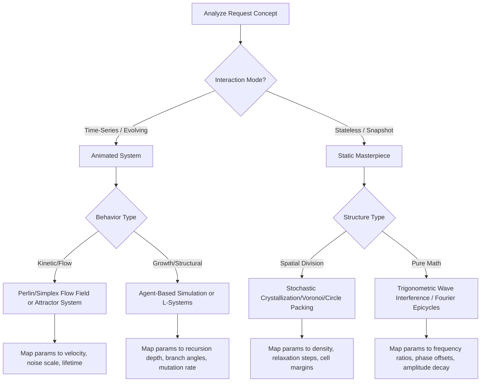

# Algorithmic Art Construction Skill

This skill governs the synthesis of interactive, seeded, high-fidelity generative art using p5.js. It bridges abstract computational philosophy with robust web-accessible interfaces.

## 📂 Progressive Disclosure & Reference Loading

This is **not** a self-contained skill. It relies on pre-configured templates and design libraries. Before beginning execution, you **must** load and parse the following external assets:

1. **`templates/viewer.html`**: The mandatory layout wrapper. Read this file to extract the exact HTML scaffolding, CSS typography, and container IDs.
2. **`templates/generator_template.js`**: The reference file outlining seeded randomness setups, standard parameter classes, and rendering loops.

---

## 🧠 Mindset & Thinking Framework

Before writing a single line of code or drafting your art movement manifesto, ask yourself:

* **The Conceptual Seed**: What is the subtle, underlying conceptual thread of the user's request? How can I embed it as a sophisticated, hidden reference (like a musical quotation) that only domain experts would recognize, while laypeople enjoy the visual beauty?
* **Aesthetic Movement**: What mathematical or organic rules govern this visual world? (e.g., flow fields, orbital mechanics, cellular automata, chaotic attractors, recursive subdivisions, etc.)
* **System Boundaries**: What parameters represent the "DNA" of the generative system? How do they balance each other (e.g., density vs. lifespan)?

---

## 🧭 Decision Tree: Algorithmic Architecture Selection



---

## ⚖️ Trade-offs & Parameter Mapping

| Approach | Performance Cost | Visual Density | Reproducibility Challenges |
| :--- | :--- | :--- | :--- |
| **Perlin Flow Fields** | High (O(N) CPU updates per frame for N agents) | Extremely high, soft gradients and organic trails | Accumulating float rounding errors across browsers. Ensure deterministic time steps. |
| **Voronoi/Circle Packing** | Medium to High (O(N²) collision check or distance fields) | Discrete, structured, crystalline tessellations | Relaxations must execute in a bounded `while` loop to prevent browser hang. |
| **Wave Harmonics** | Low (Direct mathematical evaluation) | Highly geometric, clean lines, moiré patterns | Sensitive to resolution scaling. Must scale equations relative to canvas width/height. |

---

## 🎯 Constraint & Freedom Calibration

* **LOW FREEDOM (Strict Constraints)**:
  * **Branding & Layout**: The sidebar structure, Anthropic Poppins/Lora fonts, light-mode system backgrounds, action button IDs (`#regenerate`, `#reset`, `#download`), and seed controls must remain identical to `templates/viewer.html`.
  * **Randomness**: Absolutely no unseeded `random()` or `noise()`. You must use `randomSeed(seed)` and `noiseSeed(seed)` mapping to the global parameter seed.
* **HIGH FREEDOM (Creative Expression)**:
  * **The Algorithmic Engine**: Complete freedom to design custom drawing behaviors, coordinate transformations, custom class structures, shader-like processing, and render layers.
  * **Tunable Parameters**: Custom configuration of sliders, ranges, color selectors, and numeric inputs mapped to the algorithm.

---

## 🚫 NEVER Anti-Patterns

| Action to NEVER Do | Consequence | Rationale |
| :--- | :--- | :--- |
| **NEVER use unseeded randomness** | The art will look completely different on every page reload, destroying reproducibility. | Seeded randomness is the cornerstone of generative art collection; a given seed must be a permanent coordinate. |
| **NEVER create HTML layout from scratch** | The artifact will break the required sidebar UI, fonts, and action button integrations. | The host environment expects the DOM structures from `templates/viewer.html` to inject and query states. |
| **NEVER draw with non-scaling absolute coordinates** | Re-scaling or downloading at higher resolutions (e.g. 1200x1200 px vs screen size) will break the composition. | All spatial math must be relative to `width` and `height`, or mapped normalized coordinates (0.0 - 1.0). |
| **NEVER allow unlimited particle growth without recycling** | Memory leaks, frame rate drop, and eventual page crash. | Systems must recycle off-screen or dead elements back into an object pool. |

---

## 🛠️ Step-by-Step Implementation Procedure

### Step 1: Conceptualization & Philosophy Formulation

Write a 4-6 paragraph manifesto for the visual movement (e.g., "Quantum Harmonics"). Emphasize craftsmanship, optimization, and aesthetic intent. Highlight that the system represents master-level execution.

### Step 2: Extract Template Structure

Load `templates/viewer.html`. Isolate the variable areas:

* The parameter configurations (Vite/browser script parameters).
* The custom p5.js script inside the `<script>` section.
* The sidebar HTML inputs within the designated container.

### Step 3: Implement Seeded Core

Ensure your initialization block explicitly configures randomness:

```javascript
let params = {
  seed: 12345,
  particleCount: 2000,
  noiseScale: 0.005,
  speed: 2.5
};

function setup() {
  const canvas = createCanvas(1200, 1200);
  canvas.parent('canvas-container');
  randomSeed(params.seed);
  noiseSeed(params.seed);
  // ... rest of setup
}
```

### Step 4: Map Variable UI Inputs

Inject the matching control elements into the sidebar HTML. Tie the `oninput` events directly to parameter state changes and trigger a sketch redraw:

```html
<div class="control-group">
  <label for="speed-slider">Flow Velocity</label>
  <input type="range" id="speed-slider" min="0.5" max="10" step="0.1" value="2.5" oninput="updateParam('speed', this.value)">
</div>
```

---

## 🚨 Failure Modes, Error Handling, and Fallbacks

* **Issue: Sketch lag / low frame rates**
  * *Cause*: Too many active agents or expensive pixel-manipulation operations (e.g. `loadPixels()` inside `draw()`).
  * *Fallback*: Implement dynamic complexity throttling. If `frameRate()` drops below 25 FPS, dynamically decrease particle counts or toggle down-sampling modes.
* **Issue: Black/empty canvas on initialization**
  * *Cause*: Script error prior to `setup()` finishing, or libraries blocked by CORS/CDN issues.
  * *Fallback*: Pre-validate variables using default values (`value || fallback`) and wrap calculations in `try/catch` statements, displaying a soft error overlay instead of a dead container.
* **Issue: HTML layout breaks on resizing**
  * *Cause*: Hardcoded CSS canvas sizing.
  * *Fallback*: Target the container dimension in setup using CSS properties, and hook the window resizing listener to resize the canvas dynamically with `resizeCanvas()`.

## 6) Memory Sync

After generating a high-fidelity algorithmic art piece, a visual movement manifesto, or a technical rendering report, you **MUST** trigger the local memory capture. 

1. Save the final art manifesto, parameter configuration, or technical rendering report as a Markdown file in the project directory.
2. Invoke the capture script: 
   ```bash
   python $MEMORY_SYSTEM_ROOT\capture_knowledge.py <file_path>
   ```
3. This ensures that algorithmic art philosophies, generative parameters, and visual movement definitions are automatically routed to the correct storage (OKF or ChromaDB).
