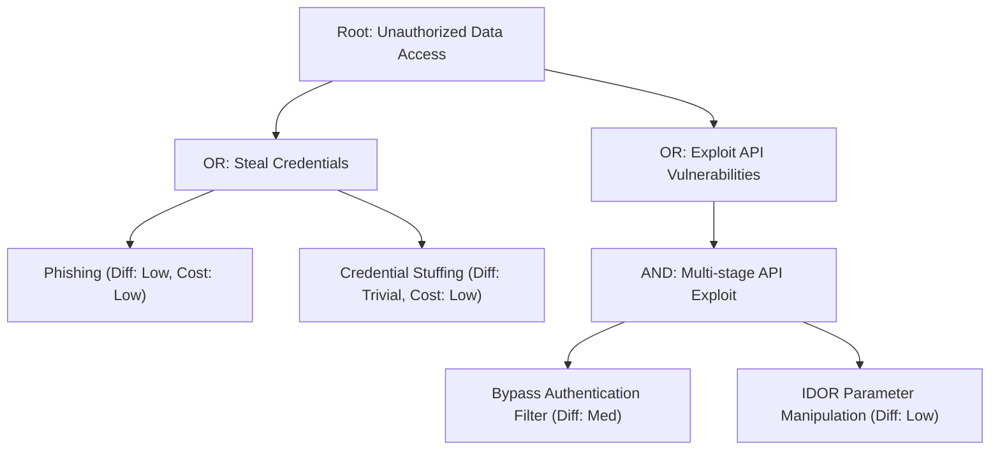

# Threat Modeling Expert Implementation Playbook

This playbook provides an advanced, actionable methodology for finding, evaluating, and documenting threats in software architectures and systems.

---

## 1. Threat Modeling Methodologies Overview

| Methodology | Best Used For | Focus Area | Output |
| :--- | :--- | :--- | :--- |
| **STRIDE** | Feature & Component Architecture | Engineering/Developer-level vulnerability finding | Exhaustive threat categorization per DFD element & interaction |
| **PASTA** | Enterprise & Risk-centric Modeling | Business impact & adversarial context | 7-stage risk-aligned mitigation strategy |
| **Attack Trees** | Critical Asset Protection & Path Analysis | Objective-driven attacker path visualization | AND/OR trees with cost, difficulty & detection scoring |
| **DREAD / OWASP Risk** | Triage & Prioritization | Quantitative / Semi-quantitative risk scoring | Prioritized backlog of mitigations |

---

## 2. STRIDE per Element & Interaction Analysis

### 2.1 STRIDE Threat Mapping Matrix

| Category | Definition | Key Question | Standard Mitigation |
| :--- | :--- | :--- | :--- |
| **S - Spoofing** | Impersonating an entity/user/process | *Can an attacker pretend to be someone or something else?* | Strong authentication, MFA, mTLS, cryptographically signed tokens |
| **T - Tampering** | Modifying data in transit, memory, or storage | *Can an unauthorized modification be made to data or logic?* | Integrity validation (HMAC, signatures), parameter binding, immutability |
| **R - Repudiation** | Denying an action took place | *Can a user perform a malicious act and claim they didn't do it?* | Tamper-proof audit logging, digital signatures, centralized log streaming |
| **I - Information Disclosure**| Exposing confidential data | *Can sensitive data be accessed, intercepted, or leaked?* | Encryption at rest/in transit (TLS 1.3, AES-256-GCM), sanitization, data masking |
| **D - Denial of Service** | Degrading or exhausting system availability | *Can an attacker disrupt normal service operations?* | Rate limiting, token buckets, DDoS mitigation, resource quotas, circuit breakers |
| **E - Elevation of Privilege**| Gaining unauthorized access level | *Can an attacker gain capabilities beyond their authorization?* | Strict RBAC/ABAC, least privilege, robust server-side authorization checks |

### 2.2 STRIDE-per-Element Matrix

| DFD Element | Spoofing | Tampering | Repudiation | Info Disclosure | Denial of Service | Elevation of Privilege |
| :--- | :---: | :---: | :---: | :---: | :---: | :---: |
| **External Entity** (User, External API) | ✅ | | ✅ | | | |
| **Process** (Web Server, Microservice, Worker) | ✅ | ✅ | ✅ | ✅ | ✅ | ✅ |
| **Data Store** (DB, Cache, S3/GCS, File) | | ✅ | ✅ | ✅ | ✅ | |
| **Data Flow** (HTTP, RPC, Pipe, Message Queue) | | ✅ | | ✅ | ✅ | |

### 2.3 Trust Boundary Analysis Checklist
When data traverses a trust boundary (e.g., Internet ➔ DMZ, DMZ ➔ Internal Network, App ➔ Database):
- [ ] Explicit authentication of source entity.
- [ ] Strict schema validation and input sanitization on arrival.
- [ ] Enforced transport encryption (mTLS / TLS 1.3).
- [ ] Authorization checks verifying caller has permissions for requested operation and tenant context.

---

## 3. PASTA (Process for Attack Structure and Threat Analysis) 7-Stage Framework

PASTA is a risk-centric threat modeling methodology that links technical vulnerabilities to business objectives:

```
Stage 1: Define Business Objectives 
   └── Assets, compliance, business impact
Stage 2: Define Technical Scope
   └── Application boundaries, software dependencies, architectural boundaries
Stage 3: Application Decomposition & DFDs
   └── Process flows, data flows, trust boundaries
Stage 4: Threat Analysis
   └── Threat intelligence, actor motivation, attack surface mapping
Stage 5: Vulnerability & Weakness Analysis
   └── Automated scanning, code review, flaw trees, CWE mapping
Stage 6: Attack Modeling & Simulation
   └── Attack trees, exploitability assessment, path validation
Stage 7: Risk & Impact Analysis
   └── Residual risk calculation, mitigation roadmap, business case
```

---

## 4. Attack Tree Construction

### 4.1 Node Types and Logic
- **Root Node**: The high-level attacker goal (e.g., *"Exfiltrate Customer Database"*).
- **OR Nodes**: Alternative paths to achieve the goal (any single child succeeds).
- **AND Nodes**: Multi-step attack sequences (all children required).
- **Leaf Nodes**: Concrete attack actions with attributes (Cost, Difficulty, Detection Risk).

### 4.2 Attribute Scoring Reference
- **Difficulty**: Trivial (1), Low (2), Medium (3), High (4), Expert (5)
- **Cost**: Free (0), Low (1), Medium (2), High (3), Very High (4)
- **Detection Risk**: None (0), Low (1), Medium (2), High (3), Certain (4)



---

## 5. Risk Prioritization & Scoring

### 5.1 Likelihood × Impact Matrix (4x4)

| Likelihood \ Impact | Low (1) | Medium (2) | High (3) | Critical (4) |
| :--- | :---: | :---: | :---: | :---: |
| **Critical (4)** | Medium (4) | High (8) | Critical (12) | Critical (16) |
| **High (3)** | Low (3) | Medium (6) | High (9) | Critical (12) |
| **Medium (2)** | Low (2) | Medium (4) | Medium (6) | High (8) |
| **Low (1)** | Low (1) | Low (2) | Low (3) | Medium (4) |

- **Critical (12–16)**: Immediate blocker. Remediate prior to production release.
- **High (8–11)**: High priority. Target resolution in sprint / 30-day cycle.
- **Medium (4–7)**: Moderate priority. Track in backlog / 60-day roadmap.
- **Low (1–3)**: Low priority / Informational. Accept risk or mitigate opportunistically.

### 5.2 DREAD Scoring Alternative
- **D**amage potential (0-10)
- **R**eproducibility (0-10)
- **E**xploitability (0-10)
- **A**ffected users (0-10)
- **D**iscoverability (0-10)
$$\text{DREAD Score} = \frac{D + R + E + A + D}{5}$$

---

## 6. Standardized Threat Model Report Template

Use the following structure when generating a comprehensive threat modeling report:

```markdown
# Threat Model: [System / Feature Name]

## 1. Executive Summary
- **System Scope**: [Summary of the system, components, and primary workloads]
- **Key Findings**: [Top 3-5 critical risks and architectural gaps]
- **Target Risk Posture**: [Summary of proposed mitigations and timeline]

## 2. Architecture & Data Flow Diagram (DFD)
- **Trust Boundaries**:
  - `TB1`: External Client ➔ Web / API Gateway (Untrusted ➔ DMZ)
  - `TB2`: API Gateway ➔ Internal Microservices (DMZ ➔ Trusted Core)
  - `TB3`: Microservices ➔ Database / Object Storage (Trusted Core ➔ Data Store)

```
[Client] ---> [API Gateway / WAF] ---> [Application Service] ---> [Database]
```

## 3. Asset & Threat Actor Classification
| Asset | Classification | Confidentiality | Integrity | Availability |
| :--- | :--- | :--- | :--- | :--- |
| User Credentials & JWTs | High / Restricted | Critical | Critical | High |
| Customer PII | High / Confidential | Critical | High | Medium |
| System Logs & Telemetry | Medium / Internal | Low | Critical | High |

## 4. Threat Enumeration & Analysis (STRIDE / PASTA)
| Threat ID | Category | Threat Scenario | Impact | Likelihood | Risk Score | Proposed Mitigation | Status |
| :--- | :--- | :--- | :--- | :--- | :--- | :--- | :--- |
| **T-01** | Spoofing | Replay of intercepted authentication tokens | High | Med | High (9) | Enforce TLS 1.3, short token TTLs, and DPoP/binding | Open |
| **T-02** | Tampering | SQL Injection via unvalidated search parameter | Critical | Med | Critical (12) | Prepared statements / parameterized ORM | Planned |
| **T-03** | Elevation | IDOR on customer tenant document endpoints | High | High | High (9) | Enforce tenant-scoped authorization checks | Planned |

## 5. Attack Paths & Trees
[Mermaid diagram or structured attack trees illustrating critical risk paths]

## 6. Actionable Mitigation Roadmap
### Immediate (Pre-deployment)
1. Implement parameterized queries across all database access layers.
2. Add rate limiting on public authentication endpoints.

### Short Term (30-day Cycle)
1. Enable centralized immutable audit logging.
2. Deploy WAF rulesets for OWASP Top 10 defenses.

### Long Term (90-day Cycle)
1. Conduct third-party gray-box penetration test.
2. Implement automated threat modeling / SAST checks into CI/CD.
```
