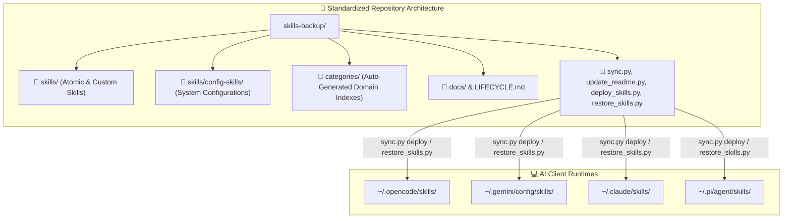

# ADR-0006: Standardize Skills Directory Structure and Eliminate Ambiguous tools/ Taxonomy

## Metadata

| Field | Value |
|---|---|
| ADR ID | ADR-0006 |
| Status | Accepted |
| Created Date | 2026-09-02 |
| Decision Date | 2026-09-02 |
| Effective Date | 2026-09-02 |
| Architecture Domain(s) | Application / Infrastructure / Enterprise / Governance |
| Scope | AI Agent Skill Repository & Multi-Harness Runtime Synchronization |
| Decision Owner | Principal AI Architect / Repository Maintainer |
| Named Decision Maker | jsoehner, AI Systems Team |
| Approval Authority | Architecture Review Board (ARB) |
| Approval Evidence ID | ARB-20260902-DIR-MIGRATE |
| Repository Location | `docs/adr/0006-standardize-skills-directory-structure.md` |
| Tags | skills, directory-structure, refactoring, taxonomy, sync, multi-harness |

---

## Governance Classification

| Field | Value |
|---|---|
| Decision Classification | Strategic |
| Decision Significance / Risk Tier | Tier 1 (High Impact / Enterprise Core) |
| Decision Horizon | Permanent |
| Reversibility | Difficult (Affects synchronization tooling and catalog indices across all client environments) |
| Business Criticality | Tier 1 |
| Data Classification | Internal |
| Regulatory Scope | None |
| Record Classification | Architectural Standard |

---

## Context and Problem Statement

The repository was previously structured with an ambiguous `tools/` root directory alongside root-level composite skills and runtime configuration folders. This caused several architectural and operational issues:

1. **Taxonomic Ambiguity**: In modern AI agentic frameworks (OpenCode, Anthropic Model Context Protocol, Gemini, Claude Code), a clear distinction exists between **Tools** (low-level executable API functions/MCP servers) and **Skills** (modular instruction packs, prompts, workflows, and behavioral protocols containing `SKILL.md`). Housing skills under `tools/` created confusion between tool primitives and agent capabilities.
2. **Synchronization Inconsistencies**: Runtime directories in target AI harness environments expect skills under `~/.opencode/skills`, `~/.gemini/config/skills`, or `~/.claude/skills`. The legacy repository layout caused directory mapping complexity in `sync.py`, `restore_skills.py`, and `deploy_skills.py`.
3. **Registry & Discovery Fragmentation**: Catalog generators had to maintain custom exclusion and inclusion rules to differentiate between root composite skills, atomic skills in `tools/`, and system configuration skills in `config-skills/`.

---

## Decision Drivers

* **Taxonomic Alignment**: Align repository structure directly with OpenCode, Gemini CLI, Claude Code, and MCP platform standards where skills are organized under a dedicated `skills/` hierarchy.
* **Unified Synchronization & Deployment**: Simplify and harden `sync.py`, `restore_skills.py`, and `deploy_skills.py` by establishing predictable directory traversal paths.
* **Catalog Integrity**: Ensure `update_readme.py` dynamically indexes both user custom skills (`skills/`) and system configuration skills (`skills/config-skills/`) without missing categories.
* **Traceability & Auditability**: Maintain full historical traceability across the 599+ skills tracked in `audit_status.json`.

---

## Decision Outcome

**Chosen Strategy: Standardize Repository Hierarchy Under `skills/` (Tier 1 Architecture Change)**

1. **Directory Migration**:
   - Renamed the legacy root `tools/` directory to `skills/`.
   - Placed all atomic skills and system configuration skills (`skills/config-skills/`) cleanly under the `skills/` namespace.
2. **Tooling & Script Alignment**:
   - **`sync.py`**: Updated path resolvers to traverse `skills/` and `skills/config-skills/`, skipping nested subdirectories while preserving root-level and group-level syncs.
   - **`restore_skills.py`**: Updated directory walk filters to flatten and deploy skills directly to client target directories without skipping valid top-level skills.
   - **`deploy_skills.py`**: Updated scanner to discover atomic skills from `skills/` and resolve composite dependency graphs accordingly.
   - **`update_readme.py`**: Updated frontmatter extraction and category scrapers to dynamically generate `categories/*.md` and update `README.md` pointing to `skills/...`.
   - **`debug_scan.py`**: Updated diagnostics to validate `skills/`.
3. **Metadata & Status Tracking**:
   - Migrated all 463 tool path entries in `audit_status.json` from `tools/*` to `skills/*`.
4. **Documentation Refresh**:
   - Synchronized `README.md`, `CONTRIBUTING.md`, `LIFECYCLE.md`, and `CHANGELOG.md` (`v1.2.0`).

---

## Architecture Diagram

---

## Consequences & Trade-Offs

### Positive Consequences
* **Clarity & Consistency**: Eliminates terminology collision between agent skills and MCP tools.
* **Deterministic Synchronization**: Prevents nested directory bugs and ensures 100% of skills are detected and deployable.
* **Full Domain Coverage**: Config skills (363 items) and user skills (463 items) are cataloged across 12 domain categories.
* **Multi-Client Portability**: Out-of-the-box support for OpenCode, Gemini, Claude, and Pi harnesses.

### Negative Consequences / Risks
* **Downstream Reference Breaks**: Any external bookmarks or scripts hardcoded to `tools/` must be updated to `skills/`.
* **Git History Tracking**: File moves require `--follow` in `git log` to trace history across the rename.

### Mitigation Strategies
* Standardized git move (`git mv`) preserved history in Git object store.
* Automated regeneration of catalog via `python3 update_readme.py`.
* Added validation checks in `deploy_skills.py` and `debug_scan.py`.

---

## Validation & Verification

The decision was validated via the following automated operational suites:
1. **Catalog Generation**: `python3 update_readme.py` successfully mapped 463 user skills and 363 config skills.
2. **Harness Dependency Engine**: `python3 deploy_skills.py --dry-run --harness pi` resolved full dependency DAG.
3. **Category Inspection**: `python3 sync.py -l` verified all 12 custom and 7 config domain categories.
4. **Audit Schema Validation**: `audit_status.json` passed schema validation with 0 orphaned `tools/` keys.
