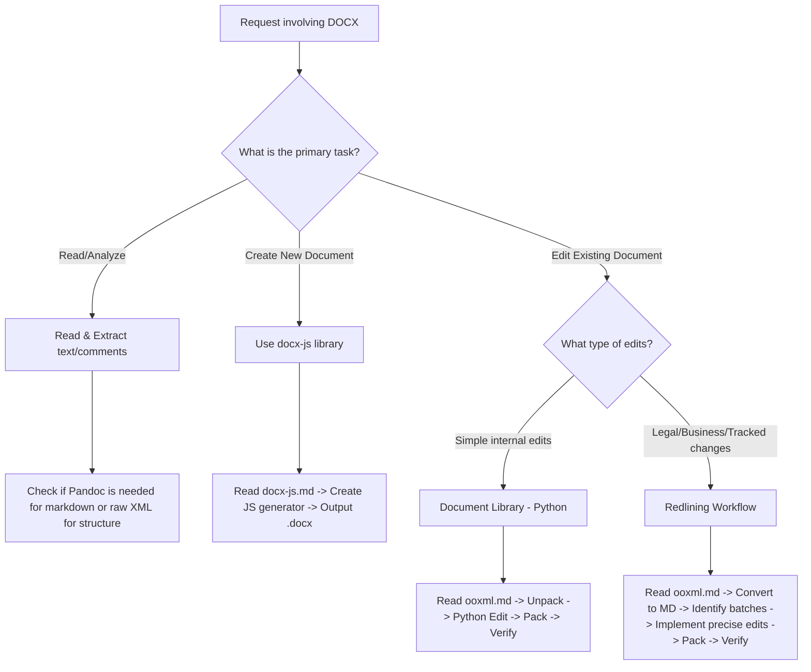

---
name: docx
description: |
  Comprehensive document creation, editing, and analysis supporting tracked changes, comments, formatting preservation, and text extraction. Trigger when a user needs to: (1) Read, parse, or analyze Word documents (.docx), (2) Create new Word documents with specific templates, styles, or formatting, (3) Modify content using redlining or tracked changes, or (4) Convert documents to PDFs or images. Keywords: docx, word, ooxml, redline, tracked changes, pandoc, docx-js, libreoffice, openxml, unpack, pack, comment.

# DOCX Creation, Editing, and Analysis

This skill guides you through creating, reading, editing, and analyzing Word documents (.docx) using low-level OOXML manipulation, JS libraries, and command-line conversion tools.

## 1. Reference Loading & Progressive Disclosure

This folder contains critical reference documentation. Follow these strict loading rules:
- **For Creating New Documents**: You **MUST** read [docx-js.md](./docx-js.md) completely before generating any code.
- **For Modifying Existing Documents**: You **MUST** read [ooxml.md](./ooxml.md) completely before executing scripts or modifying XML.
- **NEVER** set range limits when loading these reference markdown files.

## 2. Trigger Scenarios & Decision Trees

### Workflow Decision Tree


## 3. Constraints & Freedom Calibration

*   **XML Document Structure (Low Freedom)**: Elements in `word/document.xml` must strictly conform to the Open XML schema. Modifying node relationships or namespaces incorrectly will corrupt the document.
*   **Tracked Changes / Redlining (Low Freedom)**: Do not delete large blocks of text and replace them with generic tags. You must use precise `<w:del>` and `<w:ins>` nodes, reusing existing run properties and RSIDs to avoid cluttered histories.
*   **Styling and Formatting (Medium Freedom)**: Retain existing style definitions unless instructed to refactor. Match margins, paragraph spacing, and fonts of the original template.

## 4. Expert-Level Knowledge Delta

### Redlining: RSID Preservation & Precise Replacement
In Open XML, Revision Save IDs (RSIDs) are used to track which session created/modified elements. When editing text with tracked changes, you must preserve unchanged surrounding elements and isolate only the modified text within the run hierarchy.

**Incorrect Pattern (Replaces entire run, losing metadata and breaking history)**:
```xml
<!-- BEFORE -->
<w:r w:rsidR="001A2B3C"><w:t>The project will deliver 10 units.</w:t></w:r>

<!-- AFTER (Replaced entire run with a deletion/insertion pair) -->
<w:del w:author="User" w:date="2026-07-17T18:00:00Z">
  <w:r><w:delText>The project will deliver 10 units.</w:delText></w:r>
</w:del>
<w:ins w:author="User" w:date="2026-07-17T18:00:00Z">
  <w:r><w:t>The project will deliver 20 units.</w:t></w:r>
</w:ins>
```

**Correct Pattern (Splits run, keeps original RSID on unchanged parts, inserts targeted change)**:
```xml
<!-- Splitted runs: Unchanged text + Deletion + Insertion + Unchanged text -->
<w:r w:rsidR="001A2B3C"><w:t>The project will deliver </w:t></w:r>
<w:del w:author="User" w:date="2026-07-17T18:00:00Z" w:id="1">
  <w:r><w:delText>10</w:delText></w:r>
</w:del>
<w:ins w:author="User" w:date="2026-07-17T18:00:00Z" w:id="2">
  <w:r><w:t>20</w:t></w:r>
</w:ins>
<w:r w:rsidR="001A2B3C"><w:t> units.</w:t></w:r>
```

## 5. Mindset & Actionable Procedures

### Self-Inquiry Framework
*   *Am I editing a document that requires revision history (tracked changes) for legal/business audit trails?*
*   *Have I verified if pandoc can perform a high-fidelity markdown conversion for my analysis first?*
*   *If I write an OOXML edit script, does it modify `word/document.xml` using secure parsing (`defusedxml`)?*
*   *Did I test packing and validating the output before returning success to the user?*

### Step-by-Step Execution Sequence
1.  **Extract & Audit**:
    *   Extract document markdown: `pandoc --track-changes=all input.docx -o current.md`.
    *   Audit formatting and comments by unpacking: `python ooxml/scripts/unpack.py input.docx unpacked_dir`.
2.  **Define Batches**:
    *   Group changes into small batches (3–10 changes). Keep track of target text contexts (grep unique anchor phrases, do not rely on markdown line numbers).
3.  **Edit & Validate (Iterative)**:
    *   Load `ooxml.md` to review Document API.
    *   Run Python script on unpacked directory -> Run `python ooxml/scripts/validate.py unpacked_dir --original input.docx` to verify structure.
4.  **Repack & Verify**:
    *   Repack: `python ooxml/scripts/pack.py unpacked_dir output.docx`.
    *   Generate a test markdown diff: `pandoc --track-changes=all output.docx -o verification.md` and check that the edits match specifications.

## 6. Anti-Patterns & Never-Lists

| Action | Why Avoid It | Correction/Alternative |
| :--- | :--- | :--- |
| **NEVER** use line numbers from converted markdown files to reference XML lines. | Markdown conversion ignores XML tag boundaries; line numbers drift constantly. | Grep for unique textual anchor strings directly inside `word/document.xml` before editing. |
| **NEVER** edit any files without first loading `docx-js.md` (creation) or `ooxml.md` (editing). | Results in syntax errors, broken XML namespaces, and document corruption. | Load references completely without range parameters prior to script generation. |
| **NEVER** replace entire paragraphs to edit a single word or phrase. | Destroys original revision histories and run-level styles (bold, font properties). | Perform minimal, precise run splitting: `[Unchanged] + [Del] + [Ins] + [Unchanged]`. |
| **NEVER** pack a document without running `validate.py`. | Uncaught XML schema violations will cause Word to report the file as corrupt on load. | Always execute `validate.py` in the unpacked directory before repacking. |
| **NEVER** use standard xml libraries for untrusted files. | Vulnerable to XML Entity Expansion (Billion Laughs) and XXE attacks. | Use `defusedxml` or python-docx APIs that employ secure parsing defaults. |

## 7. Error Scenarios & Fallbacks

### Corrupt Document Error upon Word Opening
*   *Scenario*: Word throws "Word found unreadable content in..." when trying to open the generated or edited `.docx`.
*   *Fallback*: Unpack the corrupt document. Run `python ooxml/scripts/validate.py` on the unpacked folder. Fix schema/validation issues (typically missing matching closing tags, incorrect attributes, or broken relationships in `_rels/`), repack, and test.

### Pandoc Extraction Failure
*   *Scenario*: Pandoc fails to convert the `.docx` to markdown, or outputs raw formatting codes.
*   *Fallback*: Fall back to raw XML parsing using Python. Extract plain text content directly from the `w:t` tags in `word/document.xml` using a simple BeautifulSoup/lxml helper script.

### Missing RSID Suggestion
*   *Scenario*: The `unpack.py` script fails or does not output an RSID suggestion.
*   *Fallback*: Open `word/settings.xml` and locate the `<w:rsids>` element. Use any existing RSID from that list or use a fallback value (e.g., `00A1B2C3`) that does not clash with other runs.

## 8) Memory Sync

After a technical manual, architecture guide, or deep-dive documentation is completed, you **MUST** trigger the local memory capture. 

1. Save the final documentation as a Markdown file in the project directory.
2. Invoke the capture script: 
   ```bash
   python3 ~/memory_system/capture_knowledge.py <file_path>
   ```
3. This ensures that new high-level architectural rules, system designs, and technical standards are automatically routed to the correct storage (OKF or ChromaDB).
