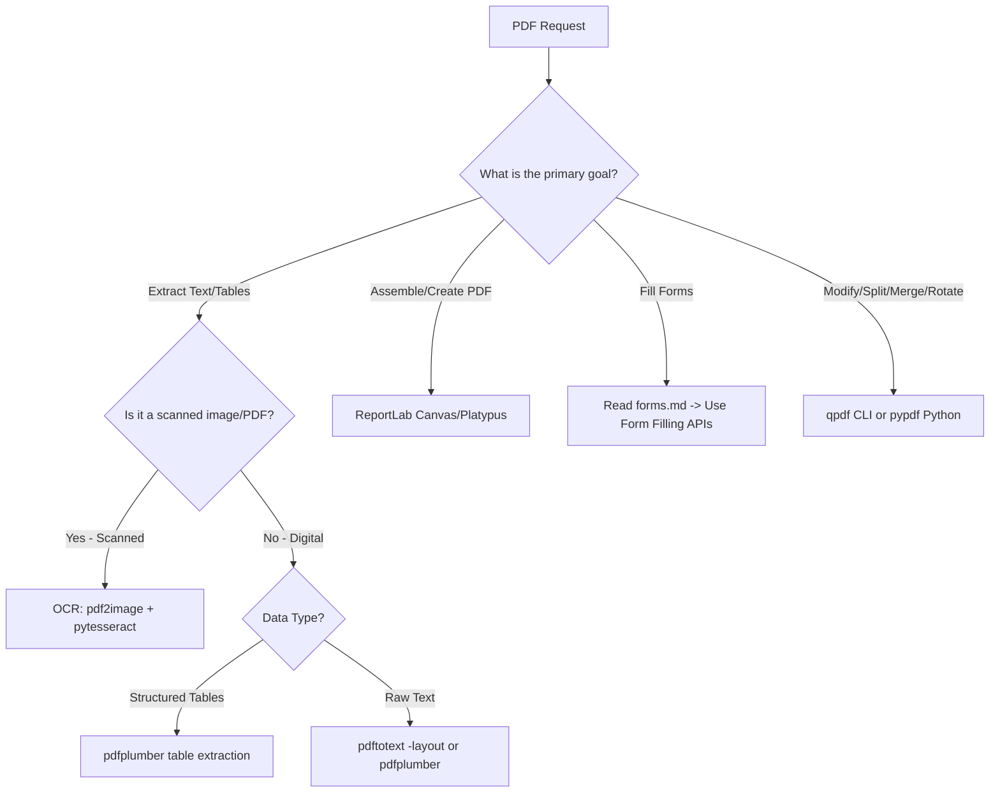

# PDF Processing Guide

This skill guides you through parsing, creating, editing, and converting PDF documents using command-line tools and Python/JS libraries.

---

## 1. Reference Loading & Progressive Disclosure

This folder contains additional reference documentation:
- **For AcroForm and Form Filling**: You **MUST** read [forms.md](file:///home/jsoehner/yuv-skills-backup/document-skills/pdf/forms.md) completely before proceeding.
- **For Advanced PDFium2 / JS (pdf-lib) Tasks**: You **MUST** read [reference.md](file:///home/jsoehner/yuv-skills-backup/document-skills/pdf/reference.md) completely.
- **NEVER** set range limits when reading these reference files.

---

## 2. Trigger Scenarios & Decision Trees

### Workflow Decision Tree


---

## 3. Constraints & Freedom Calibration

*   **Form Field Names (Low Freedom)**: When filling interactive forms, field keys must match the exact AcroForm dictionary keys. Changing spelling or case will fail to populate the values.
*   **Coordinate System (Low Freedom)**: PDF canvas coordinates use a 72 points-per-inch scale with the origin `(0,0)` at the bottom-left corner of the page. Text placement must be calculated manually from this point.
*   **Content Generation Layout (Medium Freedom)**: When using ReportLab, use `Platypus` (flowables like `Paragraph`, `Table`, `Spacer`) for automatic page-budgeting. Use direct `canvas` drawing only for absolute positioning (certificates, single-page flyers).

---

## 4. Expert-Level Knowledge Delta

### Grid Systems & Canvas Coordinates (72 Points/Inch)
ReportLab canvases measure the page size in points. For a standard Letter page (8.5 × 11 inches), the canvas dimensions are 612 × 792 points. Always design with explicit margins:
- Left margin: $54\text{ pt}$ ($0.75\text{ in}$)
- Right boundary: $612 - 54 = 558\text{ pt}$
- Top boundary: $792 - 54 = 738\text{ pt}$

To avoid text overflow when drawing strings directly:
```python
# BAD: Drawing arbitrary text without wrapping
canvas.drawString(100, 700, "A very long sentence that will overflow the page boundary...")

# GOOD: Using Paragraph style for auto-wrapping within layout boundaries
from reportlab.platypus import Paragraph
from reportlab.lib.styles import ParagraphStyle

style = ParagraphStyle('Normal', fontSize=10, leading=12)
p = Paragraph("A very long sentence that will wrap correctly.", style)
p.wrapOn(canvas, 458, 100) # Wrap text width = 458 pt (558 - 100)
p.drawOn(canvas, 100, 700)
```

---

## 5. Mindset & Actionable Procedures

### Self-Inquiry Checklist
*   *Is this PDF digital or scanned? (Test by trying to read its text stream. If empty or junk, fall back to OCR).*
*   *Do I need to extract tabular data? If yes, should I use `pdfplumber` with default settings, or adjust `table_areas` to isolate columns?*
*   *When creating reports, should I use `SimpleDocTemplate` to automatically handle page headers and footers?*
*   *Have I checked the PDF security settings to ensure it isn't encrypted?*

### Step-by-Step Execution Sequence
1.  **Inspect**: Analyze PDF structure using `qpdf --show-pages` or print `len(reader.pages)` via `pypdf`.
2.  **Extract / Fill**:
    *   For text: `pdftotext -layout input.pdf output.txt`.
    *   For forms: Load `forms.md`, fetch field names, and write the Python fill script.
3.  **Compile / Generate**:
    *   Create python scripts utilizing ReportLab. Test formatting with minor mock data first.
4.  **Validate**: Verify output files by converting pages to images using `pdftoppm` and inspecting layout alignment.

---

## 6. Anti-Patterns & Never-Lists

| Action | Why Avoid It | Correction/Alternative |
| :--- | :--- | :--- |
| **NEVER** assume PDF text extraction returns words in visual reading order. | Internally, PDFs render strings based on stream commands, not logical page flow. | Use `pdftotext -layout` or `pdfplumber.extract_text(layout=True)` to parse columns. |
| **NEVER** draw text using Canvas without setting both Font and Leading. | Font sizes default to tiny sizes or system fallbacks, causing text overlap. | Always call `canvas.setFont("Helvetica", 10)` before placing text. |
| **NEVER** overwrite an existing PDF without keeping a backup copy. | Python file writes can crash mid-operation, permanently corrupting the source file. | Always write output to a new file name (e.g., `input_filled.pdf`). |
| **NEVER** run OCR (`pytesseract`) on high-resolution vector PDFs. | It is extremely slow and results in worse text accuracy than direct extraction. | Always try extracting text programmatically first. Fall back to OCR only if text is empty. |

---

## 7. Error Scenarios & Fallbacks

### Empty Text Extraction
*   *Scenario*: `page.extract_text()` returns an empty string or white spaces, but text is visible.
*   *Fallback*: The PDF is likely scanned or uses custom font encodings. Fall back to OCR using the `pdf2image` and `pytesseract` pipeline.

### Form Field Not Appearing
*   *Scenario*: Python script successfully writes to a form field, but the output file displays blank fields in PDF viewers.
*   *Fallback*: Ensure the AcroForm `/NeedAppearances` flag is set to `True` in the PDF dictionary, forcing the reader to draw the field value on open. Alternatively, flatten the fields after filling.

### ReportLab Platypus Page Break Overflow
*   *Scenario*: Content is slightly too long, creating an accidental blank page at the end of the document.
*   *Fallback*: Reduce spacer heights, tighten padding/margins in `ParagraphStyle`, or use `KeepTogether` blocks to prevent early splits of headers and content.


## Memory Sync

After completing key technical findings, architectural decisions, code refactorings, or risk assessments, you **MUST** trigger the local memory capture.

1. Save the final summary or artifact as a Markdown file in the project directory.
2. Invoke the capture script:
   ```bash
   python3 ~/memory_system/capture_knowledge.py <file_path>
   ```
3. This ensures that new learnings, policies, and technical snippets are automatically routed to the correct local storage (OKF or ChromaDB).
