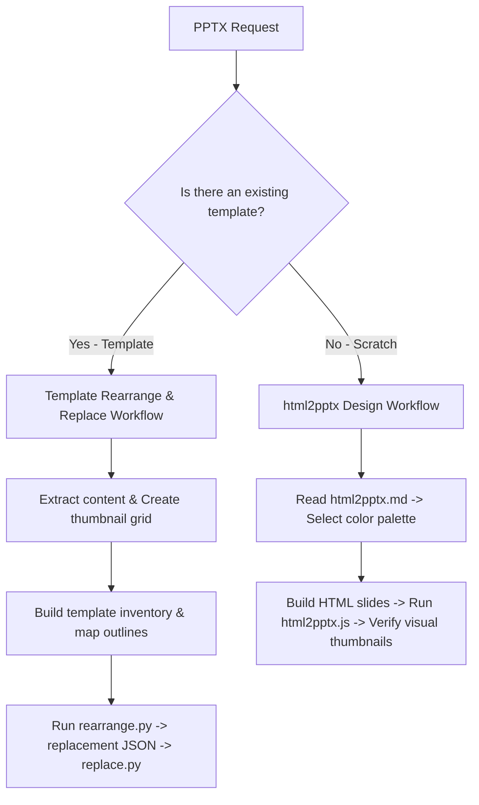

# PPTX Creation, Editing, and Analysis

This skill guides you through constructing and refining PowerPoint presentations (.pptx) using HTML-to-PPTX rendering, low-level OOXML manipulation, or template-based JSON replacement.

---

## 1. Reference Loading & Progressive Disclosure

This folder contains additional reference documentation. Follow these strict loading rules:
- **For Creating Presentations without a Template**: You **MUST** read [html2pptx.md](file:///home/jsoehner/yuv-skills-backup/document-skills/pptx/html2pptx.md) completely.
- **For Editing Existing Presentations via XML**: You **MUST** read [ooxml.md](file:///home/jsoehner/yuv-skills-backup/document-skills/pptx/ooxml.md) completely.
- **NEVER** set range limits when loading these reference markdown files.

---

## 2. Trigger Scenarios & Decision Trees

### Workflow Decision Tree


---

## 3. Constraints & Freedom Calibration

*   **Template Mapping (Low Freedom)**: Do not guess shape indices or names. You must extract and match shape keys exactly from the JSON inventory output by `inventory.py`. Unmapped shapes will be automatically cleared.
*   **Web Safe Fonts (Low Freedom)**: Only use standard fonts: Arial, Helvetica, Times New Roman, Georgia, Courier New, Verdana, Tahoma, Trebuchet MS, Impact. Custom web fonts will not render correctly.
*   **Color & Graphic Schemes (High Freedom)**: Feel free to design custom, creative color combinations matching the client's industry/topic. Avoid standard default palettes.

---

## 4. Expert-Level Knowledge Delta

### Two-Column Split Layout & Spacing
When presenting a chart, table, or large figure alongside descriptive text, **NEVER stack them vertically**. Instead, use a two-column flexbox design with an asymmetric split (e.g., 40% text, 60% chart) to optimize slide real estate.

```html
<!-- CORRECT TWO-COLUMN LAYOUT -->
<div style="display: flex; flex-direction: row; justify-content: space-between; height: 320pt;">
  <div style="width: 38%; padding-right: 2%;">
    <h3>Key Takeaways</h3>
    <ul>
      <li>Sales grew 14% quarter-over-quarter.</li>
      <li>Enterprise clients account for 60% of total revenue.</li>
    </ul>
  </div>
  <div style="width: 60%;" class="placeholder">
    <!-- Chart / Table goes here -->
  </div>
</div>
```

---

## 5. Mindset & Actionable Procedures

### Self-Inquiry Checklist
*   *Before writing code, what is the design aesthetic? Does the chosen color scheme match the topic?*
*   *Have I created slide thumbnails and inspected them for overlapping text or clipping boxes?*
*   *For template duplication, did I map the zero-indexed slide positions correctly?*
*   *Have I checked the paragraph JSON syntax (bold, color, bullet, level) when filling shape replacements?*

### Step-by-Step Execution Sequence
1.  **Analyze Template**:
    *   Generate thumbnails: `python scripts/thumbnail.py template.pptx workspace/thumbs`.
    *   Catalog layout options in `template-inventory.md`.
2.  **Outline & Map**:
    *   Choose matching layouts based on number of columns and content type. Create `outline.md`.
3.  **Assemble**:
    *   For templates: Run `rearrange.py`, extract text inventory, write replacements, and run `replace.py`.
    *   For HTML slides: Write slide templates, render via `html2pptx.js`.
4.  **Audit Visually**:
    *   Generate final thumbnails and verify:
        *   No text collisions/truncations.
        *   High contrast ratios.
        *   Consistent alignments.

---

## 6. Anti-Patterns & Never-Lists

| Action | Why Avoid It | Correction/Alternative |
| :--- | :--- | :--- |
| **NEVER** vertically stack tables/charts beneath long bullet points. | Causes text to overflow the bottom margin of the slide and breaks visual grids. | Use a two-column horizontal layout (text on left, visual element on right). |
| **NEVER** reference non-existent shapes or slide IDs in replacement JSONs. | The replacement script will throw validation errors and refuse to process the file. | Verify shape IDs directly from the output of `inventory.py` before replacing. |
| **NEVER** include manual bullet markers (•, -, *) inside replacement paragraph text. | PowerPoint handles list bullets automatically; manual characters result in double bullets. | Use `"bullet": true` and specify `"level": 0` in the paragraph properties. |
| **NEVER** skip visual validation via thumbnail grid. | AI text generators often cause box boundaries to overlap or run off-screen. | Generate thumbnails and inspect the results visually before declaring success. |

---

## 7. Error Scenarios & Fallbacks

### Shape Alignment / Text Overflow
*   *Scenario*: Text is too long for the placeholder box and is cut off or wraps into subsequent elements.
*   *Fallback*: Reduce font size (e.g., from `14` to `12` or `11`), shorten the text copy, or adjust the placeholder bounding dimensions in the template or HTML.

### Validation Failures
*   *Scenario*: The `replace.py` script returns error: `Shape 'shape-X' not found on 'slide-Y'`.
*   *Fallback*: Re-run `inventory.py` on the modified `working.pptx` file to get a fresh copy of current slide IDs and shape mapping keys. Adjust replacement JSON keys accordingly.

### Conversion to Images Failures
*   *Scenario*: `soffice` or `pdftoppm` fails to generate thumbnails.
*   *Fallback*: Check if LibreOffice is locked by a zombie process. Clean lockfiles and run `soffice --headless` manually in the background. If poppler is missing, read the text content from XML as fallback.