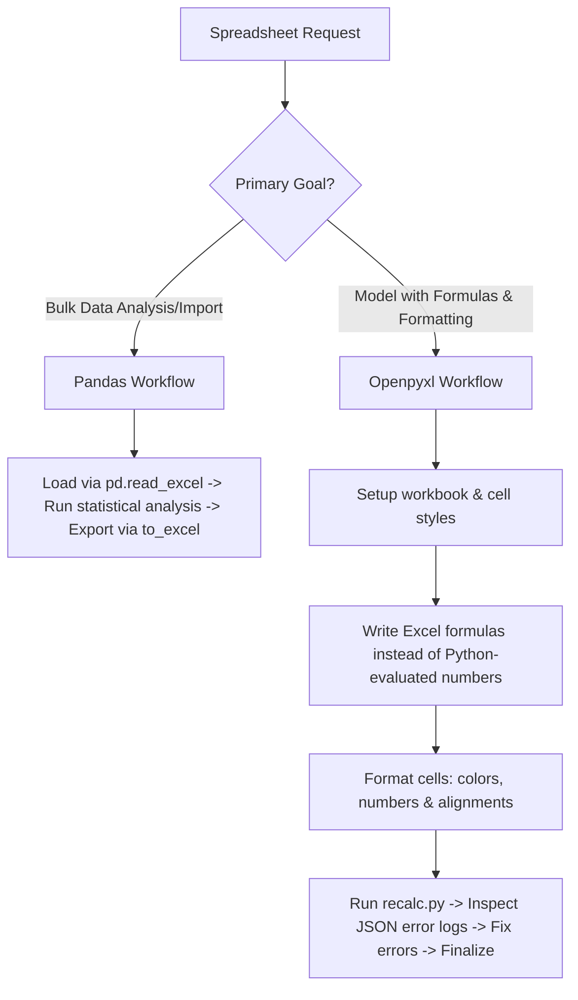

# Spreadsheet Creation, Editing, and Analysis

This skill guides you through constructing, parsing, updating, and recalculating Excel spreadsheets using openpyxl, pandas, and headless LibreOffice macros.

---

## 1. Reference Loading & Progressive Disclosure

This is a self-contained skill folder.
- Execute calculations and validations using the local [recalc.py](file:///home/jsoehner/yuv-skills-backup/document-skills/xlsx/recalc.py) script.
- Do NOT look for other external reference files unless specified.

---

## 2. Trigger Scenarios & Decision Trees

### Workflow Decision Tree


---

## 3. Constraints & Freedom Calibration

*   **Excel Formulas (Low Freedom)**: Do not compute outcomes in Python and write the output values. You must write the actual Excel formula string (e.g., `=SUM(B2:B9)`) to the cells to maintain the sheet's dynamic state.
*   **Financial Color Codes (Low Freedom)**: Standard colors are required for models: Blue text for inputs, Black text for formulas, Green text for internal links, Red text for external files, and Yellow fill for highlights.
*   **Data Structures (Medium Freedom)**: Layout tables clearly with headers containing currency designations. Avoid vertical text or merged cells in tables where sorting is required.

---

## 4. Expert-Level Knowledge Delta

### Industry Financial Model Standards & Formatting

#### Color Codes
- **Blue text (RGB: 0,0,255)**: Hardcoded inputs and scenario parameters.
- **Black text (RGB: 0,0,0)**: Formulas and calculations.
- **Green text (RGB: 0,128,0)**: Cross-sheet references.
- **Red text (RGB: 255,0,0)**: Cross-workbook links.
- **Yellow background (RGB: 255,255,0)**: Highlighted cells needing review.

#### Formatting Patterns
- **Multiples**: `0.0x` (e.g., Valuation Multiples EV/EBITDA).
- **Percentages**: `0.0%` (always include one decimal point).
- **Negatives**: Parentheses `(123)` instead of `-123`.
- **Zeros**: Display as dashes `-` using: `_($* #,##0_);_($* (#,##0);_($* "-"_);_(@_)` or similar custom format strings.

---

## 5. Mindset & Actionable Procedures

### Self-Inquiry Checklist
*   *Am I writing formulas? Did I confirm that LibreOffice is available to execute `recalc.py` to populate values and scan for formula errors?*
*   *Have I segregated inputs (hardcodes) from calculations (formulas) into separate cells?*
*   *Are my headers clearly specifying units (e.g., "Revenue ($mm)")?*
*   *Did I use relative formulas (`=B5*(1+$B$6)`) instead of inline static numbers (`=B5*1.05`)?*

### Step-by-Step Execution Sequence
1.  **Draft Model Structure**:
    *   Separate sheets/sections into Assumptions, Calculations, and Output Summaries.
2.  **Code implementation (openpyxl)**:
    *   Build worksheet. Write formula strings.
    *   Apply cell fonts, fills, alignments, and number formats.
3.  **Recalculation (MANDATORY)**:
    *   Run: `python recalc.py output.xlsx`
4.  **Error Correction**:
    *   Inspect output JSON: check for `#REF!`, `#DIV/0!`, `#VALUE!`, `#NAME?`.
    *   Adjust indices or string references and run `recalc.py` again until success.

---

## 6. Anti-Patterns & Never-Lists

| Action | Why Avoid It | Correction/Alternative |
| :--- | :--- | :--- |
| **NEVER** write computed values to cells when they can be represented as formulas. | Breaks the spreadsheet's interactivity and ability to recalculate dynamically. | Write formula strings like `=SUM(...)` or `=AVERAGE(...)` to cells. |
| **NEVER** save a workbook using openpyxl with `data_only=True` if you intend to edit it. | Saving in this mode wipes out all formulas and permanently converts them to values. | Use `data_only=True` only for reading data; keep it `False` when writing/saving. |
| **NEVER** skip running `recalc.py` after applying cell formulas. | Excel will display blank or uncalculated cells, or hide latent formula errors. | Execute `recalc.py` on the saved sheet to force evaluation and check for bugs. |
| **NEVER** hardcode values inside formula math (e.g., `=A1*1.08`). | Makes model parameters invisible and hard to adjust for scenarios. | Reference a separate assumptions cell containing `1.08`. |

---

## 7. Error Scenarios & Fallbacks

### Recalculation Script Fails (LibreOffice Lock)
*   *Scenario*: `recalc.py` hangs or fails because LibreOffice cannot initialize.
*   *Fallback*: A LibreOffice lockfile (`.~lock.filename.xlsx#`) may exist. Find and delete any lockfiles in the target directory, or terminate active soffice processes: `pkill -f soffice`.

### `#DIV/0!` Formula Error
*   *Scenario*: The `recalc.py` script returns a division by zero error for several projection periods.
*   *Fallback*: Wrap the formula inside an `IF` or `IFERROR` function. E.g., change `=B4/B5` to `=IF(B5=0, 0, B4/B5)` or `=IFERROR(B4/B5, 0)`.

### `#REF!` Error After Insert/Delete Row
*   *Scenario*: Inserting or deleting rows programmatically breaks references in formulas elsewhere in the sheet.
*   *Fallback*: When inserting rows via openpyxl, formulas do not auto-update. You must manually adjust the ranges of affected formulas in your script to account for the row shift.


## Memory Sync

After completing key technical findings, architectural decisions, code refactorings, or risk assessments, you **MUST** trigger the local memory capture.

1. Save the final summary or artifact as a Markdown file in the project directory.
2. Invoke the capture script:
   ```bash
   python3 ~/memory_system/capture_knowledge.py <file_path>
   ```
3. This ensures that new learnings, policies, and technical snippets are automatically routed to the correct local storage (OKF or ChromaDB).
