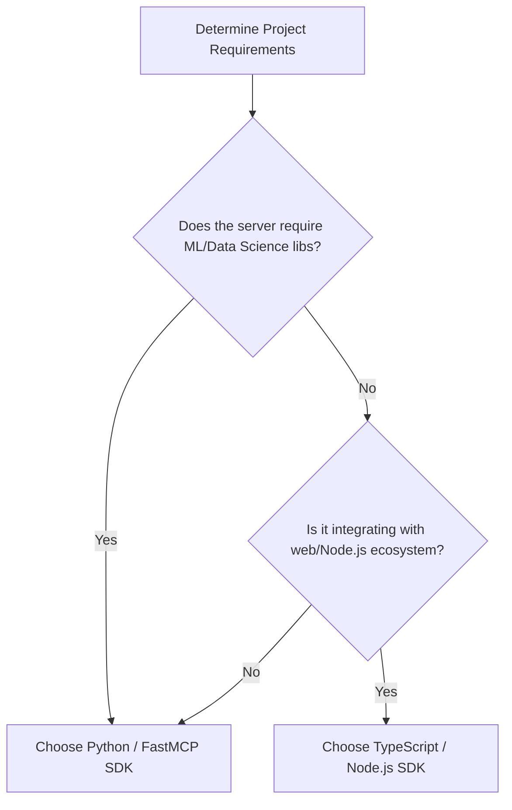

---

name: mcp-builder

description: |

  "Expert design, implementation, and evaluation of Model Context Protocol (MCP) servers. Trigger this skill when asked to build, modify, test, or evaluate MCP servers (FastMCP or official SDKs) in Python or TypeScript. Keywords: MCP server, Model Context Protocol, FastMCP, typescript-sdk, mcp.tool, tools, resources, prompts, evaluation.py, reference/."


  "Expert design, implementation, and evaluation of Model Context Protocol (MCP) servers. Trigger this skill when asked to build, modify, test, or evaluate MCP servers (FastMCP or official SDKs) in Python or TypeScript. Keywords: MCP server, Model Context Protocol, FastMCP, typescript-sdk, mcp.tool, tools, resources, prompts, evaluation.py, reference/."


license: Complete terms in LICENSE.txt

---


# MCP Server Development Guide


This skill coordinates the creation of high-performing Model Context Protocol (MCP) servers. You **MUST** load the external reference files and run scripts as indicated in the workflow steps below.


---


## SDK Decision Tree





### Framework Selection & Strategy


| SDK Language | Recommended Framework | Main Reference Guide (MANDATORY Loading) | Best Use Case |

| :--- | :--- | :--- | :--- |

| **Python** | FastMCP (Official SDK) | [🐍 Python Guide](./reference/python_mcp_server.md) | Rapid tool definition via decorators; projects leveraging NumPy, Pandas, or AI models. |

| **TypeScript** | `@modelcontextprotocol/sdk` | [⚡ TypeScript Guide](./reference/node_mcp_server.md) | High-concurrency environments; tight integration with Webpack/Vite or NPM modules. |


---


## Phased Development Workflow


### Phase 1: Deep Research and Tool Design

1. **Tool Abstracting**: Do NOT replicate raw API endpoints. Consolidate operations into atomic agent workflows (e.g. create a single tool `sync_and_reconcile` rather than separate `get_status` and `update_status` tools).

2. **Context Budgets**: Keep outputs clean. Default to Markdown tables or clean JSON lists, truncating data at ~20,000 characters.

3. **MANDATORY REFERENCE LOADING**: You **MUST** view the core guidelines in the best practices manual before planning the tool schemas:

   > **Action**: Read [📋 MCP Best Practices](./reference/mcp_best_practices.md) via `view_file` to learn about schema layouts and cursor pagination.


### Phase 2: Implementation & SDK Setup

Determine your implementation language and trigger the appropriate loading path:

* **For Python servers**:

  > **Action**: Read [🐍 Python Implementation Guide](./reference/python_mcp_server.md) completely before writing code.

* **For TypeScript servers**:

  > **Action**: Read [⚡ TypeScript Implementation Guide](./reference/node_mcp_server.md) completely before writing code.


*Key Principle*: Define inputs using strict validators (Pydantic v2 in Python, strict Zod in TS) and document error returns within the tool's docstring so the LLM understands how to recover from failure.


### Phase 3: Build & Execution Testing

* **Stdio Block Prevention**: MCP servers communicate over standard input/output. Running them directly in your primary interactive bash session will cause it to hang indefinitely.

* **Safe CLI Testing**:

  ```bash

  # Check syntax without starting long-running process

  python -m py_compile server.py

  # Or compile TypeScript

  npm run build

  ```

  To test execution, run the server using the evaluation harness, or within a background task or TMUX window.


### Phase 4: Automated Evaluations

To ensure your MCP tools are discoverable and work as intended:

1. Create a `qa_pairs.xml` file with 10 complex multi-step scenario questions.

2. **MANDATORY REFERENCE LOADING**: Read [✅ Evaluation Guide](./reference/evaluation.md) to understand how the test suite parses questions and expected results.

3. Execute the testing script to run the harness:

   ```bash

   python scripts/evaluation.py --server "python server.py" --evals reference/evaluation.md

   ```


---


## NEVER Anti-Patterns


| Action | Why | Consequences | Correct Alternative |

| :--- | :--- | :--- | :--- |

| **NEVER** run the MCP server executable directly in the active shell without a timeout or runner harness. | The server starts listening on stdio and locks up the current bash process, blocking further tools. | The shell hangs; requires task termination and restarts. | Use `scripts/evaluation.py` or run within a background task. |

| **NEVER** return massive raw JSON lists (e.g. database dumps) to the agent context. | High token usage dilutes the agent's focus and exhausts the system's context window. | Tool execution failures, high API latency, lost context. | Implement pagination parameters, result filtering, and string truncation limits. |

| **NEVER** write vague or missing tool descriptions or omit parameter details. | The LLM decides which tool to call based on descriptions. Vague text prevents proper selection. | The agent fails to trigger the tool, or calls it with incorrect arguments. | Provide comprehensive docstrings detailing target inputs, constraints, and mock examples. |

| **NEVER** use generic diagnostic errors (like "Status 400: Bad Request") in tool returns. | The agent cannot fix its inputs unless the error message explains what was wrong. | The agent gets stuck in loop retry cycles, repeating the same invalid tool call. | Output actionable messages: "Invalid date format. Expected YYYY-MM-DD, received MM/DD/YYYY." |


---


## Freedom Calibration

* **Low Freedom (Strict Rules)**: MCP Tool input schemas and JSON-RPC compliance must be rigidly adhered to. Descriptions must contain clear examples.

* **Medium Freedom (Operational)**: The internal logic (e.g., choice of HTTP libraries like `httpx` vs `requests` or `axios` vs `fetch`) is left to developer discretion.


---


## Error Handling & Fallbacks


### 1. Server Fails to Start (Import / Dependency Errors)

* **Failure**: `ModuleNotFoundError` or `Cannot find module '@modelcontextprotocol/sdk'` on launch.

* **Fallback**: Verify the virtual environment is active. Look for `requirements.txt` or `package.json` in the root and run `pip install -r requirements.txt` or `npm install` before restarting the test.


### 2. Transport Protocol Mismatch

* **Failure**: Stdio streams polluted by server print statements or warnings.

* **Fallback**: Standard logging (`print()`, `console.log()`) breaks MCP stdio communication. Convert all server-side logging statements to standard error streams (`sys.stderr` in Python, `console.error` in Node.js).


