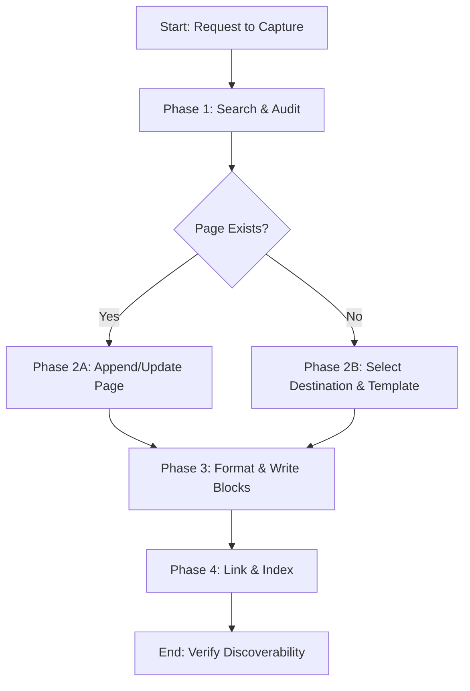

---

name: notion-knowledge-capture

description: |

  "Transforms unstructured team conversations, chat discussions, Q&As, and decisions into high-quality, structured documentation pages or database records in Notion. Use this skill when the user asks to save chat transcripts, extract decisions, document a procedure, archive post-mortems, or populate a wiki/knowledge base in Notion. Trigger keywords: Notion, notion-create-pages, notion-search, notion-update-page, save to wiki, document decision, capture discussion, extract Q&A, FAQ database, how-to guides."


  "Transforms unstructured team conversations, chat discussions, Q&As, and decisions into high-quality, structured documentation pages or database records in Notion. Use this skill when the user asks to save chat transcripts, extract decisions, document a procedure, archive post-mortems, or populate a wiki/knowledge base in Notion. Trigger keywords: Notion, notion-create-pages, notion-search, notion-update-page, save to wiki, document decision, capture discussion, extract Q&A, FAQ database, how-to guides."


---


# Notion Knowledge Capture


Transforms unstructured conversations, slack/chat context, and messy team discussions into structured, high-discoverability documentation within Notion.


---


## Core Philosophy: The Durable Knowledge Delta


Most AI agents dump raw chat logs or basic summaries into Notion, creating "documentation debt" and token waste. This skill focuses on **knowledge refinement**—extracting the durable lessons and decisions while discarding conversational noise.


### Ephemeral vs. Durable Knowledge


Before writing a single block, classify the information:

- **Ephemeral (Do NOT Document in Wiki)**: Status updates, temporary debug logs, meeting logistics, social chat.

- **Durable (Capture & Link)**: System architectures, operational workflows (How-Tos), architecture decision records (ADRs), post-mortems, and FAQs.


---


## Mindset Framework & Procedures


### The Pre-Capture Checklist


Before creating or updating any Notion page, ask yourself:

1. **Redundancy**: Has this topic been documented elsewhere? (Perform a search first).

2. **Context**: Will a team member reading this in 6 months understand *why* this decision was made without reading the original chat?

3. **Discoverability**: What is the single parent index page where this MUST be linked so it is not orphaned?

4. **Formatting**: Am I using standard Notion block structures (headings, callouts, lists) or am I writing generic walls of text?


### Phased Workflow





#### Phase 1: Search & Audit


1. Query Notion using `notion-search` with 2-3 variations of the primary topic keywords.

2. If an existing page covers ~80% of the topic, plan to update it rather than creating a duplicate.


#### Phase 2: Refinement & Structuring


1. Strip all conversational filler ("thanks", "let's try this", "as discussed").

2. Extract concrete outcomes: Decisions, Actions (with owners), Rationale, and Blockers.

3. Structure according to the specific document type (see *Content Type Layouts* below).


#### Phase 3: Block Creation & Formatting


Convert Markdown to Notion API-compatible blocks:

- Use **Callouts** for warnings, key takeaways, or summaries.

- Use **Numbered Lists** for sequential procedures.

- Use **Code Blocks** (with explicit language tags) for code snippets, configs, or CLI commands.

- Use **Toggle Lists** for secondary reference details to improve readability.


#### Phase 4: Discoverability & Linking


1. Link parent pages to the new page using the `<mention-page url="..."/>` syntax.

2. If updating a database, fill out all required metadata properties.

3. Add a link to the original conversation source (e.g., Slack thread URL) under a "Context" section.


#### Phase 5: Memory Sync


After the content is successfully published to Notion, you **MUST** save a copy of the final structured content to the local memory system.


1. Create a Markdown file in `~/memory_system/inbox/` named `notion_capture_[timestamp].md`.

2. Include the final content and a "Source" section with the Notion URL.

3. This ensures the local OKF/ChromaDB remains in sync with the remote Notion instance.


H[End: Verify Discoverability]


---


## Content Type Layouts (Expert Templates)


Choose the layout matching your knowledge type:


### 1. Architecture/Product Decision Record (ADR)

* **Metadata**: Status (Proposed/Accepted/Deprecated), Deciders, Date, Impact Area.

* **Context**: What is the problem we are solving, and what are the constraints?

* **Decision**: What choice did we make? (Keep it concise).

* **Consequences**: What are the trade-offs? (What does this enable, and what does it break?).


### 2. How-To Guide / Runbook

* **Prerequisites**: Clear list of access rights, software versions, or credentials needed.

* **Procedure**: Step-by-step instructions.

* **Verification**: How does the reader verify that the steps succeeded?

* **Troubleshooting**: Known edge cases and what to do if step X fails.


---


## Progressive Disclosure & Loading Triggers


To prevent token bloating, do not load all databases or examples at once. Follow these mandatory loading triggers:


| Scenario / Task | Action / Mandatory Load | Do NOT Load |

| :--- | :--- | :--- |

| Writing a custom DB record | Read [reference/database-best-practices.md](file:///home/jsoehner/yuv-skills-backup/notion-knowledge-capture/reference/database-best-practices.md) | `examples/how-to-guide.md` |

| Capturing a decision / ADR | Read [reference/decision-log-database.md](file:///home/jsoehner/yuv-skills-backup/notion-knowledge-capture/reference/decision-log-database.md) AND [examples/decision-capture.md](file:///home/jsoehner/yuv-skills-backup/notion-knowledge-capture/examples/decision-capture.md) | `reference/faq-database.md` |

| Creating a How-To runbook | Read [reference/how-to-guide-database.md](file:///home/jsoehner/yuv-skills-backup/notion-knowledge-capture/reference/how-to-guide-database.md) AND [examples/how-to-guide.md](file:///home/jsoehner/yuv-skills-backup/notion-knowledge-capture/examples/how-to-guide.md) | `reference/decision-log-database.md` |

| Extracting Q&A from chat | Read [reference/faq-database.md](file:///home/jsoehner/yuv-skills-backup/notion-knowledge-capture/reference/faq-database.md) AND [examples/conversation-to-faq.md](file:///home/jsoehner/yuv-skills-backup/notion-knowledge-capture/examples/conversation-to-faq.md) | `reference/how-to-guide-database.md` |

| Static Wiki page creation | Use self-contained layouts. Do NOT load any database schemas. | All database schema reference files |


---


## Freedom Calibration


- **Low Freedom (Strict Rules)**: Database schema updates and property types. You MUST match existing database properties exactly. Do NOT create arbitrary new properties without explicit user consent.

- **Medium Freedom (Structured Guidelines)**: Templates and heading orders. You may reorder or omit sections (e.g., omitting "Troubleshooting" if a procedure is extremely simple).

- **High Freedom (Creative Expression)**: Text tone, summaries, and synthesis. Write in clean, professional, active voice.


---


## NEVER Anti-Patterns


| Anti-Pattern | Why to Avoid It |

| :--- | :--- |

| **NEVER** create orphan pages | Pages not linked to a parent index, team homepage, or wiki index are impossible to discover via Notion sidebar navigation. |

| **NEVER** write raw chat logs | Chat logs contain noise, typos, and conversational dead-ends. They degrade search quality and clutter the page. |

| **NEVER** overwrite existing content blindly | Overwriting destroys history and collaborative edits. Always use `append` or update specific blocks unless explicitly instructed. |

| **NEVER** invent database properties | Creating unregistered tags (e.g. adding a new "Status" value) breaks database filters, automated rollups, and reporting views. |

| **NEVER** use deep nesting (>3 levels) | Deep page hierarchies make mobile navigation and breadcrumb usage highly frustrating. Maintain a flatter page structure. |


---


## Practical Usability & Error Fallbacks


### Decision Tree: Where to Capture Knowledge?


```

Is the knowledge a sequence of actionable steps?

├── Yes ──> Save as How-To Guide / Runbook (database or runbook wiki section)

└── No ───> Is it a resolution to a specific debate or design challenge?

            ├── Yes ──> Save as Decision Record (ADR)

            └── No ───> Is it a general definition or concept?

                        ├── Yes ──> Save in general team wiki / concept index

                        └── No ───> Save in FAQ database (Q&A pair)

```


### Common Failure Modes & Fallback Procedures


1. **Notion Search Fails to Find Parent Page**:

   - *Scenario*: The user specifies a parent page title, but `notion-search` returns no results.

   - *Fallback*: Search for broader parent folders/wikis. If still not found, create the page at the workspace root or in the workspace-level "Inbox" if it exists, and output a warning with the page URL so the user can relocate it manually.

2. **Database Property Validation Error**:

   - *Scenario*: Trying to populate a database property that doesn't exist or is of a mismatched type.

   - *Fallback*: Query the database schema first using `notion-retrieve-database`. If properties are missing, write the metadata fields to a Callout block at the very top of the page body and proceed with page creation using title and content only.

3. **Notion API Block Limit Exceeded**:

   - *Scenario*: Page content is very long, leading to request timeouts or size limit errors.

   - *Fallback*: Split the content. Create a parent index page, then create child pages for each sub-topic, linking them bidirectionally.


## Memory Sync

After completing key technical findings, architectural decisions, code refactorings, or risk assessments, you **MUST** trigger the local memory capture.

1. Save the final summary or artifact as a Markdown file in the project directory.
2. Invoke the capture script:
   ```bash
   python3 ~/memory_system/capture_knowledge.py <file_path>
   ```
3. This ensures that new learnings, policies, and technical snippets are automatically routed to the correct local storage (OKF or ChromaDB).
