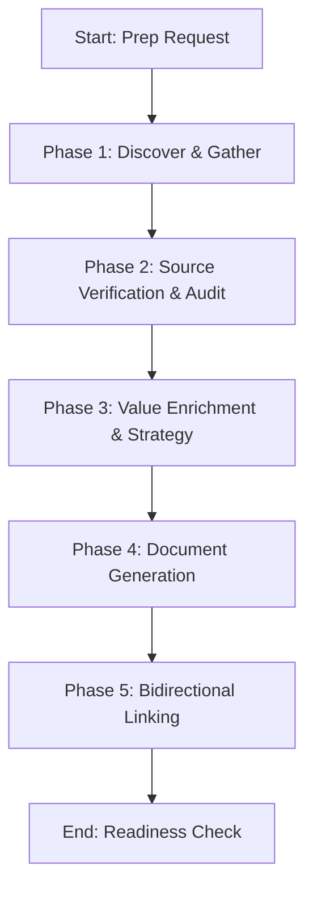

# Notion Meeting Intelligence

Prepares actionable, high-discoverability meeting materials by synthesizing internal Notion context with Claude's analytical insights.

---

## Core Philosophy: The Execution Delta

The goal of meeting preparation is not to write summaries, but to **minimize meeting duration while maximizing decision clarity**. 

### Notion Context vs. Claude Enrichment
- **Notion Context (Ground Truth)**: Timelines, existing specifications, current project status, active blockers, and historical action items.
- **Claude Enrichment (Strategic Value)**: Technical trade-offs, industry standard frameworks, risk mapping, facilitating techniques, and structured decision trees.

---

## Mindset Framework & Procedures

### The Pre-Prep Mindset Checklist
Before starting prep, ask yourself:
1. **The Core Objective**: What is the single most important decision or alignment that *must* occur in this meeting?
2. **High-Value Audience**: Whose time is the most valuable or constrained in this meeting, and how do we design these docs for rapid scanning?
3. **Data Integrity**: Are we clearly separating established facts (from Notion) from strategic suggestions/simulations (from Claude)?

### Phased Workflow



#### Phase 1: Discover & Gather
1. Execute `notion-search` for the core topic, associated projects, and notes from the last 2 syncs.
2. Retrieve the relevant pages via `notion-fetch`.

#### Phase 2: Source Verification & Audit
1. Identify the status of previous action items. Highlight unfinished tasks.
2. Note any discrepancies in timelines or project requirements.

#### Phase 3: Strategic Value Enrichment
1. For technical meetings: Propose 2 alternative technical approaches with pros/cons.
2. For client syncs: Synthesize client profile and potential risks.
3. Define the precise decision-making framework (e.g., RICE matrix, trade-off matrix).

#### Phase 4: Document Generation
Produce two distinct artifacts:
1. **Internal Pre-Read**: A strategic, honest assessment containing sensitive internal metrics, trade-offs, and blockers.
2. **External Agenda**: A high-polish, timed agenda focusing purely on client objectives, schedules, and deliverables.

#### Phase 5: Bidirectional Linking
1. Use `<mention-page url="..."/>` to link the Pre-Read and Agenda together.
2. Insert links to both documents into the parent project wiki page.

---

## Progressive Disclosure & Loading Triggers

To prevent context bloat, load only the templates relevant to your specific meeting type:

| Meeting Type | Mandatory Load | Do NOT Load |
| :--- | :--- | :--- |
| **Decision / Design Review** | Read [reference/decision-meeting-template.md](file:///home/jsoehner/yuv-skills-backup/notion-meeting-intelligence/reference/decision-meeting-template.md) | `reference/sprint-planning-template.md` |
| **Sprint Planning** | Read [reference/sprint-planning-template.md](file:///home/jsoehner/yuv-skills-backup/notion-meeting-intelligence/reference/sprint-planning-template.md) | `reference/retrospective-template.md` |
| **Retrospective** | Read [reference/retrospective-template.md](file:///home/jsoehner/yuv-skills-backup/notion-meeting-intelligence/reference/retrospective-template.md) | `reference/one-on-one-template.md` |
| **1-on-1 / Sync** | Read [reference/one-on-one-template.md](file:///home/jsoehner/yuv-skills-backup/notion-meeting-intelligence/reference/one-on-one-template.md) | `reference/decision-meeting-template.md` |
| **Status Update / Sync** | Read [reference/status-update-template.md](file:///home/jsoehner/yuv-skills-backup/notion-meeting-intelligence/reference/status-update-template.md) | `reference/brainstorming-template.md` |
| **Brainstorming / Workshop** | Read [reference/brainstorming-template.md](file:///home/jsoehner/yuv-skills-backup/notion-meeting-intelligence/reference/brainstorming-template.md) | `reference/retrospective-template.md` |
| **Template Selector** | For overall design context, load [reference/template-selection-guide.md](file:///home/jsoehner/yuv-skills-backup/notion-meeting-intelligence/reference/template-selection-guide.md) | N/A |

---

## Freedom Calibration

- **Low Freedom (Zero Mismatch)**: Separation of internal/external context. Never leak internal strategic discussions to external clients. Agenda time limits must sum exactly to the meeting length.
- **Medium Freedom (Structured guidelines)**: Agenda section headings. You may customize agenda items based on the actual conversation flow.
- **High Freedom (Strategic advice)**: Synthesis of the trade-off matrix, facilitator advice, and Claude enrichment insights.

---

## NEVER Anti-Patterns

| Anti-Pattern | Why to Avoid It |
| :--- | :--- |
| **NEVER** expose internal docs to external clients | Exposing internal strategic disputes, engineering worries, or margin calculations ruins client trust and professional leverage. |
| **NEVER** write meeting summaries without action-item statuses | Reviewing status without checking if action items were actually completed creates repetitive status loops that waste engineering cycles. |
| **NEVER** write walls of continuous text | Stakeholders and leaders skim. Long paragraphs are skipped. Use bullet structures, bold text, and highlighted callouts. |
| **NEVER** fabricate customer metrics or specific statistics | Inventing user counts, uptime data, or financial numbers damages professional credibility and leads to downstream failures. |
| **NEVER** leave a meeting page unlinked | Unlinked meeting notes are lost immediately. They must always bidirectionally link back to the parent project epic/page. |

---

## Practical Usability & Error Fallbacks

### Decision Tree: Template & Document Selection

```
Is the meeting with external clients or partners?
├── Yes ──> Create an External Agenda (Timed) AND (Optional) Internal Pre-read.
└── No ───> What is the primary output?
            ├── Decisions/Reviews ─> Use Decision Meeting Template
            ├── Process Review ────> Use Retrospective Template
            ├── Work Planning ─────> Use Sprint Planning Template
            └── Team Alignment ────> Use Status Update or One-on-One Template
```

### Common Failure Modes & Fallback Procedures

1. **No Notion Context / Search Returns Empty**:
   - *Scenario*: Search queries return no related project pages or history.
   - *Fallback*: Generate a standard Agenda using general best practices for the specified meeting type. Use block placeholders (e.g., `[Insert status from engineering team here]`) so the team knows exactly what details to paste in before the meeting.
2. **Extremely Limited Preparation Time (<15 minutes)**:
   - *Scenario*: User requests prep right before a meeting.
   - *Fallback*: Bypass the full Pre-Read. Create a "Hot Agenda" with:
     - 1-sentence Goal.
     - 3 key bullet points of known context.
     - Clear list of decisions that must be reached before the meeting ends.
3. **Missing Attendee Information**:
   - *Scenario*: Meeting invite details don't list attendees or roles.
   - *Fallback*: Use standard roles (Facilitator, Scribe, Timekeeper) and structure the agenda for a default team of 4-6 stakeholders, prompting the user to update names.
