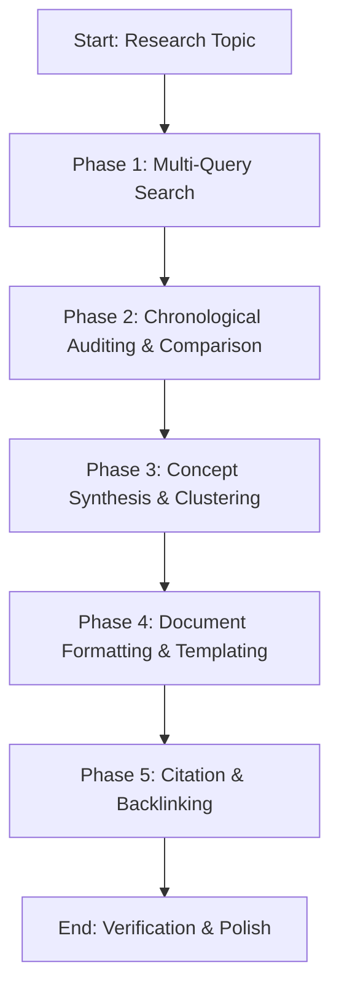

# Notion Research & Documentation

Synthesizes fragmented workspace content into structured, analytical, and highly cited research documentation in Notion.

---

## Core Philosophy: Truth and Synthesis

Effective research documentation does not simply copy-paste existing notes. It **integrates disconnected findings**, resolves **conflicting timelines**, and provides **traceability** back to the source pages.

### Source Hierarchy of consensus
When synthesis reveals conflicting details (e.g., a spec says X, but a meeting note says Y):
1. **Decision Logs (ADRs)**: Represents active agreements (Highest Authority).
2. **Recent Meeting Notes / Slack syncs**: Represents temporary adjustments or recent updates.
3. **Spec Sheets / Product Requirement Docs**: Outlines original intent, but may be outdated if updates weren't kept in sync.

---

## Mindset Framework & Procedures

### The Pre-Research Checklist
Before drafting the research document, ask yourself:
1. **Consensus & Conflict**: Did I find any contradictions between my sources? How will I explicitly represent this disagreement?
2. **Chronology**: When was each source last edited, and does the newer doc override the older one?
3. **Synthesis vs. Summary**: Am I just summarizing pages individually, or am I extracting trends, patterns, and themes across them?

### Phased Workflow



#### Phase 1: Search Scoping
1. Execute `notion-search` with multiple distinct query strings (e.g., broad synonyms, project nicknames, related tags).
2. Fetch the top 5-10 most relevant pages via `notion-fetch`.

#### Phase 2: Chronological Auditing & Comparison
1. Inspect page metadata: creator, last updated time, and active contributors.
2. Draft a quick mental timeline of the project or topic to see how the technical specs evolved.

#### Phase 3: Synthesis
1. Group findings by sub-topics (e.g., technical requirements, business goals, blockers).
2. Highlight missing knowledge blocks ("known unknowns") that require user clarification.

#### Phase 4: Formatting & Layout
1. Select the appropriate page layout (see *Progressive Disclosure*).
2. Keep layouts readable: use **Table of Contents** blocks (`table_of_contents`), column blocks for side-by-side comparisons, and **Callouts** for key takeaways.

#### Phase 5: Citations
1. Always link every major assertion to its source page using `<mention-page url="..."/>`.
2. Add the source last-modified date next to the citation (e.g., `(Source: [Page Name], Updated: 2026-05-12)`).

---

## Progressive Disclosure & Loading Triggers

To prevent token bloat, load only the formatting schemas relevant to your research style:

| Research Format | Mandatory Load | Do NOT Load |
| :--- | :--- | :--- |
| **Comparison Grid / Matrix** | Read [reference/comparison-format.md](file:///home/jsoehner/yuv-skills-backup/notion-research-documentation/reference/comparison-format.md) AND [reference/comparison-template.md](file:///home/jsoehner/yuv-skills-backup/notion-research-documentation/reference/comparison-template.md) | `reference/comprehensive-report-template.md` |
| **Long-Form Report / Analysis** | Read [reference/comprehensive-report-format.md](file:///home/jsoehner/yuv-skills-backup/notion-research-documentation/reference/comprehensive-report-format.md) AND [reference/comprehensive-report-template.md](file:///home/jsoehner/yuv-skills-backup/notion-research-documentation/reference/comprehensive-report-template.md) | `reference/quick-brief-template.md` |
| **Executive Brief / Status Deck** | Read [reference/quick-brief-format.md](file:///home/jsoehner/yuv-skills-backup/notion-research-documentation/reference/quick-brief-format.md) AND [reference/quick-brief-template.md](file:///home/jsoehner/yuv-skills-backup/notion-research-documentation/reference/quick-brief-template.md) | `reference/comprehensive-report-template.md` |
| **Standard Summary** | Read [reference/research-summary-format.md](file:///home/jsoehner/yuv-skills-backup/notion-research-documentation/reference/research-summary-format.md) AND [reference/research-summary-template.md](file:///home/jsoehner/yuv-skills-backup/notion-research-documentation/reference/research-summary-template.md) | `reference/comparison-template.md` |
| **Linking & Citations** | Read [reference/citations.md](file:///home/jsoehner/yuv-skills-backup/notion-research-documentation/reference/citations.md) | N/A |
| **Overall Selection Guide** | Read [reference/format-selection-guide.md](file:///home/jsoehner/yuv-skills-backup/notion-research-documentation/reference/format-selection-guide.md) | N/A |
| **Advanced Search Tips** | Read [reference/advanced-search.md](file:///home/jsoehner/yuv-skills-backup/notion-research-documentation/reference/advanced-search.md) | N/A |

---

## Freedom Calibration

- **Low Freedom (Strict Rules)**: Citation tracking. You MUST reference source documents and include their last-modified timestamps.
- **Medium Freedom (Structured Guidelines)**: Format matching. Select and modify section headings based on research goals, but keep layout consistency intact.
- **High Freedom (Analytical Writing)**: Synthesis narrative. Express findings clearly and objectively, identifying trends or gaps in the information.

---

## NEVER Anti-Patterns

| Anti-Pattern | Why to Avoid It |
| :--- | :--- |
| **NEVER** write reports without source timestamps | Documentation goes out of date. Without timestamps, readers might follow a deprecated requirement thinking it represents the current plan. |
| **NEVER** link pages using plain text only | Plain text links break if page names change. Always use Notion's native page-mention formatting to preserve integrity. |
| **NEVER** copy-paste redundant blocks of text | Wastes reading time and page space. Synthesize points into bullet lists and summarize instead of copying text. |
| **NEVER** ignore source contradictions | Omiting conflicting viewpoints hides project risks. Always document discrepancies under a dedicated "Key Open Conflicts" header. |
| **NEVER** assume page size equals authority | Long, detailed specs may be outdated drafts. Check edit histories and decision logs for the true active agreement. |

---

## Practical Usability & Error Fallbacks

### Decision Tree: Choosing the Document Format

```
What is the target reader's goal?
├── Analyze competing options or tools ─> Use Comparison Template
└── Synthesize general research findings?
    ├── Executive-level review ───────> Use Quick Brief Template
    └── Standard team update?
        ├── High complexity / deep dive ─> Use Comprehensive Report Template
        └── Medium complexity summary ──> Use Research Summary Template
```

### Common Failure Modes & Fallback Procedures

1. **Conflicting Source Material**:
   - *Scenario*: Two different Notion pages provide contradictory guidelines.
   - *Fallback*: Do not guess which is correct. Create a **Divergence Matrix** (table or list) showing the conflicting points, the page URLs, and the edit dates. Flag it under a callout block: `⚠️ WARNING: Conflicting Requirements Found`.
2. **Search Yields No Results**:
   - *Scenario*: Topic search returns zero matching pages in Notion.
   - *Fallback*: Verify search terms. If still empty, draft the document outline using external research (if appropriate), and mark internal sections with `[Pending Internal Input: Search query 'X' failed]`.
3. **Database Destination Missing / Access Denied**:
   - *Scenario*: Unable to save the research page to a specific database parent.
   - *Fallback*: Create the research report as a standalone page in the workspace root, email/notify the user with the page link, and ask them to move it into the correct database.


## 6) Memory Sync

After completing a task, key decision, or report, you **MUST** trigger the local memory capture. 

1. Save the final document, report, or summary as a Markdown file in the project directory.
2. Invoke the capture script: 
   `ash
   python \capture_knowledge.py <file_path>
   `
3. This ensures that new requirements, technical standards, and findings are automatically routed to the correct storage (OKF or ChromaDB).
