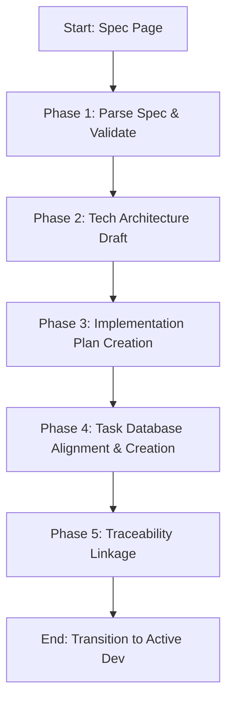

# Notion Spec to Implementation

Converts high-level specs (PRDs, RFCs, System Designs) into high-fidelity, trackable implementation plans and atomic Notion database tasks.

---

## Core Philosophy: Operationalizing Requirements

Most implementation plans fail because they are either too vague or too massive. This skill guides the transformation of abstract ideas into **atomic, testable, and dependency-mapped tasks**.

### The Task Atomicity Rule
- **Atomic Task (Ideal)**: Represents a single unit of work (e.g., "Implement user migration script") that can be completed in **1-2 days** and verified independently.
- **Giant Task (Anti-Pattern)**: Represents an entire phase (e.g., "Build the API layer"). This hides blockers, prevents team parallelization, and makes estimation impossible.

---

## Mindset Framework & Procedures

### The Pre-Deconstruction Checklist
Before splitting a spec into tasks, ask yourself:
1. **Scope Boundaries**: What is strictly in-scope for this milestone? What represents a "nice-to-have" that should be deferred to a later ticket?
2. **Dependencies**: Which tasks block others? (e.g., database schema migrations must block API route development).
3. **Verification**: How will the engineer know this task is done? What is the specific test script or curl command?

### Phased Workflow



#### Phase 1: Parse Spec & Validate
1. Search for the specification using `notion-search` and read it via `notion-fetch`.
2. Extract functional constraints, tech stack requirements, and security rules.

#### Phase 2: Tech Architecture Draft
1. Define the technical approach (endpoints, database changes, UI states).
2. Note any ambiguities in the spec and flag them as "Risks" in the plan.

#### Phase 3: Create Implementation Plan
1. Draft the plan dividing work into sequential Phases (e.g., Phase 1: Data Model, Phase 2: Core Logic, Phase 3: UI & Verification).
2. Save the plan to Notion, linking it directly to the source spec.

#### Phase 4: Task Creation
1. Search for the team's task database. Fetch its schema using `notion-retrieve-database`.
2. Map fields like Status, Priority, Sprint, and Epics. Create the tasks.
3. Write precise technical notes inside the page body of each task, including validation criteria.

#### Phase 5: Traceability Linkage
1. Reference the implementation plan link inside each task.
2. Update the parent spec page with a link to the new Implementation Plan.

---

## Progressive Disclosure & Loading Triggers

To prevent token bloat, load only the formatting schemas relevant to your active phase:

| Phase / Scenario | Mandatory Load | Do NOT Load |
| :--- | :--- | :--- |
| **Parsing PRDs / Specs** | Read [reference/spec-parsing.md](file:///home/jsoehner/yuv-skills-backup/notion-spec-to-implementation/reference/spec-parsing.md) | `reference/progress-tracking.md` |
| **Drafting Implementation Plan** | Read [reference/standard-implementation-plan.md](file:///home/jsoehner/yuv-skills-backup/notion-spec-to-implementation/reference/standard-implementation-plan.md) OR [reference/quick-implementation-plan.md](file:///home/jsoehner/yuv-skills-backup/notion-spec-to-implementation/reference/quick-implementation-plan.md) | `reference/task-creation.md` |
| **Creating Database Tasks** | Read [reference/task-creation.md](file:///home/jsoehner/yuv-skills-backup/notion-spec-to-implementation/reference/task-creation.md) AND [reference/task-creation-template.md](file:///home/jsoehner/yuv-skills-backup/notion-spec-to-implementation/reference/task-creation-template.md) | `reference/spec-parsing.md` |
| **Tracking Progress & Status** | Read [reference/progress-tracking.md](file:///home/jsoehner/yuv-skills-backup/notion-spec-to-implementation/reference/progress-tracking.md), [reference/progress-update-template.md](file:///home/jsoehner/yuv-skills-backup/notion-spec-to-implementation/reference/progress-update-template.md), AND [reference/milestone-summary-template.md](file:///home/jsoehner/yuv-skills-backup/notion-spec-to-implementation/reference/milestone-summary-template.md) | `reference/quick-implementation-plan.md` |

---

## Freedom Calibration

- **Low Freedom (Strict Rules)**: Database schema alignment. You must strictly match property types (Status, Epics, Select options) to prevent schema validation failures. Task sizing should not exceed 2 days.
- **Medium Freedom (Structured Guidelines)**: Implementation plan templates. Section headers may be re-ordered or adjusted based on technical complexity (e.g. omitting "Database Migration" for frontend-only projects).
- **High Freedom (Technical Insight)**: Technical execution approach. Recommend optimal system design patterns based on best engineering practices.

---

## NEVER Anti-Patterns

| Anti-Pattern | Why to Avoid It |
| :--- | :--- |
| **NEVER** create giant, multi-day tasks | Tasks like "build authentication" are impossible to track, hide bottlenecks, and make team parallelization impossible. |
| **NEVER** recreate tasks on spec updates | Re-creating tasks destroys history, comments, and developer progress logs. Instead, edit existing tasks or append new sub-tasks. |
| **NEVER** skip acceptance/validation criteria | Marking tasks "Done" without precise test cases leads to integration failures and regression bugs. |
| **NEVER** invent database properties | Creating unregistered tags or options breaks team kanban boards, scrum dashboards, and query logic. |
| **NEVER** write generic descriptions | Task bodies like "setup database" are too vague. Specify tables, indexes, field types, and technical constraints. |

---

## Practical Usability & Error Fallbacks

### Decision Tree: Template & Document Selection

```
How complex is the target feature set?
├── Single bug, small refactor, or simple script?
│   └── Use Quick Implementation Plan Template
└── Multi-phase project, architectural shift, or PRD?
    └── Use Standard Implementation Plan Template
```

### Common Failure Modes & Fallback Procedures

1. **Required Database Property Missing in Task Creator**:
   - *Scenario*: The task database has mandatory custom fields that this skill is unaware of, causing creation errors.
   - *Fallback*: Retrieve the database schema using `notion-retrieve-database`. If properties mismatch, create the task with the title and content body only, and document the missing metadata inside a Callout block at the top of the task body.
2. **Ambiguity / Contradictions in the Specification**:
   - *Scenario*: The PRD outlines contradictory features, or lacks technical specifics (e.g. API endpoint parameters).
   - *Fallback*: Do not guess. Create a high-priority "Specification Clarification" task in the plan. Detail the exact open questions and tag the relevant stakeholders. Do not generate child implementation tasks for that component until resolved.
3. **Notion Search Fails to Find Task Database**:
   - *Scenario*: Searching for "Tasks" or "Jira" returns no database results.
   - *Fallback*: Create the Implementation Plan as a standalone page. Add a bulleted Markdown checklist representing the tasks inside the plan body, and request the user to link it to their tracking system manually.


## 6) Memory Sync

After completing a task, key decision, or report, you **MUST** trigger the local memory capture. 

1. Save the final document, report, or summary as a Markdown file in the project directory.
2. Invoke the capture script: 
   `ash
   python \capture_knowledge.py <file_path>
   `
3. This ensures that new requirements, technical standards, and findings are automatically routed to the correct storage (OKF or ChromaDB).
