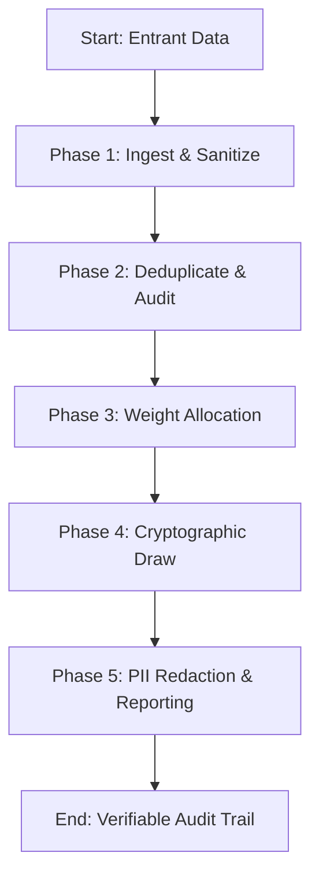

# Raffle Winner Picker

Verifiable, cryptographically secure, and privacy-compliant selection of random winners from spreadsheets, files, and lists.

---

## Core Philosophy: Verifiable Fairness

A raffle drawing must be **unbiased**, **verifiable**, and **privacy-preserving**. Most random generators use simple pseudo-random functions (like Python's `random.random()`) which are predictable if the seed state is known. This skill enforces cryptographically secure randomness and provides auditing trails to prove fairness.

---

## Mindset Framework & Procedures

### The Pre-Draw Checklist
Before executing any drawing, ask yourself:
1. **Deduplication Key**: What is the unique identifier for each entrant? (e.g., Email, Discord ID, Phone). How are duplicates treated?
2. **Weighting Logic**: Is this a flat draw or weighted (e.g., 1 ticket per dollar spent)?
3. **Privacy Compliance**: How will I display the winner without exposing PII (Personally Identifiable Information) like full emails or phone numbers?
4. **Verifiability**: Should we use a public anchor seed (e.g., a specific future Bitcoin block hash) to prove no pre-determination?

### Phased Workflow



#### Phase 1: Ingest & Sanitize
1. Read the list, CSV, or Google Sheet.
2. Remove empty rows, corrupt header lines, or formatting whitespace.

#### Phase 2: Deduplication
1. Identify duplicate keys.
2. Unless weighted entries are explicitly requested, deduplicate by the unique identifier (keeping the first entry).

#### Phase 3: Weight Allocation
1. For weighted drawings, build a Cumulative Distribution Function (CDF).
2. If a row has an invalid weight, default it to 1 and log a warning.

#### Phase 4: Cryptographic Draw
1. Use Python's `secrets` module (which calls the operating system's secure source of entropy, `/dev/urandom`) rather than `random`.
2. Select the index using `secrets.choice()` or `secrets.randbelow()`.

#### Phase 5: Redaction & Report
1. Redact emails (e.g., `j***n@domain.com`) and phone numbers (e.g., `+1 ***-***-4521`).
2. Generate the audit trail (total count, timestamp, random engine details).

---

## Progressive Disclosure & Loading Triggers

> [!NOTE]
> **Self-Contained Skill**: This is a self-contained skill. Do NOT load external files or reference directories.

---

## Freedom Calibration

- **Low Freedom (Strict Rules)**: Use of Python `secrets` module is mandatory for randomness generation. You must NOT use standard `random.random()`. PII redaction is mandatory before outputting results.
- **Medium Freedom (Structured Guidelines)**: Exclusions and weighting algorithms. You can select either linear or quadratic weighting based on the user's contest rules.
- **High Freedom (Creative Summary)**: Congratulatory message styling and announcement templates.

---

## NEVER Anti-Patterns

| Anti-Pattern | Why to Avoid It |
| :--- | :--- |
| **NEVER** use standard `random.random()` | Standard PRNGs are not cryptographically secure and their states can be guessed or manipulated if the seed is known. |
| **NEVER** print full emails or phone numbers | Exposing full contact information violates GDPR/CCPA regulations and exposes winners to spam and phishing. |
| **NEVER** run the draw without deduplication | Multi-post spammers or form errors will skew the probability, ruining fairness for single entrants. |
| **NEVER** hardcode seeds for "fairness" | Hardcoded seeds make the draw entirely deterministic. A malicious actor can verify the code and guess the winner before execution. |
| **NEVER** use sorting or shuffling for weighted draws | Shuffling algorithms (like Fisher-Yates) are computationally heavy and easily prone to implementation errors when weights are introduced. Use CDF array boundaries instead. |

---

## Practical Usability & Fair Execution Script

For maximum transparency, execute the drawing using the following Python script pattern:

```python
import secrets
import csv

# 1. Ingest & Sanitize
entrants = []
with open('entries.csv', mode='r', encoding='utf-8') as f:
    reader = csv.DictReader(f)
    for row in reader:
        email = row.get('Email', '').strip().lower()
        name = row.get('Name', '').strip()
        weight = float(row.get('Weight', 1.0))  # Default weight is 1.0
        if email and name:
            entrants.append({'Email': email, 'Name': name, 'Weight': weight})

# 2. Deduplicate
seen = set()
unique_entrants = []
for e in entrants:
    if e['Email'] not in seen:
        seen.add(e['Email'])
        unique_entrants.append(e)

# 3. Weighted CDF Construction
cumulative_weights = []
total_weight = 0.0
for e in unique_entrants:
    total_weight += e['Weight']
    cumulative_weights.append(total_weight)

# 4. Cryptographic Selection
# Draw random float in range [0.0, total_weight)
random_weight = secrets.SystemRandom().uniform(0.0, total_weight)

# Find matching entrant
winner = None
for i, limit in enumerate(cumulative_weights):
    if random_weight <= limit:
        winner = unique_entrants[i]
        break

# 5. Redact & Output
def redact_email(email):
    parts = email.split('@')
    if len(parts) == 2:
        username, domain = parts
        return f"{username[0]}***{username[-1]}@{domain}"
    return "******"

print(f"🎉 Winner: {winner['Name']} ({redact_email(winner['Email'])})")
print(f"Audit Trail: Total Unique Entries: {len(unique_entrants)}, Drawn Value: {random_weight}/{total_weight}")
```

### Common Failure Modes & Fallback Procedures

1. **Google Sheets / File API Connection Error**:
   - *Scenario*: The tool fails to read the target URL or spreadsheet.
   - *Fallback*: Instruct the user to export the sheet as a CSV file, paste the CSV text directly into the chat thread, and run the Python script on the pasted text content.
2. **Missing Weight Columns**:
   - *Scenario*: The user requests a weighted draw but the data file has no numeric weight values.
   - *Fallback*: Inform the user, assign a weight of 1.0 to all entries (equivalent to a flat draw), and proceed with secure selection.
3. **Tie / Multi-Winner Exclusions**:
   - *Scenario*: Drawing multiple winners and the same user gets picked twice.
   - *Fallback*: Maintain a list of already selected winners. If a duplicate is drawn, discard it and rerun the selection function until a unique winner is chosen.

## 6) Capture Knowledge

After a raffle or giveaway is conducted, automatically trigger the `capture_knowledge.py` script.
The script will analyze the drawing to identify:
- Total number of entrants and unique entries.
- Distribution of weights (if applicable).
- Random seed/value used for the draw.
The script will then route this information to the appropriate storage:
- **OKF**: Raffle fairness standards, weighted selection rules, and audit trail requirements.
- **ChromaDB**: Specific drawing results, winner lists, and randomness verification logs.
