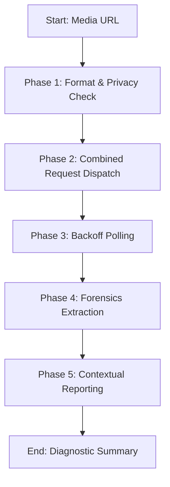

---

name: resemble-detect

description: |

  "Orchestrates media deepfake detection, audio source tracing, watermarking, and text generation detection via Resemble AI. Use this skill when analyzing audio/video files for synthetic content, checking watermark provenance, verifying speaker identities, or scanning for AI text. Trigger keywords: deepfake detection, synthetic media, voice verification, resemble-detect, resemble_docs_lookup, watermark, speaker search, post /detect, text_detect."


  "Orchestrates media deepfake detection, audio source tracing, watermarking, and text generation detection via Resemble AI. Use this skill when analyzing audio/video files for synthetic content, checking watermark provenance, verifying speaker identities, or scanning for AI text. Trigger keywords: deepfake detection, synthetic media, voice verification, resemble-detect, resemble_docs_lookup, watermark, speaker search, post /detect, text_detect."


---


# Resemble Detect


Verifies media authenticity, executes forensic deepfake detection, watermarks assets, and identifies synthetic audio sources using the Resemble AI API.


---


## Core Philosophy: Verifiable Forensic Results


Never estimate authenticity. Every claim of media being "real" or "fake" must be backed by a completed Resemble AI detect job with a status of `"completed"`.


### Advanced Forensic Heuristics

When interpreting API results, look beyond the binary `label`:

- **Consistency Score**: Measures variance across chunks. High aggregated fake score with low consistency suggests **localized tampering** (e.g., audio splicing or face-swaps).

- **Invisible Frequency Layer (IFL)**: Spotting anomalies in high-frequency spectrums that are invisible to the human eye but captured in the `ifl.heatmap`.

- **Source Tracing Profiling**: Traces synthetic audio to its generative model source (e.g., `elevenlabs`, `resemble_ai`).


---


## Mindset Framework & Procedures


### The Analysis Mindset Checklist

Before starting an audit, ask yourself:

1. **Accessibility**: Is the media file hosted at a public HTTPS URL? (Local paths will fail).

2. **Analysis Depth**: Do I need basic detection or full forensic intelligence? (Enable all flags in one request to save round-trips).

3. **Data Privacy**: Does the user's data contain sensitive PII? (If yes, force `zero_retention_mode: true` or `privacy_mode: true`).


### Phased Workflow





#### Phase 1: Ingestion

1. Ensure the URL begins with `https://`.

2. Determine if the media is image, video, audio, or text.


#### Phase 2: combined Payload Construction

Construct the payload. Maximize efficiency by merging options:

```json

{

  "url": "https://example.com/audio.mp3",

  "visualize": true,

  "intelligence": true,

  "audio_source_tracing": true

}

```


#### Phase 3: Polling Strategy

1. Send the `POST` request.

2. Poll `GET /detect/{uuid}` using exponential backoff (2s -> 4s -> 8s -> 16s). Stop polling if the job takes over 120s and return a pending status note.


#### Phase 4: Diagnostic Extraction

Extract the metrics:

- Audio: Compare `aggregated_score` (overall) and `consistency`.

- Image: Check `ifl` heatmap link and `reverse_image_search_sources` if enabled.

- Video: Traverse the `children` tree to locate the exact timestamps of synthetic frames.


---


## Progressive Disclosure & Loading Triggers


> [!NOTE]

> **Self-Contained Skill**: This is a self-contained skill. Do NOT load external files or reference directories.


---


## Freedom Calibration


- **Low Freedom (Strict Rules)**: Polling intervals (never poll faster than 2 seconds to avoid rate-limiting), endpoint names, header parameters, and base URLs.

- **Medium Freedom (Structured Guidelines)**: Threshold customization. Adjust the detection sensitivity parameters based on the source quality.

- **High Freedom (Creative Summary)**: Formatting the final summary and facilitating questions for the user.


---


## NEVER Anti-Patterns


| Anti-Pattern | Why to Avoid It |

| :--- | :--- |

| **NEVER** guess or inspect media manually | AI fakes target features that are invisible or inaudible to human operators. Rely strictly on mathematical scores. |

| **NEVER** report labels without score metrics | A score of 0.51 (uncertain) and 0.98 (absolute) are both labeled "fake", but they signify completely different confidence profiles. |

| **NEVER** make separate API calls for features | Combining detection, intelligence, and tracing into one request reduces total API processing latency by up to 3x. |

| **NEVER** submit local files to `POST /detect` | The Resemble API is cloud-based and cannot read or resolve paths like `/home/...` or `C:\...`. It returns 400. |

| **NEVER** poll the API faster than every 2 seconds | High-frequency polling triggers a 429 rate limit error and may temporarily suspend the API client credentials. |

| **NEVER** query intelligence before completion | Requesting insights from a pending detection uuid will yield a 422 Unprocessable Entity error. |


---


## API & Usability Guide


### Decision Matrix: Payload Selection


```

Is the input content textual?

├── Yes ──> Use POST /text_detect (Supports Prefer: wait header for sync)

└── No ───> Use POST /detect

            ├── For fast check ───────> Set URL only

            └── For full audit ──────> Set visualize=true, intelligence=true, audio_source_tracing=true

```


### Interpretation Matrix

- **0.0 - 0.3**: Authentic / Real media.

- **0.3 - 0.5**: Inconclusive. Recommend manual auditing or checking source watermarks.

- **0.5 - 0.7**: Likely synthetic. Flag for review.

- **0.7 - 1.0**: High-confidence synthetic / deepfake.


### Error Handling & Troubleshooting


| Status Code | Cause | Fallback Resolution |

| :--- | :--- | :--- |

| **400 Bad Request** | Missing URL or invalid parameters | Check payload keys and verify the URL starts with `https://`. |

| **401 Unauthorized** | Expired or incorrect token | Verify `Authorization` header spelling and check the Bearer API key status. |

| **422 Unprocessable Entity** | Querying incomplete jobs | Stop requesting. Return to the polling loop until status is `"completed"`. |

| **429 Rate Limit** | Poll rate too high | Wait 5 seconds, double the polling interval, and resume. |

| **500 Server Error** | Resemble API down | Wait 10 seconds, retry once. If it fails again, alert the user and save the payload. |


