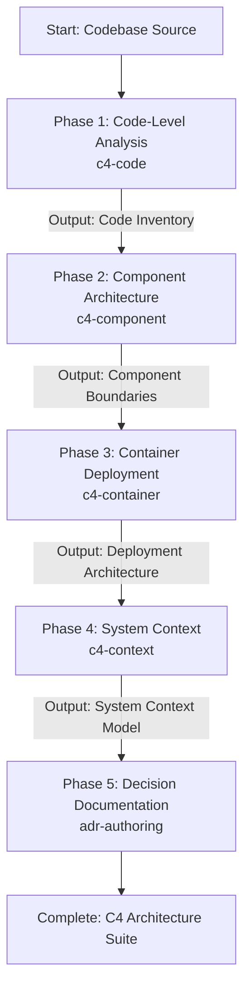

# C4 Modeling Pipeline

A single master skill that generates comprehensive, bottom-up C4 architecture documentation and links key architectural rationale to Architectural Decision Records (ADRs).

## Sequential Execution Pipeline

---

### Phase 1: Code-Level Architecture Analysis
* **Skill to Execute**: `c4-code`
* **Input / Prerequisites**: Target repository or package directory.
* **Execution Protocol**:
  1. Inspect source files, classes, interfaces, and function signatures.
  2. Map low-level class hierarchies, data models, and structural relationships.
* **Produced Output**: Detailed code-level structure and entity relationship specifications.

### Phase 2: Component Architecture Synthesis
* **Skill to Execute**: `c4-component`
* **Input / Prerequisites**: Code analysis specifications from Phase 1.
* **Execution Protocol**:
  1. Group related code modules and classes into logical components.
  2. Document component boundaries, responsibilities, and public API interfaces.
  3. Generate Mermaid component diagrams.
* **Produced Output**: Component-level architecture documentation with boundary definitions.

### Phase 3: Container Architecture Synthesis
* **Skill to Execute**: `c4-container`
* **Input / Prerequisites**: Component architecture documents from Phase 2.
* **Execution Protocol**:
  1. Map components to deployable units (web apps, background workers, microservices, databases, caches).
  2. Document inter-container communication protocols (HTTP/REST, gRPC, WebSockets, message brokers).
  3. Generate Mermaid container diagrams illustrating infrastructure topologies.
* **Produced Output**: System deployment and container architecture specification.

### Phase 4: System Context Synthesis
* **Skill to Execute**: `c4-context`
* **Input / Prerequisites**: Container and component specifications from Phase 2 and Phase 3.
* **Execution Protocol**:
  1. Map high-level system boundaries, primary personas, user journeys, and external integrations.
  2. Define enterprise boundaries and third-party SaaS/vendor dependencies.
  3. Generate top-level Mermaid System Context diagrams.
* **Produced Output**: Comprehensive C4 System Context model.

### Phase 5: Architectural Decision Recording
* **Skill to Execute**: `adr-authoring`
* **Input / Prerequisites**: Architecture insights, trade-offs, and boundary decisions from Phases 1-4.
* **Execution Protocol**:
  1. Draft a formal ADR capturing structural choices, trade-offs, and downstream consequences.
  2. Save record in `docs/adr/` and update `docs/adr/README.md`.
  3. Trigger local memory capture: `python3 ~/memory_system/capture_knowledge.py <adr_file.md>`.
* **Produced Output**: Accepted ADR record linked to C4 diagrams.

## Execution Guardrails & Halting Rules
1. Must follow bottom-up progression: Phase 1 must inform Phase 2, which informs Phase 3, which informs Phase 4.
2. If unexpected circular dependencies or blurry component boundaries are detected in Phase 2, document the architectural ambiguity before container synthesis.
