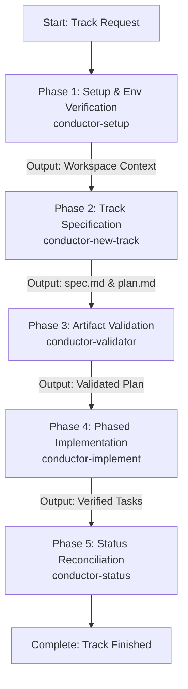

# Conductor Pipeline Orchestrator

A single master skill that runs the full Conductor feature/bug track lifecycle from initial scoping through validated implementation and status reconciliation.

## Sequential Execution Pipeline

---

### Phase 1: Setup & Workspace Verification
* **Skill to Execute**: `conductor-setup`
* **Input / Prerequisites**: Project repository and target feature or bug domain.
* **Execution Protocol**:
  1. Inspect `conductor/` directory for tech stack definitions, style guides, and active workflows.
  2. Verify that workspace conventions, git branch state, and product definitions are aligned.
* **Produced Output**: Confirmed project context and verified Conductor workspace environment.

### Phase 2: Track Specification & Implementation Planning
* **Skill to Execute**: `conductor-new-track`
* **Input / Prerequisites**: Requirements and context verified in Phase 1.
* **Execution Protocol**:
  1. Initialize the track folder (`conductor/tracks/<track_id>/`).
  2. Draft `spec.md` with problem statement, functional requirements, and acceptance criteria.
  3. Draft `plan.md` detailing phased, incremental tasks structured around TDD cycles.
* **Produced Output**: `conductor/tracks/<track_id>/spec.md` and `conductor/tracks/<track_id>/plan.md`.

### Phase 3: Plan Validation
* **Skill to Execute**: `conductor-validator`
* **Input / Prerequisites**: `spec.md` and `plan.md` created in Phase 2.
* **Execution Protocol**:
  1. Audit `spec.md` for complete requirements, user stories, and acceptance criteria.
  2. Audit `plan.md` for task atomicity, dependency ordering, and verification commands.
  3. Correct any gaps or inconsistencies before writing production code.
* **Produced Output**: Validation certificate / clean audit passing the track into implementation readiness.

### Phase 4: Phased Task Implementation
* **Skill to Execute**: `conductor-implement`
* **Input / Prerequisites**: Validated `plan.md` from Phase 3.
* **Execution Protocol**:
  1. Sequentially execute tasks defined in Phase 1, Phase 2, etc. of `plan.md`.
  2. For each task: apply TDD workflow (test first, code second, verify).
  3. Create atomic git commits per completed task checkpoint.
  4. Mark completed tasks as `[x]` in `plan.md`.
* **Produced Output**: Implemented feature code, passing automated tests, and git commit checkpoints.

### Phase 5: Status Auditing & Track Reconciliation
* **Skill to Execute**: `conductor-status`
* **Input / Prerequisites**: Updated track files from Phase 4.
* **Execution Protocol**:
  1. Inspect active tracks, completed tasks, and remaining backlog.
  2. Output the track summary and reconcile track state against project deliverables.
* **Produced Output**: Executive progress summary and updated track registry.

## Execution Guardrails & Halting Rules
1. Never run `conductor-implement` without a validated `plan.md` produced by Phase 2 and verified by Phase 3.
2. If any task in Phase 4 fails verification, halt execution, diagnose with `debugger`, or use `conductor-revert` to rollback the failing work unit before proceeding.
