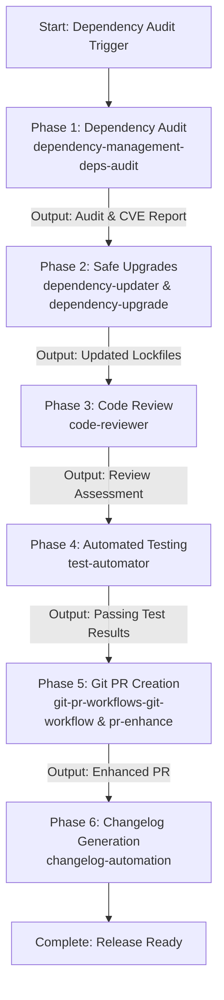

# Dependency & Release Pipeline

A single master skill that orchestrates the entire lifecycle of upgrading dependencies, verifying stability, opening enhanced pull requests, and publishing standardized release notes in strict sequential order.

## Sequential Execution Pipeline

---

### Phase 1: Dependency Audit & Vulnerability Scan
* **Skill to Execute**: `dependency-management-deps-audit`
* **Input / Prerequisites**: Project manifest and lockfiles (`package.json`, `requirements.txt`, `Cargo.lock`, `go.mod`).
* **Execution Protocol**:
  1. Scan for outdated packages, known CVEs, license conflicts, and deprecated dependencies.
  2. Categorize updates into patch, minor, and major breaking changes.
* **Produced Output**: Dependency health report and actionable upgrade list.

### Phase 2: Safe Dependency Upgrading
* **Skill to Execute**: `dependency-updater` (for patch/minor) and `dependency-upgrade` (for major breaking changes)
* **Input / Prerequisites**: Audit report from Phase 1.
* **Execution Protocol**:
  1. Apply non-breaking patch and minor version bumps incrementally.
  2. For major versions: consult migration guides, adapt breaking API signatures, and update configuration files.
* **Produced Output**: Modified lockfiles and modernized import/call sites.

### Phase 3: Code Review & Breaking Change Analysis
* **Skill to Execute**: `code-reviewer`
* **Input / Prerequisites**: Git diff of modified dependencies and migrated code from Phase 2.
* **Execution Protocol**:
  1. Review changes for unintentional behavior alterations, subtle API contract breaks, or deprecated usage.
  2. Verify that security practices and coding standards are maintained.
* **Produced Output**: Code review assessment approving changes for test verification.

### Phase 4: Automated Test Verification
* **Skill to Execute**: `test-automator`
* **Input / Prerequisites**: Upgraded codebase from Phases 2 and 3.
* **Execution Protocol**:
  1. Execute unit, integration, and regression test suites.
  2. Confirm 100% test pass rate with no regressions or deprecation warnings.
* **Produced Output**: Verified test run report confirming build and test success.

### Phase 5: Structured Branch & Enhanced Pull Request Creation
* **Skill to Execute**: `git-pr-workflows-git-workflow` and `git-pr-workflows-pr-enhance`
* **Input / Prerequisites**: Passing test report and git diff from Phase 4.
* **Execution Protocol**:
  1. Create a dedicated branch (e.g., `deps/upgrade-q3-2026`).
  2. Commit changes using Conventional Commits standard (`chore(deps): update project dependencies`).
  3. Generate an enhanced PR description featuring upgrade tables, risk assessments, test verification evidence, and reviewer checklists.
* **Produced Output**: Published Pull Request ready for peer review.

### Phase 6: Standardized Changelog Generation
* **Skill to Execute**: `changelog-automation`
* **Input / Prerequisites**: PR metadata and conventional commit messages from Phase 5.
* **Execution Protocol**:
  1. Parse conventional commits and PR descriptions.
  2. Append formatted release notes to `CHANGELOG.md` following Keep a Changelog standard.
* **Produced Output**: Updated `CHANGELOG.md` tracking dependency bumps and security patches.

## Execution Guardrails & Halting Rules
1. Never merge or submit PRs if Phase 4 automated tests report any failures.
2. Major version bumps must include explicit regression testing against all downstream consumers.
