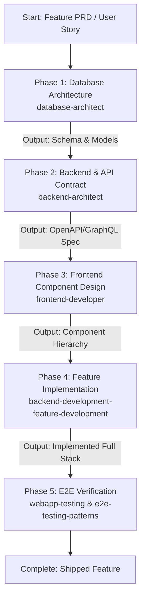

# Feature Delivery Pipeline

A unified master skill that coordinates cross-stack feature delivery following API-first and contract-driven development principles in strict sequential order.

## Sequential Execution Pipeline

---

### Phase 1: Database Architecture & Data Modeling
* **Skill to Execute**: `database-architect`
* **Input / Prerequisites**: Feature requirements, domain entities, and data volume expectations.
* **Execution Protocol**:
  1. Design normalized relational tables or document collections, defining constraints and foreign keys.
  2. Plan indexing strategy for critical query paths and write migration scripts.
* **Produced Output**: Complete schema migration scripts, entity relationship diagrams (ERD), and query patterns.

### Phase 2: Backend Architecture & API Contract Specification
* **Skill to Execute**: `backend-architect`
* **Input / Prerequisites**: Database schema and data models from Phase 1.
* **Execution Protocol**:
  1. Define service boundaries, authentication/authorization requirements, and caching policies.
  2. Author contract-first API specifications (OpenAPI 3.1 or GraphQL schema) defining request/response structures.
* **Produced Output**: Published API contract specification (e.g., `openapi.yaml`) and backend service architecture diagram.

### Phase 3: Frontend Component Architecture & State Modeling
* **Skill to Execute**: `frontend-developer`
* **Input / Prerequisites**: API contract specification from Phase 2.
* **Execution Protocol**:
  1. Design component hierarchy, routing paths, and UI state management (Zustand, Redux, React Query).
  2. Generate typed API client interfaces based on the API schema from Phase 2.
  3. Plan responsive layouts, accessibility (WCAG) requirements, and design token integration.
* **Produced Output**: Component tree blueprints, typed API clients, and UI state flow diagrams.

### Phase 4: Full-Stack Implementation
* **Skill to Execute**: `backend-development-feature-development` (collaborating with `frontend-developer`)
* **Input / Prerequisites**: Architecture blueprints and API contracts from Phases 1, 2, and 3.
* **Execution Protocol**:
  1. Implement backend controllers, service logic, and database repository layers according to contract.
  2. Implement frontend pages and UI components bound to the mockable backend API client.
  3. Verify unit tests for both client and server.
* **Produced Output**: Fully implemented and integrated full-stack feature code.

### Phase 5: End-to-End Integration & Verification Testing
* **Skill to Execute**: `webapp-testing` (leveraging `e2e-testing-patterns`)
* **Input / Prerequisites**: Deployed local or staging application from Phase 4.
* **Execution Protocol**:
  1. Execute automated end-to-end tests exercising the entire user journey through the UI and backend.
  2. Validate edge cases, network failures, error modals, and latency profiles.
* **Produced Output**: Passing E2E test report and release verification sign-off.

## Execution Guardrails & Halting Rules
1. Never write frontend or backend implementation before API contracts are specified and locked in Phase 2.
2. Halt if E2E test assertions fail in Phase 5; do not proceed to release until all regressions are fixed.
