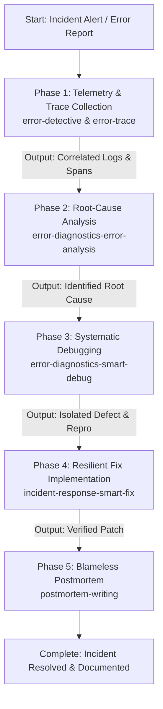

# Incident Diagnostics Pipeline

A single master skill that orchestrates incident response from initial telemetry investigation through root-cause analysis, defect correction, and blameless postmortem documentation.

## Sequential Execution Pipeline



---

### Phase 1: Telemetry, Logs & Distributed Trace Collection
* **Skill to Execute**: `error-diagnostics-error-trace` (leveraging `error-detective`)
* **Input / Prerequisites**: Incident notification, error alert, stack trace, or timestamp range.
* **Execution Protocol**:
  1. Ingest application logs, structured telemetry, and distributed trace spans.
  2. Correlate upstream client requests with downstream database, cache, or microservice failures.
  3. Identify error rate anomalies, latency spikes, and failing endpoints.
* **Produced Output**: Correlated telemetry dossier and stack trace timeline.

### Phase 2: Root-Cause Analysis (RCA)
* **Skill to Execute**: `error-diagnostics-error-analysis`
* **Input / Prerequisites**: Telemetry dossier from Phase 1.
* **Execution Protocol**:
  1. Analyze stack traces, exception hierarchies, and state conditions preceding the crash.
  2. Formulate and validate hypotheses explaining why the failure occurred under specific conditions.
  3. Rule out external environmental factors (network partition, memory exhaustion, third-party outage).
* **Produced Output**: Validated Root Cause Analysis (RCA) document specifying the failure mechanism.

### Phase 3: Systematic Debugging & Reproduction
* **Skill to Execute**: `error-diagnostics-smart-debug` (leveraging `debugger`)
* **Input / Prerequisites**: RCA document from Phase 2.
* **Execution Protocol**:
  1. Construct a minimal reproduction test case demonstrating the bug locally.
  2. Step through code execution to isolate the exact erroneous lines, unhandled nil pointers, or race conditions.
* **Produced Output**: Minimal reproduction test case and identified lines of defect.

### Phase 4: Resilient Fix Implementation & Verification
* **Skill to Execute**: `incident-response-smart-fix` (applying `error-handling-patterns`)
* **Input / Prerequisites**: Reproduction test case and isolated defect from Phase 3.
* **Execution Protocol**:
  1. Implement targeted patch addressing the root cause.
  2. Introduce defensive guards, fallback routines, circuit breakers, or retry policies where appropriate.
  3. Execute reproduction test case to verify bug is resolved with zero regressions.
* **Produced Output**: Staged code fix with passing automated verification tests.

### Phase 5: Blameless Postmortem & Knowledge Ingestion
* **Skill to Execute**: `postmortem-writing`
* **Input / Prerequisites**: Incident timeline, telemetry logs, RCA, and fix diff from Phases 1-4.
* **Execution Protocol**:
  1. Draft a blameless postmortem containing: incident summary, timeline, root cause, impact metrics, recovery actions, and preventative action items.
  2. Ingest postmortem learnings into local memory:
     ```bash
     python3 ~/memory_system/capture_knowledge.py <postmortem_report.md>
     ```
* **Produced Output**: Published postmortem document and synced incident learnings.

## Execution Guardrails & Halting Rules
1. Never apply a fix without first establishing a reproducible test case.
2. Halt if the fix in Phase 4 introduces regressions in existing test suites.
