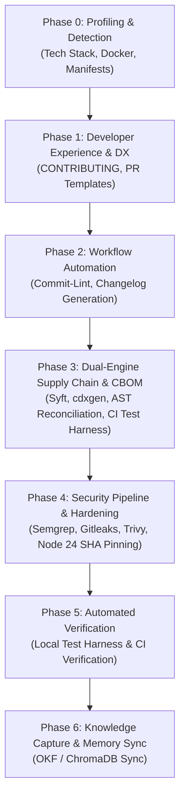

# Repository Governance Orchestrator

The **Repository Governance Orchestrator** is a Master Skill designed to systematically scaffold, audit, and enforce a "Gold Standard" baseline across any GitHub repository. It unifies developer experience (DX), commit hygiene, multi-layer security analysis, Node 24 runtime modernization, and dual-engine software and cryptographic supply chain governance (SBOM & CBOM) with automated CI/CD test verification.

---

## When to Use

Use this skill whenever you need to:
- **Onboard any new or existing repository** to organizational engineering, DX, and security baselines.
- **Scaffold the complete dual-engine SBOM and CBOM scanning workflow** into a target repository to automatically inventory software packages, discover cryptographic call sites across Python, JS/TS, Go, Java, Rust, C#, and C/C++, and generate PQC migration scorecards.
- **Inject automated CI test harnesses** (`test_boms.sh`) that fail builds if BOMs are missing, invalid, or lack cryptographic assets.
- **Standardize Pull Request and Contribution workflows** (`PULL_REQUEST_TEMPLATE.md`, `CONTRIBUTING.md`, `commit-lint.yml`, `changelog.yml`).
- **Audit and modernize GitHub Actions workflows** to Node 24 runtimes and enforce 40-character immutable commit SHA pinning.

---

## Distinction Among Governance Orchestrators

| Orchestrator Skill | Primary Scope | Key Deliverables & Gates |
| :--- | :--- | :--- |
| **`repo-governance-orchestrator`** | **Baseline Repo Scaffolding & Supply Chain DX** | `CONTRIBUTING.md`, PR template, Conventional Commits, `changelog.yml`, dual-engine SBOM/CBOM (`sbom.yml`, `scan_crypto_ast.py`, `analyze_cbom.py`, `test_boms.sh`), baseline SAST/Secret scanning (`security-testing.yml`), Node 24 SHA pinning. |
| **`security-governance-orchestrator`** | **Comprehensive Security Lifecycle & Compliance** | STRIDE threat modeling, Security ADRs (SecADRs), SARIF export to GitHub Security tab, Dependabot cooldown configuration, and SOC2/CIS compliance posture. |
| **`adr-governance-orchestrator`** | **Architectural Decision Lifecycle** | Problem discovery, MADR/Nygard authoring, compliance gatekeeping (`adr-gatekeeper`), and index synchronization. |
| **`architecture-governance-orchestrator`** | **Macro-Level Systems Architecture** | Visual C4 architecture models (Context, Container, Component, Code), cloud/K8s/monorepo blueprints, and ADR cross-referencing. |

---

## Sequential Orchestration Pipeline

When executed against a target repository, the orchestrator proceeds through six strict sequential phases:



### Phase 0: Repository Profiling & Technology Stack Detection
1. Inspect root directory to detect languages (`pyproject.toml`, `package.json`, `go.mod`, `pom.xml`, `Cargo.toml`, etc.).
2. Detect build containers (`Dockerfile`, `docker-compose.yml`).
3. Check for existing `.github/workflows` to prevent conflicting duplicate actions.

### Phase 1: Documentation & Developer Experience
1. Scaffold standardized [`CONTRIBUTING.md`](templates/CONTRIBUTING.md) adapted to the repository's technology stack.
2. Scaffold [`.github/PULL_REQUEST_TEMPLATE.md`](templates/PULL_REQUEST_TEMPLATE.md) with mandatory testing evidence, security impact declarations, and sign-off checklists.

### Phase 2: Workflow Automation, Commit Hygiene & Unattended Updates
1. Deploy [`.github/workflows/commit-lint.yml`](templates/commit-lint.yml) enforcing Conventional Commits on all pull requests and pushes using `wagoid/commitlint-github-action@v6`.
2. Deploy [`.github/workflows/changelog.yml`](templates/changelog.yml) to automate semantic version release notes and `CHANGELOG.md` updates.
3. Deploy [`.github/workflows/nightly-dependency-update.yml`](templates/nightly-dependency-update.yml) and [`.github/workflows/auto-manage-prs.yml`](templates/auto-manage-prs.yml) for automated 03:00 AM dependency updates with:
   - Dynamic PAT token resolution (avoiding GitHub `GITHUB_TOKEN` anti-recursion workflow suppression).
   - Reviewer lock elimination (removing blocking `reviewers` fields on pre-verified updates).
   - Direct unattended auto-merge execution (`gh pr merge --auto --squash --delete-branch`).

### Phase 3: Dual-Engine Supply Chain & Cryptographic Governance (BOM Suite)
Deploy the full dual-engine scanning pipeline into the repository:
1. **GitHub Actions Workflow** [`.github/workflows/sbom.yml`](templates/sbom.yml):
   - Generates CycloneDX and SPDX SBOMs via Anchore / Syft.
   - Generates CycloneDX 1.6/1.7 CBOMs via `@cyclonedx/cdxgen --include-crypto`.
   - Executes multi-language semantic AST call-site discovery (`scan_crypto_ast.py`) to catch instantiated cryptographic calls missed by manifest scanners.
   - Executes the automated CI verification test harness (`test_boms.sh`).
   - Generates the Post-Quantum Cryptography (PQC) migration scorecard and `$GITHUB_STEP_SUMMARY` (`analyze_cbom.py`).
   - Uploads all artifacts to `oss/` and attaches them to GitHub release tags (`v*`).
2. **Local Engineering Scripts** (installed into `scripts/` with executable permissions):
   - `scripts/generate_boms.sh`: Local bash generator supporting container images (`-t docker`) or directory scans (`-t dir`). Automatically runs AST reconciliation.
   - `scripts/scan_crypto_ast.py`: Multi-language AST parser for Python (`ast`), JS/TS, Go, Java, Rust, C#, and C/C++ regex fallbacks. Reconciles call sites directly into `oss/cbom.json`.
   - `scripts/analyze_cbom.py`: Analyzes algorithms, key sizes, classical vs PQC inventory, quantum vulnerabilities, and formats Markdown & GitHub Actions Step Summaries.
   - `scripts/test_boms.sh`: Automated test harness verifying JSON validity, CycloneDX schema conformity, cryptographic asset counts, and PQC audit execution.

### Phase 4: Security Pipeline & Node 24 SHA Pinning
1. Deploy [`.github/workflows/security-testing.yml`](templates/security-testing.yml):
   - **Gitleaks**: Scans for leaked tokens, private keys, and passwords.
   - **Semgrep SAST**: Scans source code for application security flaws.
   - **Trivy**: Scans filesystems and container images for known CVEs.
2. Enforce [`github-actions-node24`](../github-actions-node24/SKILL.md) standards:
   - Bump all actions to Node 24 runtimes (e.g., `actions/checkout@v7`, `actions/upload-artifact@v4`).
   - Pin all `uses:` directives with 40-character immutable commit SHAs.

### Phase 5: Automated Verification & Health Checks
1. Execute the local BOM generator:
   ```bash
   bash scripts/generate_boms.sh .
   ```
2. Execute the verification test harness:
   ```bash
   bash scripts/test_boms.sh oss
   ```
3. Verify that 4/4 test gates pass with non-zero cryptographic inventory.

### Phase 6: Knowledge Capture & Memory Sync
1. Persist the generated governance posture, PQC scorecard, and repository configuration to local agent memory:
   ```bash
   python3 ~/memory_system/capture_knowledge.py oss/crypto-summary.md
   ```

---

## Bundled CLI Tooling & Usage

The skill provides an automated Python CLI tool [`scaffold_governance.py`](scripts/scaffold_governance.py) to scaffold components into any repository:

```bash
# Full Governance Suite (DX + Security + Dual-Engine BOM Suite)
python3 skills/repo-governance-orchestrator/scripts/scaffold_governance.py /path/to/target-repo

# BOM Scanning & Cryptographic Pipeline Only
python3 skills/repo-governance-orchestrator/scripts/scaffold_governance.py /path/to/target-repo --mode bom-only

# Preview Scaffolding Actions (Dry Run)
python3 skills/repo-governance-orchestrator/scripts/scaffold_governance.py /path/to/target-repo --dry-run

# Overwrite existing configurations
python3 skills/repo-governance-orchestrator/scripts/scaffold_governance.py /path/to/target-repo --force
```

### CLI Arguments & Flags
- `<target_repo>`: Positional argument specifying the target repository path.
- `--mode [full|bom-only|security-only|dx-only]`: Selects which components to scaffold (default: `full`).
- `--force`: Overwrites existing files if they already exist in the repository.
- `--dry-run`: Displays what files would be copied without making filesystem changes.
- `--app-name <name>`: Customizes the Docker image or application identifier.

---

## Anti-Patterns & Strict Constraints

- **NEVER** release software or merge major security PRs without verified, non-empty SBOM and CBOM artifacts.
- **NEVER** rely exclusively on manifest scanners for cryptographic inventory; always run the dual-engine AST reconciliation (`scan_crypto_ast.py`) to discover runtime call sites.
- **NEVER** deploy GitHub Actions using floating major tags (e.g., `@v4`) in production; always enforce 40-character commit SHA pinning to prevent supply chain poisoning.
- **NEVER** use symlinks across skill directories or target repositories; always use direct canonical file paths.
