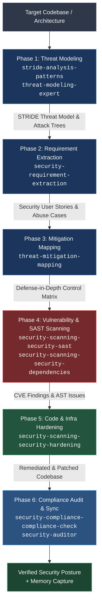

# Security Agent Orchestrator

`security-agent-orchestrator` is a sequential pipeline orchestrator designed to execute an end-to-end, defense-in-depth security lifecycle analysis on any target codebase or system architecture.

It coordinates specialized sub-skills in strict sequential order: decomposing the architecture into threat models, translating risks into requirements, engineering mitigation controls, discovering vulnerabilities via static and dependency analysis, actively patching code and infrastructure, and validating regulatory compliance.

---

## 1. Execution Pipeline Architecture



---

## 2. Skills Launched by Phase

The orchestrator launches **8 specialized security skills** across its 6 operational phases:

| Phase | Phase Name | Primary Skill Launched | Supporting Skills | Core Tooling & Standards | Key Output Artifact |
| :---: | :--- | :--- | :--- | :--- | :--- |
| **1** | **Threat Modeling** | [`stride-analysis-patterns`](file:///Users/jsoehner/skills-backup/skills/stride-analysis-patterns/SKILL.md) | [`threat-modeling-expert`](file:///Users/jsoehner/skills-backup/skills/threat-modeling-expert/SKILL.md), [`attack-tree-construction`](file:///Users/jsoehner/skills-backup/skills/attack-tree-construction/SKILL.md) | STRIDE, DFDs, Trust Boundaries, MITRE ATT&CK | `THREAT_MODEL.md` |
| **2** | **Requirement Extraction** | [`security-requirement-extraction`](file:///Users/jsoehner/skills-backup/skills/security-requirement-extraction/SKILL.md) | None | OWASP ASVS, Gherkin/BDD Abuse Stories | `SECURITY_REQUIREMENTS.md` |
| **3** | **Mitigation Mapping** | [`threat-mitigation-mapping`](file:///Users/jsoehner/skills-backup/skills/threat-mitigation-mapping/SKILL.md) | None | Defense-in-Depth, NIST SP 800-53 | `MITIGATION_MATRIX.md` |
| **4** | **Vulnerability Scanning** | [`security-scanning-security-sast`](file:///Users/jsoehner/skills-backup/skills/security-scanning-security-sast/SKILL.md) | [`security-scanning-security-dependencies`](file:///Users/jsoehner/skills-backup/skills/security-scanning-security-dependencies/SKILL.md), [`secrets-management`](file:///Users/jsoehner/skills-backup/skills/secrets-management/SKILL.md) | Semgrep, Bandit, ESLint Security, Trivy, Gitleaks | `VULNERABILITY_REPORT.json` / `SARIF` |
| **5** | **Code & Infra Hardening** | [`security-scanning-security-hardening`](file:///Users/jsoehner/skills-backup/skills/security-scanning-security-hardening/SKILL.md) | None | Parameterized Queries, CSP, Talisman/Helmet, Dockerfile/K8s Hardening | Remediated Code Diffs & Patches |
| **6** | **Compliance Verification** | [`security-compliance-compliance-check`](file:///Users/jsoehner/skills-backup/skills/security-compliance-compliance-check/SKILL.md) | [`security-auditor`](file:///Users/jsoehner/skills-backup/skills/security-auditor/SKILL.md) | SOC2, ISO 27001, PCI-DSS, HIPAA, GDPR | `COMPLIANCE_SCORECARD.md` + Memory Sync |

---

## 3. Deep-Dive: Phase Breakdown

### Phase 1: Threat Modeling & Attack Tree Construction
- **Primary Skill**: [`stride-analysis-patterns`](file:///Users/jsoehner/skills-backup/skills/stride-analysis-patterns/SKILL.md)
- **Supporting Skill**: [`threat-modeling-expert`](file:///Users/jsoehner/skills-backup/skills/threat-modeling-expert/SKILL.md)
- **Objective**: Deconstruct application architecture, identify data flows, define trust zones, and enumerate attack paths.
- **Execution Workflow**:
  1. Parse source code, routing tables, and infrastructure manifests to trace data ingress/egress points.
  2. Map trust boundaries (e.g., untrusted public internet vs. API gateway vs. internal private VPC).
  3. Systematically evaluate the 6 STRIDE attack vectors:
     - **Spoofing**: Authentication bypass, token forgery, missing MFA.
     - **Tampering**: Parameter tampering, SQL/command injection, integrity verification failure.
     - **Repudiation**: Missing immutable audit logs, lack of cryptographically signed transactions.
     - **Information Disclosure**: PII in logs, unencrypted data in transit/rest, verbose error stack traces.
     - **Denial of Service**: Resource exhaustion, unthrottled API endpoints, regex ReDoS.
     - **Elevation of Privilege**: IDOR, vertical privilege escalation, insecure role assignment.
- **Output Artifact**: `THREAT_MODEL.md` including Data Flow Diagrams (DFD) and threat enumeration table.

---

### Phase 2: Security Requirement Extraction
- **Primary Skill**: [`security-requirement-extraction`](file:///Users/jsoehner/skills-backup/skills/security-requirement-extraction/SKILL.md)
- **Objective**: Convert theoretical attack paths from Phase 1 into actionable engineering requirements and testable specifications.
- **Execution Workflow**:
  1. Review all High and Critical threat items discovered in the threat model.
  2. Translate threats into formal **Security User Stories** with Gherkin acceptance criteria (Given/When/Then).
  3. Define positive security requirements and **Abuse Test Cases** (defining what the system must *prevent*).
  4. Benchmark requirements against OWASP Application Security Verification Standard (ASVS) Level 2/3.
- **Output Artifact**: `SECURITY_REQUIREMENTS.md` with explicit acceptance criteria for engineers.

---

### Phase 3: Threat Mitigation Mapping
- **Primary Skill**: [`threat-mitigation-mapping`](file:///Users/jsoehner/skills-backup/skills/threat-mitigation-mapping/SKILL.md)
- **Objective**: Map every extracted requirement to concrete technical controls and defense-in-depth mechanisms.
- **Execution Workflow**:
  1. Construct a traceability matrix linking threats to technical mitigations.
  2. Design compensating controls where direct mitigations are constrained by legacy code or third-party APIs.
  3. Prioritize mitigations using risk-based scoring (Exploitability $\times$ Business Impact).
  4. Specify implementation patterns (e.g., replacing raw queries with parameterized ORM methods, adding Redis token bucket rate limiting, implementing AES-256-GCM envelope encryption).
- **Output Artifact**: `MITIGATION_MATRIX.md` with clear implementation directives.

---

### Phase 4: Static Analysis & Dependency Vulnerability Scanning
- **Primary Skills**:
  - [`security-scanning-security-sast`](file:///Users/jsoehner/skills-backup/skills/security-scanning-security-sast/SKILL.md) (Static Application Security Testing)
  - [`security-scanning-security-dependencies`](file:///Users/jsoehner/skills-backup/skills/security-scanning-security-dependencies/SKILL.md) (Software Composition Analysis / Supply Chain)
- **Supporting Skill**: [`secrets-management`](file:///Users/jsoehner/skills-backup/skills/secrets-management/SKILL.md)
- **Objective**: Identify actual vulnerabilities, exposed credentials, and vulnerable third-party libraries across the codebase.
- **Tools Invoked**:
  - **Multi-language SAST**: Semgrep (`p/security-audit`, `p/owasp-top-ten`, `p/cwe-top-25`)
  - **Language-Specific AST Scanners**: Bandit (Python), ESLint Security (Node.js/TypeScript), SpotBugs/Checkstyle (Java), gosec (Go)
  - **Secret Detection**: Gitleaks / TruffleHog regex scanning across commit history and untracked files
  - **SCA / Dependency CVEs**: Trivy filesystem scan, `npm audit`, `pip-audit`, OSV-Scanner
- **Output Artifact**: `VULNERABILITY_REPORT.json` and standardized `SARIF` finding records with CVSS scores and line-number references.

---

### Phase 5: Code & Infrastructure Hardening
- **Primary Skill**: [`security-scanning-security-hardening`](file:///Users/jsoehner/skills-backup/skills/security-scanning-security-hardening/SKILL.md)
- **Objective**: Apply direct, hands-on code patches and infrastructure hardening changes to remediate findings from Phase 4.
- **Execution Workflow**:
  1. **Application Code Patching**:
     - Replace concatenated SQL with parameterized queries.
     - Encode dynamic HTML outputs and apply DOMPurify to eliminate XSS.
     - Implement secure cookie flags (`Secure`, `HttpOnly`, `SameSite=Strict`).
     - Add security response headers (Content-Security-Policy, HSTS, X-Frame-Options).
  2. **Dependency Remediation**:
     - Upgrade vulnerable dependencies to non-vulnerable patched versions.
     - Pin transient dependencies in lockfiles (`package-lock.json`, `poetry.lock`, `requirements.txt`).
  3. **Infrastructure & Container Hardening**:
     - Remove root user execution in `Dockerfile` (`USER 10001`).
     - Remove sensitive build arguments and unnecessary OS packages.
     - Restrict overly permissive file permissions.
- **Output Artifact**: Validated git diffs and passing test suites.

---

### Phase 6: Compliance Verification & Knowledge Capture
- **Primary Skill**: [`security-compliance-compliance-check`](file:///Users/jsoehner/skills-backup/skills/security-compliance-compliance-check/SKILL.md)
- **Supporting Skill**: [`security-auditor`](file:///Users/jsoehner/skills-backup/skills/security-auditor/SKILL.md)
- **Objective**: Audit the final hardened state against regulatory frameworks, generate a compliance scorecard, and capture organizational learnings.
- **Execution Workflow**:
  1. Map existing controls and remediations against target frameworks:
     - **SOC 2 Type II**: Trust Services Criteria (CC6.1 Logical Access, CC6.6 Boundary Defense, CC7.1 Vulnerability Management).
     - **ISO/IEC 27001:2022**: Annex A controls (A.8.8 Technical vulnerability management, A.8.20 Network security).
     - **PCI-DSS v4.0**: Req 3 (Protect Stored Account Data), Req 6 (Develop Secure Systems).
     - **GDPR**: Art 32 (Security of processing, encryption of personal data).
  2. Compute final residual risk score and generate executive audit summary.
  3. **Local Memory Sync**: Trigger local knowledge capture:
     ```bash
     python3 ~/memory_system/capture_knowledge.py docs/security/SECURITY_AUDIT_REPORT.md
     ```
- **Output Artifact**: `COMPLIANCE_SCORECARD.md` and ingested vector memory entries.

---

## 4. Execution Guardrails & Halting Rules

To guarantee rigor, the orchestrator enforces strict operational guardrails:

1. **Sequential Integrity**: Never jump to hardening (Phase 5) without completing threat modeling (Phase 1) and vulnerability scanning (Phase 4). Context from earlier phases is mandatory for safe patching.
2. **Critical Vulnerability Halting**: If any **Critical** or **High** severity vulnerabilities remain unresolved after Phase 5, the pipeline halts with a non-zero exit status and flags the blockers.
3. **No Unauthenticated Secret Bypass**: Any exposed credential or private key detected in Phase 4 must be revoked and removed immediately.
4. **Regression Verification**: Code patches applied in Phase 5 must pass all existing application test suites before progressing to Phase 6.

---

## 5. Relationship to `security-governance-orchestrator`

These two security skills are designed to work together symbiotically:

```
┌─────────────────────────────────────────────────────────────────────────┐
│                   security-governance-orchestrator                      │
│                  (Repository Governance & CI/CD)                        │
│                                                                         │
│  • Provisions .github/workflows/security-governance.yml                │
│  • Configures Dependabot, CODEOWNERS, and Branch Protection Rules       │
│  • Authors and logs Architectural Decision Records (docs/adr/*.md)      │
│  • Enforces client-side pre-commit hooks and PR gatekeeper checks       │
└────────────────────────────────────┬────────────────────────────────────┘
                                     │ triggers for deep analysis
                                     ▼
┌─────────────────────────────────────────────────────────────────────────┐
│                     security-agent-orchestrator                         │
│                    (Hands-on Technical Execution)                       │
│                                                                         │
│  • STRIDE threat modeling & data flow analysis                          │
│  • Translates threats into security user stories and abuse test cases   │
│  • Executes SAST, dependency auditing, and credential scanning          │
│  • Directly writes code patches and hardens configuration manifests     │
│  • Audits against SOC2 / ISO 27001 / PCI-DSS compliance                 │
└─────────────────────────────────────────────────────────────────────────┘
```

- **`security-agent-orchestrator`** is the **execution engine** that inspects code, finds CVEs, drafts threat models, and patches vulnerabilities.
- **`security-governance-orchestrator`** is the **management & gatekeeping layer** that ensures those technical decisions are permanently preserved in ADRs and enforced in GitHub CI/CD on every PR.

---

## 6. Example Invocations

### Full Security Lifecycle Run
```markdown
Run the security-agent-orchestrator on this repository to perform a full defense-in-depth security analysis, threat model the API surface, scan for vulnerabilities, and harden identified risks.
```

### Targeted Threat Modeling & Scanning
```markdown
Execute Phase 1 through Phase 4 of security-agent-orchestrator on the authentication service in auth/ to produce a STRIDE model and identify injection flaws.
```

### Automated Remediation
```markdown
Use security-agent-orchestrator to review our dependency manifests and apply Phase 5 hardening to patch all high-severity CVEs and configure security headers.
```
