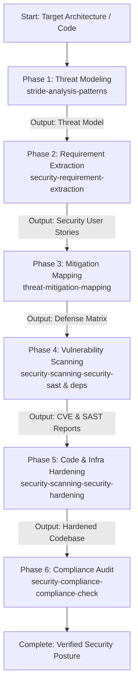

# Security Agent Orchestrator

A unified master skill that executes a complete defense-in-depth security audit and remediation lifecycle in strict sequential order.

## Sequential Execution Pipeline



---

### Phase 1: Threat Modeling & Attack Tree Construction
* **Skill to Execute**: `stride-analysis-patterns` (leveraging `threat-modeling-expert`)
* **Input / Prerequisites**: System architecture, data flow diagrams, and external trust boundaries.
* **Execution Protocol**:
  1. Deconstruct the architecture into trust zones and data stores.
  2. Systematically identify threats across Spoofing, Tampering, Repudiation, Information Disclosure, Denial of Service, and Elevation of Privilege (STRIDE).
* **Produced Output**: STRIDE Threat Model matrix and attack path documentation.

### Phase 2: Security Requirement Extraction
* **Skill to Execute**: `security-requirement-extraction`
* **Input / Prerequisites**: STRIDE threat model from Phase 1.
* **Execution Protocol**:
  1. Translate abstract threats into actionable security requirements.
  2. Author security user stories, acceptance criteria, and abuse test cases.
* **Produced Output**: Security requirements specification and testing criteria.

### Phase 3: Threat Mitigation Mapping
* **Skill to Execute**: `threat-mitigation-mapping`
* **Input / Prerequisites**: Identified threats and requirements from Phases 1 & 2.
* **Execution Protocol**:
  1. Map each identified threat to specific architectural controls (e.g., mTLS, input sanitization, rate limiting, KMS encryption).
  2. Prioritize mitigation investments based on exploitability and impact.
* **Produced Output**: Control mitigation matrix linking threats to technical defenses.

### Phase 4: Static Analysis & Dependency Vulnerability Scanning
* **Skill to Execute**: `security-scanning-security-sast` and `security-scanning-security-dependencies`
* **Input / Prerequisites**: Source code repository and dependency lockfiles.
* **Execution Protocol**:
  1. Execute SAST scanning for injection flaws, authentication bypasses, and insecure deserialization.
  2. Run dependency audits for known CVEs, license issues, and vulnerable transitive packages.
* **Produced Output**: Comprehensive SAST vulnerability report and dependency CVE list.

### Phase 5: Code & Infrastructure Hardening
* **Skill to Execute**: `security-scanning-security-hardening`
* **Input / Prerequisites**: Vulnerability reports from Phase 4 and mitigation requirements from Phase 3.
* **Execution Protocol**:
  1. Patch vulnerable code paths (e.g., enforce parameterization, boundary checks, secure headers).
  2. Upgrade or pin vulnerable packages.
  3. Harden container images and deployment manifests.
* **Produced Output**: Remediated codebase with passing security checks.

### Phase 6: Compliance Verification & Knowledge Capture
* **Skill to Execute**: `security-compliance-compliance-check` (leveraging `security-auditor`)
* **Input / Prerequisites**: Remediated codebase and configuration from Phase 5.
* **Execution Protocol**:
  1. Verify compliance posture against target regulatory frameworks (SOC2, ISO 27001, GDPR, PCI-DSS).
  2. Ingest security policies and findings into local memory:
     ```bash
     python3 ~/memory_system/capture_knowledge.py <security_audit_report.md>
     ```
* **Produced Output**: Compliance audit certificate and memory-synced security profile.

## Execution Guardrails & Halting Rules
1. Never jump to hardening without static scanning and threat context.
2. Halt if any Critical/High SAST vulnerabilities remain unresolved in Phase 5.
