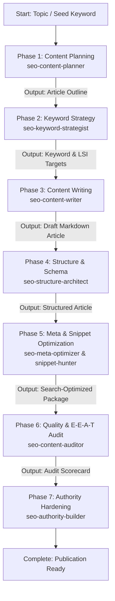

# SEO Content Pipeline

A single master skill that orchestrates the entire publication lifecycle for high-ranking, E-E-A-T compliant articles from initial keyword discovery to final authority hardening.

## Sequential Execution Pipeline

---

### Phase 1: Content Planning & Topic Clustering
* **Skill to Execute**: `seo-content-planner`
* **Input / Prerequisites**: Target niche, business theme, or seed topic.
* **Execution Protocol**:
  1. Identify search intent (informational, commercial, navigational).
  2. Construct a detailed outline featuring H2/H3 headings, logical thematic progression, and question blocks.
* **Produced Output**: Comprehensive article brief and structural outline.

### Phase 2: Keyword Strategy & LSI Variation Mapping
* **Skill to Execute**: `seo-keyword-strategist`
* **Input / Prerequisites**: Article brief from Phase 1.
* **Execution Protocol**:
  1. Select primary, secondary, and semantic Latent Semantic Indexing (LSI) keywords.
  2. Define target density boundaries to avoid keyword stuffing while maximizing topical relevance.
* **Produced Output**: Keyword strategy matrix with density recommendations and placement targets.

### Phase 3: SEO Content Writing
* **Skill to Execute**: `seo-content-writer`
* **Input / Prerequisites**: Outline from Phase 1 and keyword targets from Phase 2.
* **Execution Protocol**:
  1. Author engaging, human-centric prose following the provided outline.
  2. Naturally integrate target keywords, statistical evidence, and practical code/operational examples.
* **Produced Output**: Complete draft article in Markdown.

### Phase 4: Structural Optimization & Schema Markup
* **Skill to Execute**: `seo-structure-architect`
* **Input / Prerequisites**: Draft article from Phase 3.
* **Execution Protocol**:
  1. Validate heading hierarchy (single H1, nested H2s/H3s).
  2. Inject JSON-LD structured data (Article, FAQPage, HowTo schemas).
  3. Embed contextual internal links to related domain topics.
* **Produced Output**: Structurally optimized article with embedded JSON-LD schemas.

### Phase 5: Meta Data & Featured Snippet Formatting
* **Skill to Execute**: `seo-meta-optimizer` and `seo-snippet-hunter`
* **Input / Prerequisites**: Structured article from Phase 4.
* **Execution Protocol**:
  1. Author compelling meta titles (<60 characters) and meta descriptions (<155 characters).
  2. Format concise 40-50 word answer paragraphs and numbered lists tailored for Google Featured Snippets.
* **Produced Output**: Complete SEO metadata package and snippet-ready blocks.

### Phase 6: Content Quality & E-E-A-T Auditing
* **Skill to Execute**: `seo-content-auditor`
* **Input / Prerequisites**: Complete article and metadata package from Phase 5.
* **Execution Protocol**:
  1. Score article against Experience, Expertise, Authoritativeness, and Trustworthiness (E-E-A-T) criteria.
  2. Check readability indices, verify factual assertions, and audit for over-optimization.
* **Produced Output**: Audit scorecard with prioritized quality findings.

### Phase 7: Authority Building & Final Hardening
* **Skill to Execute**: `seo-authority-builder`
* **Input / Prerequisites**: Audit scorecard from Phase 6.
* **Execution Protocol**:
  1. Address any missing credibility markers: insert author bios, expert quotes, primary research citations, and editorial disclaimers.
* **Produced Output**: Final publication-ready article package ready for CMS deployment.

## Execution Guardrails & Halting Rules
1. Never generate article text without the keyword and outline framework from Phases 1 & 2.
2. Halt if the audit in Phase 6 flags keyword stuffing or low E-E-A-T scores; remediate before publishing.
