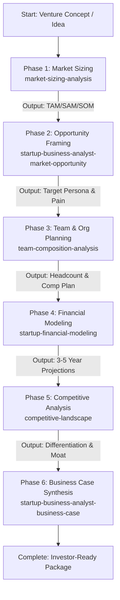

# Startup Business Pipeline

A single master skill that orchestrates the entire startup strategy and venture formulation workflow, generating an investor-ready business case and quantitative financial model.

## Sequential Execution Pipeline

---

### Phase 1: Market Sizing (TAM / SAM / SOM)
* **Skill to Execute**: `market-sizing-analysis`
* **Input / Prerequisites**: Venture problem statement, pricing model, and target customer profile.
* **Execution Protocol**:
  1. Execute top-down and bottom-up market sizing calculations.
  2. Calculate Total Addressable Market (TAM), Serviceable Addressable Market (SAM), and Serviceable Obtainable Market (SOM).
* **Produced Output**: Rigorous TAM/SAM/SOM calculations with cited data sources and market CAGR assumptions.

### Phase 2: Market Opportunity & Problem Framing
* **Skill to Execute**: `startup-business-analyst-market-opportunity`
* **Input / Prerequisites**: Market sizing numbers from Phase 1.
* **Execution Protocol**:
  1. Quantify customer pain points, urgency, and willingness to pay.
  2. Define ideal customer profiles (ICPs), target vertical segments, and expansion pathways.
* **Produced Output**: Detailed market opportunity analysis and customer segmentation document.

### Phase 3: Team Composition & Organizational Planning
* **Skill to Execute**: `team-composition-analysis`
* **Input / Prerequisites**: Stage of venture (Pre-seed, Seed, Series A) and execution scope.
* **Execution Protocol**:
  1. Formulate role-by-role hiring roadmap across engineering, product, sales, and operations.
  2. Estimate compensation benchmarks, payroll taxes, and benefits.
* **Produced Output**: Headcount plan with phased hiring milestones and compensation model.

### Phase 4: Financial Modeling & Projections
* **Skill to Execute**: `startup-financial-modeling` (leveraging `startup-business-analyst-financial-projections`)
* **Input / Prerequisites**: Market figures from Phase 1/2 and headcount costs from Phase 3.
* **Execution Protocol**:
  1. Construct a 3-5 year financial model including revenue projections, gross margins, CAC, LTV, and burn rate.
  2. Model runway scenarios, break-even milestones, and capital requirements.
* **Produced Output**: Complete 3-5 year financial projection tables and scenario models.

### Phase 5: Competitive Landscape & Moat Analysis
* **Skill to Execute**: `competitive-landscape`
* **Input / Prerequisites**: Target market definition and proposed product features.
* **Execution Protocol**:
  1. Map direct competitors, indirect alternatives, and status quo inertia.
  2. Construct a competitive feature matrix and identify sustainable defensibility (network effects, switching costs, IP).
* **Produced Output**: Competitive differentiation grid and defensibility strategy.

### Phase 6: Investor-Ready Business Case Synthesis
* **Skill to Execute**: `startup-business-analyst-business-case`
* **Input / Prerequisites**: Synthesized outputs from Phases 1 through 5.
* **Execution Protocol**:
  1. Compile the comprehensive business case document featuring: Executive Summary, Problem, Solution, Market Opportunity, Financial Summary, Go-To-Market, Team, and Funding Ask.
* **Produced Output**: Master investor-ready business case document.

## Execution Guardrails & Halting Rules
1. Never generate financial forecasts without bottom-up unit economics and realistic headcount costs.
2. Ensure TAM/SAM/SOM figures cite verifiable industry references.
