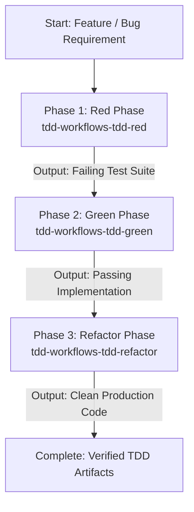

# TDD Pipeline Orchestrator

A unified orchestration skill that executes the complete Test-Driven Development (TDD) lifecycle sequentially. This skill coordinates and executes each dependent phase in the exact required order, passing artifacts and test outcomes from one stage to the next.

## Sequential Execution Pipeline



---

### Phase 1: Red Phase (Generate Failing Tests)
* **Skill to Execute**: `tdd-workflows-tdd-red` (leveraging `test-automator`)
* **Input / Prerequisites**: Target requirement, user story, API contract, or bug description.
* **Execution Protocol**:
  1. Analyze target functionality, boundary conditions, and failure modes.
  2. Scaffold the test suite using the project's native test framework (e.g., pytest, Jest, Vitest, Go test).
  3. Author precise test cases that assert desired behavior prior to implementation.
  4. Run the test suite to **verify and confirm that the tests fail** for the expected reasons (missing implementation or unmet assertions).
* **Produced Output**: A committed or staged failing test file (e.g., `tests/test_feature.py`).

### Phase 2: Green Phase (Implement Minimal Passing Code)
* **Skill to Execute**: `tdd-workflows-tdd-green`
* **Input / Prerequisites**: The failing test suite generated in Phase 1.
* **Execution Protocol**:
  1. Inspect the failing test assertions and error messages from Phase 1.
  2. Implement the **minimal** amount of business logic necessary to make every failing test pass.
  3. Avoid premature optimizations or speculative abstractions during this phase.
  4. Execute the test runner and verify that **100% of the tests pass cleanly**.
* **Produced Output**: Working production code satisfying all Phase 1 test assertions.

### Phase 3: Refactor Phase (Clean, Optimize, and Harden)
* **Skill to Execute**: `tdd-workflows-tdd-refactor` (leveraging `tdd-orchestrator`)
* **Input / Prerequisites**: The passing implementation code and green test suite from Phase 2.
* **Execution Protocol**:
  1. Identify code smells, duplication, rigid coupling, or unclear variable/function naming.
  2. Refactor logic for readability, performance, and adherence to design patterns (e.g., SOLID, DRY).
  3. Re-run the full test suite after each atomic refactoring step to guarantee zero regression.
  4. Validate linting, type-checking, and docstring clarity.
* **Produced Output**: Polished, production-ready code with complete, green test coverage.

---

## Execution Guardrails & Halting Rules
1. **No Skip Policy**: Never jump directly to Phase 2 (Green) without first executing Phase 1 (Red) and confirming the tests actually fail.
2. **Atomic Transition**: Do not proceed to Phase 3 (Refactor) until Phase 2 confirms all tests pass with an exit code of 0.
3. **Rollback on Regressions**: If Phase 3 introduces test failures, revert the refactor step immediately and re-verify.

## Memory Sync
Upon completing the TDD cycle, record key testing patterns or architectural learnings using:
```bash
python3 ~/memory_system/capture_knowledge.py <summary_or_diff.md>
```
