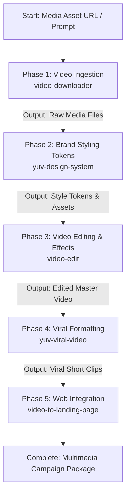

# Video & Brand Pipeline Orchestrator

A single master skill that coordinates video ingestion, brand styling, captioning, video motion effects, viral content rendering, and interactive landing page scaffolding in sequential order.

## Sequential Execution Pipeline

---

### Phase 1: Video & Audio Ingestion
* **Skill to Execute**: `video-downloader`
* **Input / Prerequisites**: Source video URL, cloud storage path, or raw video file path.
* **Execution Protocol**:
  1. Fetch source media, isolating high-resolution video streams and separated audio tracks.
  2. Verify codec compatibility (MP4, MOV) and validate disk space.
* **Produced Output**: Local raw video file and audio stem ready for processing.

### Phase 2: Brand Styling & Visual Token Injection
* **Skill to Execute**: `yuv-design-system`
* **Input / Prerequisites**: Campaign theme or output mode (e.g., NEON, DECKS, WARM EDITORIAL).
* **Execution Protocol**:
  1. Extract color palettes (pink/cyan/white for high-contrast neon, warm editorial for thought leadership).
  2. Configure typography hierarchy (Anton headers, Inter body text) and liquid-glass overlay parameters.
* **Produced Output**: Brand configuration tokens and motion parameter assets.

### Phase 3: Video Editing & Motion Effects
* **Skill to Execute**: `video-edit`
* **Input / Prerequisites**: Raw media from Phase 1 and brand tokens from Phase 2.
* **Execution Protocol**:
  1. Transcribe audio to generate word-by-word synchronized captions.
  2. Apply kinetic typography, liquid-glass cards, and GSAP motion transitions.
  3. Render edited master MP4.
* **Produced Output**: High-definition edited video with synchronized kinetic captions.

### Phase 4: Viral Short Generation
* **Skill to Execute**: `yuv-viral-video`
* **Input / Prerequisites**: Edited video from Phase 3.
* **Execution Protocol**:
  1. Format into vertical 9:16 aspect ratio optimized for TikTok, YouTube Shorts, and Instagram Reels.
  2. Add high-impact hooks, progress indicators, and dynamic audio-visual punctuation.
* **Produced Output**: Rendered vertical viral short ready for distribution.

### Phase 5: Interactive Web Landing Page Integration
* **Skill to Execute**: `video-to-landing-page`
* **Input / Prerequisites**: Master video and viral clips from Phases 3 and 4.
* **Execution Protocol**:
  1. Construct a modern, responsive web landing page.
  2. Implement a scroll-driven hero canvas that scrubbing plays the video based on page scroll depth.
  3. Integrate CTA buttons and accessible fallback transcripts.
* **Produced Output**: Production-ready landing page HTML/React component embedding the video.

## Execution Guardrails & Halting Rules
1. Halt if downloaded media from Phase 1 fails integrity or codec checks.
2. Ensure accessibility standards (WCAG contrast and closed captions) are strictly maintained during Phases 3 and 5.
