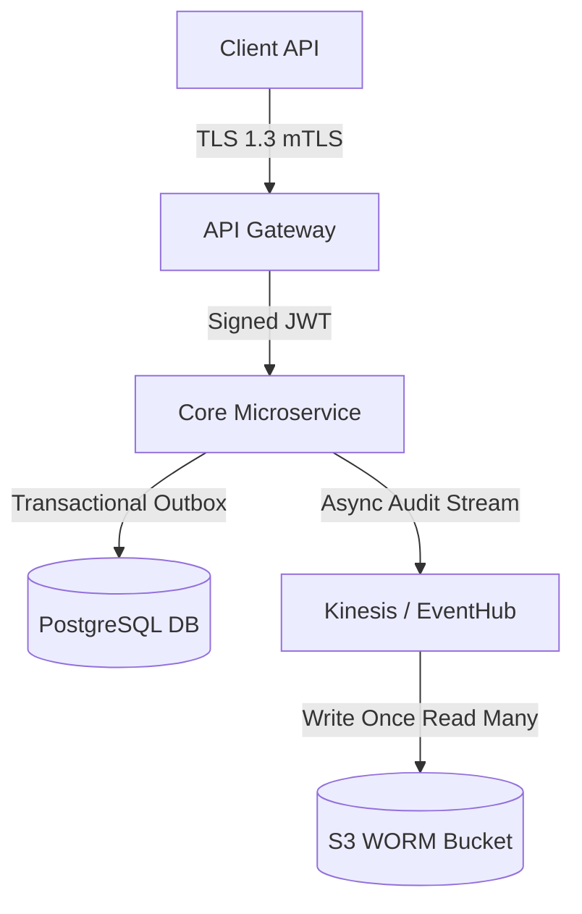

# Architecture Decision Records (ADRs & RADRs)

Comprehensive patterns for creating, maintaining, and managing Architecture Decision Records (ADRs) and Regulated Architecture Decision Records (RADRs) that capture the context, risk assessment, regulatory traceability, and rationale behind technical decisions.

## Use this skill when

- Making significant architectural decisions (frameworks, storage engines, security boundaries, microservices)
- Documenting software design choices in regulated industries (FDA/GxP, HIPAA, PCI-DSS v4.0, ISO 27001, IEC 62304, DORA, SOC 2)
- Recording trade-offs, hazard mitigations, and compliance control mappings
- Establishing formal Quality Management System (QMS) / GRC audit-ready decision documentation
- Onboarding new team members or reviewing historical technical decisions

## Do not use this skill when

- You only need to document small implementation details or routine code refactoring
- The change is a minor patch, bug fix, or dependency patch version update
- There is no architectural or compliance impact to record

## Instructions

1. **Select the Appropriate ADR Format**:
   - Use **Lightweight ADR (MADR / Nygard)** for standard, developer-facing technical decisions.
   - Use **Regulated ADR (RADR)** for safety-critical, security-impacting, or compliance-governed decisions (FDA/GxP, HIPAA, PCI-DSS, ISO 27001, DORA, IEC 62304).
2. **Capture Metadata (Audit Envelope)**: Include persistent IDs, system scope, safety/risk classification, and regulatory control mappings.
3. **Document Context & Rationale**: Detail business problem drivers, regulatory mandates, and ISO/IEC/IEEE 42010 architectural viewpoints.
4. **Conduct Hazard & Risk Assessment**: Map identified threats/hazards to architectural mitigations (STRIDE / ISO 14971).
5. **Evaluate Alternatives**: Provide a structured comparative matrix showing why alternatives were rejected.
6. **Establish Verification & Audit Evidence Strategy**: Define test protocols, automated CI/CD evidence paths, and QMS sign-off matrices.
7. **Maintain Append-Only Lifecycle**: Never modify approved historical records in-place; issue superseding ADRs for architectural updates.

---

## Core Concepts

### 1. Standard ADR vs. Regulated ADR (RADR)

| Decision Criteria | Lightweight ADR (MADR/Nygard) | Regulated ADR (RADR) |
| :--- | :--- | :--- |
| **Primary Audience** | Development team & engineering leads | Auditors, Compliance Officers, QMS Leads & Architects |
| **Target Scope** | Internal code/service architecture | Systems of Interest subject to regulatory oversight |
| **Governance Metadata** | Status, Date, Deciders | Full Audit Envelope (Safety class, Control IDs, Requirement IDs) |
| **Risk Analysis** | Implicit in consequences | Explicit Hazard/Threat Matrix (ISO 14971 / STRIDE) |
| **Traceability** | Optional Jira / PR links | Mandatory 3-way trace (SRS Req → Architecture → Test Protocol) |
| **Sign-off Requirements** | Peer PR approval | Multi-disciplinary sign-off (Architect, QA, CISO, Regulatory Affairs) |

### 2. ADR Lifecycle

```
Proposed → Under Review → Accepted / Approved → Deprecated → Superseded
                              ↓
                           Rejected
```

---

## Templates

### Template 1: Standard ADR (MADR Format)

```markdown
# ADR-0001: Use PostgreSQL as Primary Database

## Status

Accepted

## Context

We need to select a primary database for our new e-commerce platform. The system
will handle:
- ~10,000 concurrent users
- Complex product catalog with hierarchical categories
- Transaction processing for orders and payments
- Full-text search for products
- Geospatial queries for store locator

The team has experience with MySQL, PostgreSQL, and MongoDB. We need ACID
compliance for financial transactions.

## Decision Drivers

* **Must have ACID compliance** for payment processing
* **Must support complex queries** for reporting
* **Should support full-text search** to reduce infrastructure complexity
* **Should have good JSON support** for flexible product attributes
* **Team familiarity** reduces onboarding time

## Considered Options

### Option 1: PostgreSQL
- **Pros**: ACID compliant, excellent JSON support (JSONB), built-in full-text
  search, PostGIS for geospatial, team has experience
- **Cons**: Slightly more complex replication setup than MySQL

### Option 2: MySQL
- **Pros**: Very familiar to team, simple replication, large community
- **Cons**: Weaker JSON support, no built-in full-text search (need
  Elasticsearch), no geospatial without extensions

### Option 3: MongoDB
- **Pros**: Flexible schema, native JSON, horizontal scaling
- **Cons**: No ACID for multi-document transactions (at decision time),
  team has limited experience, requires schema design discipline

## Decision

We will use **PostgreSQL 15** as our primary database.

## Rationale

PostgreSQL provides the best balance of:
1. **ACID compliance** essential for e-commerce transactions
2. **Built-in capabilities** (full-text search, JSONB, PostGIS) reduce
   infrastructure complexity
3. **Team familiarity** with SQL databases reduces learning curve
4. **Mature ecosystem** with excellent tooling and community support

The slight complexity in replication is outweighed by the reduction in
additional services (no separate Elasticsearch needed).

## Consequences

### Positive
- Single database handles transactions, search, and geospatial queries
- Reduced operational complexity (fewer services to manage)
- Strong consistency guarantees for financial data
- Team can leverage existing SQL expertise

### Negative
- Need to learn PostgreSQL-specific features (JSONB, full-text search syntax)
- Vertical scaling limits may require read replicas sooner
- Some team members need PostgreSQL-specific training

### Risks
- Full-text search may not scale as well as dedicated search engines
- Mitigation: Design for potential Elasticsearch addition if needed

## Implementation Notes

- Use JSONB for flexible product attributes
- Implement connection pooling with PgBouncer
- Set up streaming replication for read replicas
- Use pg_trgm extension for fuzzy search

## Related Decisions

- ADR-0002: Caching Strategy (Redis) - complements database choice
- ADR-0005: Search Architecture - may supersede if Elasticsearch needed

## References

- [PostgreSQL JSON Documentation](https://www.postgresql.org/docs/current/datatype-json.html)
- [PostgreSQL Full Text Search](https://www.postgresql.org/docs/current/textsearch.html)
- Internal: Performance benchmarks in `/docs/benchmarks/database-comparison.md`
```

### Template 2: Lightweight ADR

```markdown
# ADR-0012: Adopt TypeScript for Frontend Development

**Status**: Accepted
**Date**: 2024-01-15
**Deciders**: @alice, @bob, @charlie

## Context

Our React codebase has grown to 50+ components with increasing bug reports
related to prop type mismatches and undefined errors. PropTypes provide
runtime-only checking.

## Decision

Adopt TypeScript for all new frontend code. Migrate existing code incrementally.

## Consequences

**Good**: Catch type errors at compile time, better IDE support, self-documenting
code.

**Bad**: Learning curve for team, initial slowdown, build complexity increase.

**Mitigations**: TypeScript training sessions, allow gradual adoption with
`allowJs: true`.
```

### Template 3: Y-Statement Format

```markdown
# ADR-0015: API Gateway Selection

In the context of **building a microservices architecture**,
facing **the need for centralized API management, authentication, and rate limiting**,
we decided for **Kong Gateway**
and against **AWS API Gateway and custom Nginx solution**,
to achieve **vendor independence, plugin extensibility, and team familiarity with Lua**,
accepting that **we need to manage Kong infrastructure ourselves**.
```

### Template 4: ADR for Deprecation

```markdown
# ADR-0020: Deprecate MongoDB in Favor of PostgreSQL

## Status

Accepted (Supersedes ADR-0003)

## Context

ADR-0003 (2021) chose MongoDB for user profile storage due to schema flexibility
needs. Since then:
- MongoDB's multi-document transactions remain problematic for our use case
- Our schema has stabilized and rarely changes
- We now have PostgreSQL expertise from other services
- Maintaining two databases increases operational burden

## Decision

Deprecate MongoDB and migrate user profiles to PostgreSQL.

## Migration Plan

1. **Phase 1** (Week 1-2): Create PostgreSQL schema, dual-write enabled
2. **Phase 2** (Week 3-4): Backfill historical data, validate consistency
3. **Phase 3** (Week 5): Switch reads to PostgreSQL, monitor
4. **Phase 4** (Week 6): Remove MongoDB writes, decommission

## Consequences

### Positive
- Single database technology reduces operational complexity
- ACID transactions for user data
- Team can focus PostgreSQL expertise

### Negative
- Migration effort (~4 weeks)
- Risk of data issues during migration
- Lose some schema flexibility

## Lessons Learned

Document from ADR-0003 experience:
- Schema flexibility benefits were overestimated
- Operational cost of multiple databases was underestimated
- Consider long-term maintenance in technology decisions
```

### Template 5: Request for Comments (RFC) Style

```markdown
# RFC-0025: Adopt Event Sourcing for Order Management

## Summary

Propose adopting event sourcing pattern for the order management domain to
improve auditability, enable temporal queries, and support business analytics.

## Motivation

Current challenges:
1. Audit requirements need complete order history
2. "What was the order state at time X?" queries are impossible
3. Analytics team needs event stream for real-time dashboards
4. Order state reconstruction for customer support is manual

## Detailed Design

### Event Store

```
OrderCreated { orderId, customerId, items[], timestamp }
OrderItemAdded { orderId, item, timestamp }
OrderItemRemoved { orderId, itemId, timestamp }
PaymentReceived { orderId, amount, paymentId, timestamp }
OrderShipped { orderId, trackingNumber, timestamp }
```

### Projections

- **CurrentOrderState**: Materialized view for queries
- **OrderHistory**: Complete timeline for audit
- **DailyOrderMetrics**: Analytics aggregation

## Drawbacks

- Learning curve for team
- Increased complexity vs. CRUD
- Need to design events carefully (immutable once stored)
- Storage growth (events never deleted)

## Implementation Plan

1. Prototype with single order type (2 weeks)
2. Team training on event sourcing (1 week)
3. Full implementation and migration (4 weeks)
4. Monitoring and optimization (ongoing)
```

### Template 6: Regulated ADR (RADR) Format (Audit-Ready)

```markdown
# RADR-YYYY-XXXX: [Short, Action-Oriented Decision Title]

---
## 0. Document Control & Governance Header

| Metadata Field | Value / Link |
| :--- | :--- |
| **RADR Identifier** | `RADR-2026-0042` |
| **System Scope** | `[e.g., Medical Device Core Telemetry Service / Payment Gateway]` |
| **Document Status** | `[Proposed | Under Review | Approved | Deprecated | Superseded]` |
| **Effective Date** | `2026-08-08` |
| **Version** | `1.0.0` |
| **Data Sensitivity Classification** | `[Confidential / PII / PHI / PCI-DSS Cardholder Data]` |
| **Regulatory Safety Class** | `[Class B (IEC 62304) / High Risk (DORA) / Category 2]` |
| **Governing Regulations** | `[e.g., FDA 21 CFR Part 11, HIPAA § 164.312, PCI-DSS v4.0 Req 10]` |
| **Upstream Requirements** | `[SRS-REQ-0104, SRS-REQ-0210]` |
| **Risk File Reference** | `[HAZARD-FILE-2026-09, THREAT-MODEL-04]` |
| **Validation Protocol** | `[VAL-TP-2026-102]` |

---

## 1. Regulatory Context & Business Drivers

### 1.1 Business Problem Statement

[Describe the problem or architectural need being addressed.]

### 1.2 Regulatory & Legal Directives

- **Regulation X (Clause Y)**: Requires immutable audit logging for all record modifications.
- **Security Standard Z**: Mandates TLS 1.3 for all internal service communication.

---

## 2. System Boundaries & Architectural Viewpoint

### 2.1 Scope & Boundaries

[Define the System of Interest (SoI). List included components and explicit out-of-scope boundaries.]

### 2.2 ISO 42010 Architectural Viewpoint

- **Primary Viewpoint**: `[e.g., Security & Data Protection View | Storage Persistence View]`
- **Key Stakeholder Concerns**: `[Auditability, Zero Data Loss, Latency SLA < 50ms]`

---

## 3. Risk Assessment & Hazard Mitigation

| Threat / Hazard ID | Risk Description | Pre-Mitigation Level | Designed Architectural Mitigation | Residual Risk Level |
| :--- | :--- | :--- | :--- | :--- |
| `THREAT-01` | Unauthorized access to stored PHI data. | **High** | Enforce envelope encryption via KMS with auto-rotation. | **Low (Accepted)** |
| `HAZARD-02` | Database write failure during audit event generation. | **Critical** | Implement transactional outbox pattern with fallback buffer. | **Low (Accepted)** |

---

## 4. Evaluated Options & Due Diligence Matrix

### 4.1 Comparative Evaluation Matrix

| Evaluation Criteria | Weight | Option 1 (Chosen) | Option 2 | Option 3 |
| :--- | :---: | :---: | :---: | :---: |
| **Regulatory Compliance** | 35% | **5/5** | 3/5 | 1/5 |
| **Security Posture** | 25% | **5/5** | 4/5 | 2/5 |
| **Operational Maintainability** | 20% | **4/5** | 4/5 | 3/5 |
| **Implementation Risk** | 20% | **4/5** | 2/5 | 4/5 |
| **Weighted Score** | **100%** | **4.65** | **3.25** | **2.35** |

---

## 5. Decision Statement & Technical Rationale

> **We decision to adopt [Option 1 Name] for [System Scope] effective [Date].**

### Technical Architecture Details



---

## 6. Regulatory Compliance & Control Mapping

| Regulatory Clause | Architectural Control Implementation | Evidence Location |
| :--- | :--- | :--- |
| `HIPAA § 164.312(b)` | Audit mechanism records user identity, timestamp, and delta changes. | `src/audit/logger.go` |
| `PCI-DSS v4.0 10.2.1` | Immutable audit log destination configured with Object Lock (WORM). | `infra/terraform/s3.tf` |

---

## 7. Consequences & Operational Blast Radius

### 7.1 Positive Impacts

- Fully compliant audit trail capability meeting QMS requirements.

### 7.2 Trade-offs & Negative Consequences

- Additional cloud WORM storage costs.

---

## 8. Verification, Validation & Audit Evidence Strategy

### 8.1 Verification Protocol

- **Automated Verification**: CI/CD pipeline enforces static security analysis (`gosec` / `semgrep`) and Terraform WORM configuration checks.
- **Validation Execution**: System validation protocol `VAL-TP-2026-102` will execute load testing and database failure injection tests.

---

## 9. Reversibility & Exit Strategy

### 9.1 Rollback Trigger Criteria

- Failure to pass validation test protocol `VAL-TP-2026-102`.

---

## 10. Governance Approval & Lifecycle Audit Log

### 10.1 Approval & Sign-Off Matrix

| Role | Approver Name | Title / Department | Status | Sign-off Date |
| :--- | :--- | :--- | :---: | :--- |
| **Lead Architect** | J. Doe, PE | Principal Software Architect | Approved | 2026-08-08 |
| **Quality Assurance Lead** | M. Smith | Quality Management System Director | Approved | 2026-08-08 |
| **Chief Information Security Officer** | A. Vance | CISO / Security Governance | Approved | 2026-08-08 |
| **Regulatory Compliance Lead** | R. Taylor | Regulatory Affairs Officer | Approved | 2026-08-08 |

### 10.2 Revision History Log

| Rev | Date | Author | Description of Change | Approved By |
| :---: | :---: | :--- | :--- | :--- |
| `0.1` | 2026-08-01 | J. Doe | Initial Draft for architectural review. | Self |
| `1.0` | 2026-08-08 | J. Doe | Finalized RADR incorporating Quality & Security feedback. | QMS Governance Board |
```

---

## ADR Management & QMS Integration

### Directory Structure

```
docs/
├── adr/
│   ├── README.md                          # Index and guidelines
│   ├── template-madr.md                   # Lightweight team template
│   ├── template-radr.md                   # Formal compliance RADR template
│   ├── 0001-use-postgresql.md
│   ├── 0002-caching-strategy.md
│   ├── 0003-mongodb-user-profiles.md     # [DEPRECATED]
│   └── 0020-deprecate-mongodb.md         # Supersedes 0003
```

### Automation & CI/CD Evidence Sync

```bash
# Validate RADR frontmatter & section completeness in CI pipeline
python scripts/validate_radr.py docs/adr/RADR-*.md

# Synchronize merged RADRs to enterprise QMS/GRC tool (e.g., ServiceNow/MasterControl)
python scripts/sync_qms_evidence.py --input docs/adr/ --target qms
```

---

## Best Practices & Anti-Patterns

### Do's

- **Choose the right template**: Use lightweight MADRs for internal tech choices; use RADRs for compliance, safety, or security scope.
- **Maintain 3-way traceability**: Always link RADRs to upstream SRS requirements and downstream test protocols.
- **Enforce append-only discipline**: Never edit accepted/approved ADRs in-place; write a new ADR that supersedes the previous decision.

### Anti-Patterns

- NEVER modify historical context of an approved decision; always supersede with a new record.
- NEVER omit the Risk Assessment or Regulatory Control Mapping sections in a RADR.
- NEVER leave approval matrices unassigned for safety-critical software choices.


## 6) Memory Sync

After completing a task, key decision, or report, you **MUST** trigger the local memory capture. 

1. Save the final document, report, or summary as a Markdown file in the project directory.
2. Invoke the capture script: 
   `ash
   python \capture_knowledge.py <file_path>
   `
3. This ensures that new requirements, technical standards, and findings are automatically routed to the correct storage (OKF or ChromaDB).
