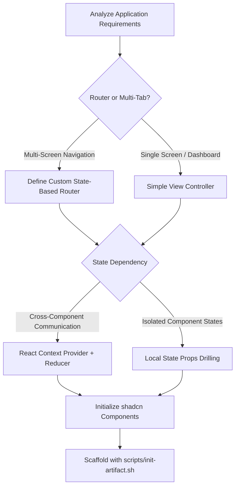

# Advanced React & shadcn/ui Artifacts Builder

This skill orchestrates the creation, scaffolding, optimization, and packaging of rich, multi-component React applications into a single, high-performance HTML file suitable for rendering in the Claude.ai artifact preview pane.

## 📂 Progressive Disclosure & Script Execution Triggers

This skill relies on local runner scripts to scaffold and build environments. You **must** utilize the following automation components when executing this skill:

* **Initial Setup**: Always run `bash scripts/init-artifact.sh <project-name>` to configure the workspace structure (Vite + React 18 + TS + Tailwind + shadcn). Do not manually install Vite or Radix primitives.
* **Compilation & Bundling**: Always run `bash scripts/bundle-artifact.sh` from the project root to bundle dependencies, CSS, assets, and JS into `bundle.html` via Parcel and `html-inline`.

---

## 🧠 Mindset & Architecture Framework

Before scaffolding a project, evaluate the design space with the following framework:
1. **State Ownership**: Will this application state reside in simple hook components (`useState`) or do we need a centralized global store (`React.useContext` or a lightweight reducer)?
2. **Visual Aesthetics (Anti-AI Slop)**: How do we bypass typical generative design patterns? Avoid purple/indigo gradients, default Inter font, and centered card-based landing zones. Opt for high-density, professional utility dashboards with dark/light mode integration, monospace accents, and dynamic layout systems.
3. **Asset Constraints**: Because the final output must be a single, self-contained HTML file, all assets (images, icons, fonts) must be either inlined as SVGs/Base64 or loaded from ultra-stable public CDNs.

---

## 🧭 Decision Tree: Architectural Complexity & State Patterns



---

## ⚖️ Technical Trade-offs: Single-File React Bundling

| Optimization Pattern | Trade-off / Cost | Best Used For | Mitigation Strategy |
| :--- | :--- | :--- | :--- |
| **Lucide-react Icon Imports** | Inlining hundreds of SVG icons bloats the bundle sizes by megabytes. | Standard dashboard navigation, buttons, status badges. | Import icons individually: `import { Check } from 'lucide-react'` instead of wildcard imports. |
| **Base64 Image Encoding** | Increases raw binary asset size by ~33%, making the single HTML load slowly. | Logos, patterns, fallback avatars. | Optimize images before encoding, or leverage stable CDNs (e.g., Unsplash) with CORS support. |
| **shadcn/ui Custom Theme Config** | Modifying Tailwind configuration files directly makes upgrades difficult. | Branded dashboards with customized design tokens. | Use CSS custom properties (variables) defined inside `index.css` rather than altering the tailwind config object. |

---

## 🎯 Constraint & Freedom Calibration

* **LOW FREEDOM (Strict Constraints)**:
  * **Bundling Pipeline**: You must use `scripts/bundle-artifact.sh` and preserve the `.parcelrc` configurations. Custom webpack/esbuild configurations are prohibited.
  * **Core Output Name**: The compilation output must always build to a file named `bundle.html` in the target directory.
* **HIGH FREEDOM (Creative Development)**:
  * **Application Architecture**: Complete freedom over context configurations, helper utility libraries, hooks, charts (e.g., Recharts), and state machine definitions.
  * **Aesthetics & Branding**: Absolute liberty to develop bespoke layout designs, micro-interactions, responsive sidebars, custom grids, and interactive canvas overlays.

---

## 🚫 NEVER Anti-Patterns

| Action to NEVER Do | Consequence | Rationale |
| :--- | :--- | :--- |
| **NEVER use standard HTML `<a>` tags for internal tabs** | Reloads the Claude iframe, crashing the application state. | React artifacts operate as Single Page Applications in isolated sandboxes; use component-based view switches. |
| **NEVER write vanilla inline CSS styles** | Disables tailwind customization and breaks CSS media-queries / dark modes. | Tailwind configuration systems are standard here; use Tailwind classes to ensure theme synchronization. |
| **NEVER import external JS scripts dynamically in React lifecycle** | Creates race conditions and runtime execution bugs. | All dependencies must be defined in `package.json` and compiled statically during the Parcel bundling phase. |
| **NEVER leave console logs or source-maps active in production compile** | Bloats file size and leaks implementation internals. | Parcel must be configured to trim development variables and source maps during final bundling. |

---

## 🛠️ Step-by-Step Implementation Procedure

### Step 1: Initialization
Scaffold the environment by executing:
```bash
bash scripts/init-artifact.sh my-cool-dashboard
```
This sets up directory aliasing (`@/*`), Tailwind, and installs Radix/shadcn requirements.

### Step 2: Component Implementation
Develop custom state-based React code under `src/`. Leverage Lucide React icons, and hook up shadcn inputs. Make sure to structure directories logically:
```
src/
  ├── components/    # Presentational & interactive items
  ├── hooks/         # Custom state/effects helpers
  ├── App.tsx        # Shell logic and layout routing
  └── index.css      # Core tailwind directives and variables
```

### Step 3: Bundle Compilation
Run compilation and build the output file:
```bash
bash scripts/bundle-artifact.sh
```

### Step 4: Quality & Validation Check
Read `bundle.html` size. Verify the output is fully inline and does not contain broken external asset linkages.

---

## 🚨 Failure Modes, Error Handling, and Fallbacks

* **Issue: Bundle generation fails with "Parcel resolver errors"**
  * *Cause*: Path alias mismatch (e.g. using `@/components` when tsconfig paths or `.parcelrc` are misconfigured).
  * *Fallback*: Verify your `.parcelrc` configuration includes `parcel-resolver-tspaths`. If resolution continues to fail, rewrite aliases to relative imports (e.g. `../../components`).
* **Issue: Radix primitives crash with "Context provider missing"**
  * *Cause*: Primitives nested outside their parent state controllers or rendering components conditionally without checking hydration states.
  * *Fallback*: Verify layout wrappers like `<TooltipProvider>` wrap the entire root application rather than just local DOM trees.
* **Issue: Output file `bundle.html` exceeds 5MB**
  * *Cause*: Importing heavy graphing libraries or unused third-party dependencies.
  * *Fallback*: Use standard charting or lightweight SVG elements instead of bulky data packages. Audit `package.json` and drop unused nodes before bundling.