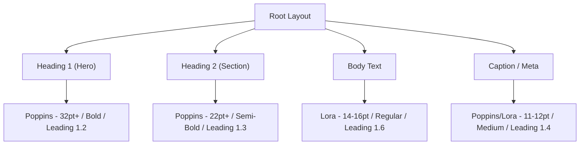

# Anthropic Brand Visual System & Guidelines

This skill defines the visual identity specifications, layout rules, color relationships, and typographic hierarchies matching Anthropic’s aesthetic.

> [!NOTE]

> This is a self-contained skill. Do NOT load external style files or reference directories. Apply these rules directly in your code generator engines (e.g. python-pptx, HTML templates, CSS sheets).

---

## 🎨 Color System Matrix

Anthropic's aesthetic is built on sophisticated contrast, warm neutrals, and controlled accent injections. Never use raw primaries (e.g., `#0000FF` or `#FF0000`).

| Color Role | Hex Value | RGB Representation (for PPTX/Canvas) | Recommended Usage Ratio |
| :--- | :--- | :--- | :--- |
| **Dark (Primary Text/Dark BG)** | `#141413` | `RGB(20, 20, 19)` | 60% (as text/borders on light; as main BG on dark) |
| **Light (Page BG/Light Text)** | `#faf9f5` | `RGB(250, 249, 245)` | 30% (as canvas BG / card backgrounds) |
| **Mid Gray (Secondary Elements)** | `#b0aea5` | `RGB(176, 174, 165)` | 10% (captions, disabled states, icons) |
| **Light Gray (Subtle BG / Fills)** | `#e8e6dc` | `RGB(232, 230, 220)` | Alternate panel BG, border strokes |
| **Orange (Primary Accent)** | `#d97757` | `RGB(217, 119, 87)` | < 5% (CTA buttons, active indicators, focus rings) |
| **Blue (Secondary Accent)** | `#6a9bcc` | `RGB(106, 155, 204)` | < 5% (Info boxes, highlights, charts) |
| **Green (Success / Tertiary)** | `#788c5d` | `RGB(120, 140, 93)` | < 5% (Success status, metric increases) |

---

## ✍️ Typographic Scale & Hierarchy

Fonts dictate the voice of the layout. Follow this scale meticulously:



---

## 🎯 Constraint & Freedom Calibration

* **LOW FREEDOM (Strict Constraints)**:
  * **Color Palette**: Hex codes must match the system matrix exactly. Do not shift hue values or use web-safe equivalents.
  * **Font Combinations**: Headings must always be Poppins, and Body must always be Lora. Do not reverse this pairing.
* **HIGH FREEDOM (Layout Structure)**:
  * **Composition Patterns**: Complete freedom regarding grid splits, vertical alignments, navigation placement, card padding, and graphical shape boundaries, provided they adhere to minimal layouts.

---

## 🚫 NEVER Anti-Patterns

| Action to NEVER Do | Consequence | Rationale |
| :--- | :--- | :--- |
| **NEVER use pure black (#000) or pure white (#fff)** | Creates harsh, cheap contrast that looks unpolished and causes eye strain. | Warm off-whites (`#faf9f5`) and charcoal-blacks (`#141413`) create a premium, editorial paper feel. |
| **NEVER pair Lora with Lora or Poppins with Poppins for body/headings** | Visual monotony; eliminates typographic hierarchy and breaks scanning patterns. | Sans-serif headings (Poppins) provide modern structure, while serif body (Lora) provides readable editorial flow. |
| **NEVER use rounded corners greater than 8px (rounded-lg)** | Gives UI cards an amateur, overly bubbly, generic SaaS look. | Anthropic's style prefers sharp or subtly rounded (2px-6px) corners to maintain architectural stability. |
| **NEVER overload the canvas with multiple accent colors at once** | Dilutes call-to-actions and causes visual confusion. | Accents are functional highlights, not decorative paint. Use one accent per visual module. |

## 6) Memory Sync

After a brand-guided design, visual identity specification, or style guide update is completed, you **MUST** trigger the local memory capture. 

1. Save the final brand guidelines, style sheet, or design system specs as a Markdown file in the project directory.
2. Invoke the capture script: 
   ```bash
   python $MEMORY_SYSTEM_ROOT\capture_knowledge.py <file_path>
   ```
3. This ensures that brand guidelines, typographic scales, and color systems are automatically routed to the correct storage (OKF or ChromaDB).
