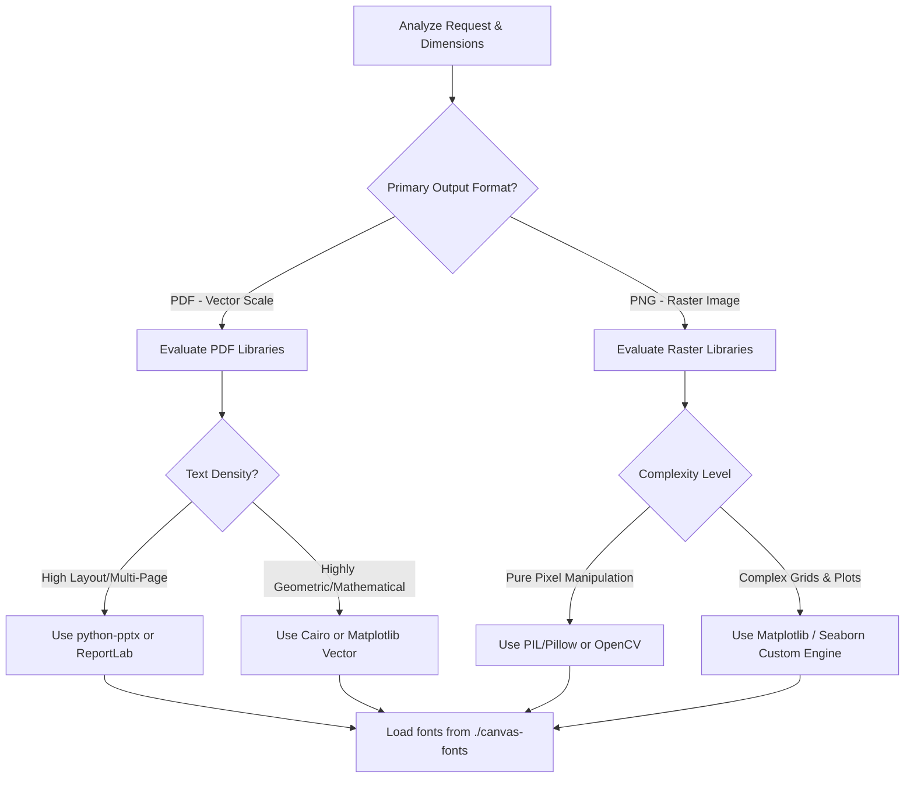

# Canvas Design Philosophy & Execution System

This skill details the creation of structured, highly visual static designs and art compositions. It bridges visual manifesto-writing with physical canvas generation.

## 📂 Progressive Disclosure & Font Loading Triggers

Before laying out a canvas, you **must** perform the following initialization checks:

1. **Verify Font Directory**: Read the `./canvas-fonts` directory to inspect available custom TTF/OTF typefaces. Do not hardcode custom typography without verifying its availability.
2. **Library Capability Audit**: Inspect the runtime environment to check which rendering packages are available (e.g., `python-pptx`, `reportlab`, `matplotlib`, `PIL/Pillow`, `Cairo`). Choose your tool based on the required output format (PDF vs. PNG).

---

## 🧠 Mindset & Spatial Thinking Framework

When interpreting a canvas request, execute this cognitive flow:
* **The Clinical Lens**: Treat the abstract design like a page from a scientific codex. How can I use dense patterns, repeated shapes, and analytical reference labels to make the ephemeral feel measurable?
* **Border Safety First**: Mentally calculate margins before shapes. A canvas is defined by its boundaries; negative space is an active design element, not empty vacuum.
* **Typographic Restraint**: Text must act as a graphic element. Ask: "Can this concept be understood through geometric relationships alone, using text only as coordinate anchors?"

---

## 🧭 Decision Tree: Design Pipeline & Format Routing

---

## ⚖️ Grid Math & Spatial Rules of Thumb

To ensure a balanced composition, employ the **Dynamic Margin & Grid Alignment Rule**:
* **Base Margin**: Minimum $M = \min(Width, Height) \times 0.08$ (8% padding around all edges). No critical visuals or text may enter this buffer zone.
* **Grid Spacing**: Divide canvas into a $12 \times 12$ virtual coordinate grid. Align all primary shapes, text blocks, and dividers to these grid lines:
  $$X_n = M + \left( \frac{Width - 2M}{12} \right) \times n \quad \text{for } n \in [0..12]$$
  $$Y_n = M + \left( \frac{Height - 2M}{12} \right) \times n \quad \text{for } n \in [0..12]$$

---

## 🎯 Constraint & Freedom Calibration

* **LOW FREEDOM (Boundary & Safety Constraints)**:
  * **Margins and Overlaps**: Zero tolerance for text overflow, clipping, or unintended intersections. Elements must be structurally separate.
  * **File Output Formats**: Must strictly match the requested extensions (`.pdf` or `.png`).
* **HIGH FREEDOM (Creative Visual System)**:
  * **Visual Metaphors**: Complete liberty in defining patterns, recursive structures, shape-density thresholds, chromatic ratios, and grid-breaking graphics.

---

## 🚫 NEVER Anti-Patterns

| Action to NEVER Do | Consequence | Rationale |
| :--- | :--- | :--- |
| **NEVER place text near the exact canvas edges** | Text clipping on printing or rendering. Looks sloppy and uncalibrated. | Standard margins act as a spatial frame that anchors the center composition. |
| **NEVER use standard default fonts without fallback rules** | Operating systems will render ugly fallback Courier or Times, destroying typography. | System font rendering behaves differently across Linux and macOS; you must verify path fonts. |
| **NEVER mix more than two font families on one canvas** | Visually chaotic, breaks styling continuity. | One clean Sans-serif for data/technical markers and one Serif for editorial weight is the optimum balance. |
| **NEVER overlap text blocks on top of other text blocks** | Renders the text unreadable, indicating lack of geometric awareness. | You must compute text bounding boxes or use distinct vertical coordinate offsets. |

---

## 🛠️ Step-by-Step Canvas Creation Procedure

### Step 1: Design Philosophy Formulation (.md file)
Draft a 4-6 paragraph visual manifesto (e.g., "Brutalist Joy"). Define spatial divisions, rhythmic metrics, and color rules. Save this as a separate `.md` document.

### Step 2: Establish the Canvas Size & Coordinate Maps
In your generation code, initialize your dimensions:
* PDF: A4, Letter, or custom square vectors (e.g., 10x10 inches).
* PNG: Default to high resolution (e.g., $2400 \times 2400$ px) for crisp print simulation.

### Step 3: Draw Structured Geometries
Apply systematic visual language. Generate repeating grids, procedural vectors, or concentric shapes. Keep line weights thin and precise.

### Step 4: Render Editorial Typography
Add the contextual text (large title, clinical label, metadata coordinates). Align them to your $12 \times 12$ virtual coordinate maps. Ensure the font files are resolved from `./canvas-fonts`.

---

## 🚨 Common Layout Failures and Fallbacks

* **Issue: Text strings clipping off screen**
  * *Cause*: Hardcoded X/Y offsets combined with long user-generated inputs.
  * *Fallback*: Implement auto-wrapping logic based on character count threshold, or use bounding box calculations (`textlength()` in PIL) to dynamically decrease font size if boundary exceeded.
* **Issue: Missing font files at runtime**
  * *Cause*: Core typefaces in `./canvas-fonts` are corrupted or not found on the host machine.
  * *Fallback*: Configure a cascading try/catch load block. If the target font fails to load, fall back to standard `Helvetica` or `Georgia` system default system aliases.
* **Issue: Muddy colors/low contrast**
  * *Cause*: Poorly calibrated background-to-foreground hex choices.
  * *Fallback*: Check relative luminance. Ensure text contrasts satisfy a minimum of 4.5:1 ratio against the color blocks it rests upon.
## 6) Memory Sync

After capturing knowledge, ensure all high-level architectural decisions, new technical standards, and key documentation are synced to the persistent memory system.
1. Run \`capture_knowledge.py\` to route findings to the appropriate storage (OKF for policies, ChromaDB for logs).
2. Ensure all new architectural \"Hard Rules\" are reflected in the \`policy_memory_routing.md\` if they represent significant system-wide constraints.
3. Verify that all newly created diagrams and documentation are stored in the standardized directory structure using relative paths.
