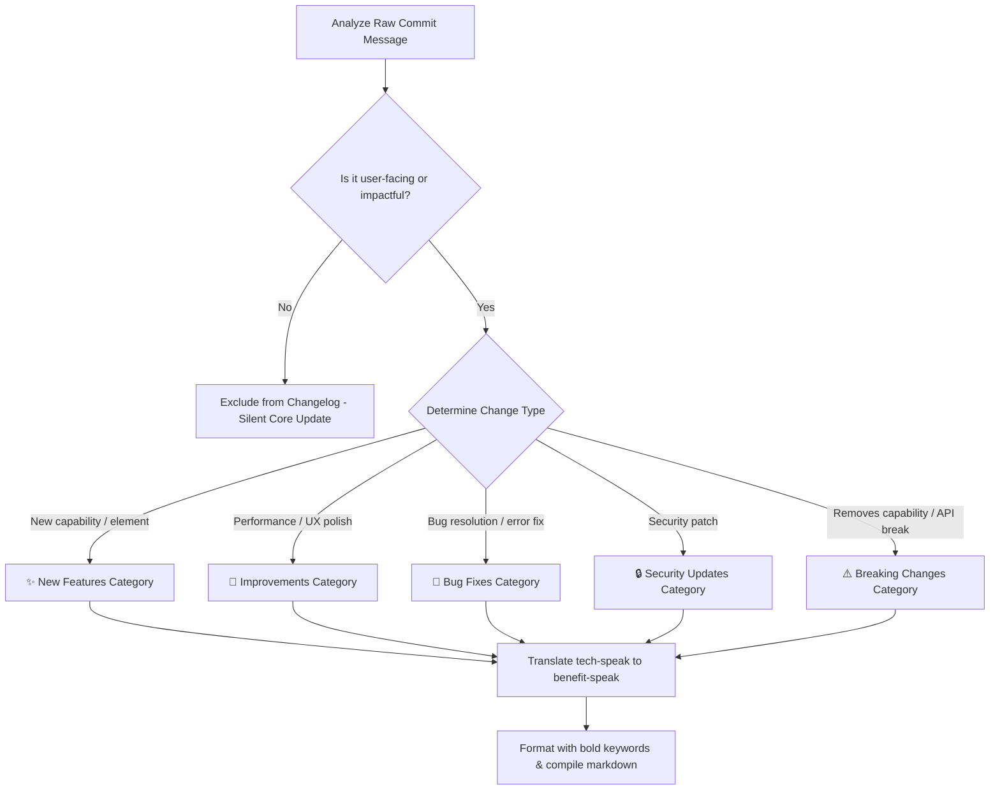

# Professional Changelog Generator

This skill processes technical, developer-centric git logs into readable, structured, and user-facing changelogs.

> [!NOTE]
> This is a self-contained skill. Do NOT load external files or reference directories unless explicitly instructed by the user to use a local styling template (such as `CHANGELOG_STYLE.md`).

---

## 🧠 Mindset & Translation Framework

When converting raw developer commits, ask yourself:
* **The Value Lens**: What value does this change bring to the end-user? (e.g., "Refactored sql query optimization" -> "Improved application loading speeds by up to 40%").
* **Internal Exposure Risk**: Does this commit expose internal infrastructure details, security vulnerabilities, database schemas, or server names?
* **Commit Noise Reduction**: Is this commit a routine task (chores, tests, pipeline tweaks, minor typo fixes) that provides zero value to customers? If so, exclude it.

---

## 🧭 Decision Tree: Change Classification & Formatting

---

## ⚖️ Translation Heuristics: Dev-Speak vs. Customer-Speak

| Raw Developer Commit Message | Target Customer-Speak Translation | Category | Reason for Translation |
| :--- | :--- | :--- | :--- |
| `feat: added redis caching layer to getAccounts` | **Faster Dashboard Loads**: Speed up account and profile page response times. | Improvements | Users don't care about "Redis"; they care about page speeds. |
| `fix: resolved null pointer exception in Stripe webhook handler` | **Stripe Payment Reliability**: Fixed a checkout error where payments would occasionally fail to activate user subscriptions. | Bug Fixes | "Null pointer exception" is technobabble; explain the business consequence. |
| `chore: updated jest configs and package.json lock` | *Excluded* | N/A | Testing infrastructure updates have zero external customer relevance. |
| `refactor: extract user verification middleware` | **Enhanced Account Security**: Upgraded authentication systems to prevent unauthorized session sharing. | Security | Turn refactoring work into customer security trust markers. |

---

## 🎯 Constraint & Freedom Calibration

* **LOW FREEDOM (Format & Structure Constraints)**:
  * **Changelog Structure**: Group changes into standard headers: `✨ New Features`, `🔧 Improvements`, `🐛 Bug Fixes`, `🔒 Security`, and `⚠️ Breaking Changes`.
  * **Confidentiality Limits**: Absolute ban on exposing hostnames, database structures, security hashes, or developer names.
* **HIGH FREEDOM (Tone and Copywriting)**:
  * **Branding Voice**: Complete freedom to match the tone to the company voice (e.g., casual/fun, clinical/corporate, or technical/open-source).

---

## 🚫 NEVER Anti-Patterns

| Action to NEVER Do | Consequence | Rationale |
| :--- | :--- | :--- |
| **NEVER paste developer commits verbatim** | Creates an unreadable, intimidating wall of code names and minor typos. | The purpose of a changelog is product communication, not a raw code mirror. |
| **NEVER leak API keys, system paths, or internal names** | Exposes potential attack vectors to malicious actors. | Internal system configurations must remain abstracted at all times. |
| **NEVER group bug fixes under the "New Features" section** | Misleads customers regarding real product progress and erodes trust. | Clear categorization maintains transparency regarding application health. |
| **NEVER generate a changelog without checking chronological order** | Confuses users regarding when updates occurred relative to version upgrades. | Changelogs must order releases from newest to oldest. |

---

## 🛠️ Step-by-Step Generation Procedure

### Step 1: Extract Git History
Run your git fetch commands to gather logs (e.g., `git log --pretty=format:"%s (%an)" v1.1.0..v1.2.0`).

### Step 2: Filter and Sort
Filter out merge branch messages (`Merge branch 'main'`), ci/cd jobs, and testing logs. Group the remaining messages into matching categories.

### Step 3: Translate to Benefit-Speak
Apply the translation heuristics. Convert raw commits into action verbs, highlighting business value or resolving issues.

### Step 4: Formatting and Review
Check Markdown syntax. Add emoji headers. Output the changes structured by date or semantic versioning code.

---

## 🚨 Error Handling and Messy Log Fallbacks

* **Issue: Git log returns empty string or no commits**
  * *Cause*: Uninitialized repository, incorrect git version tag, or executing outside repository root directory.
  * *Fallback*: Scan the current directory for git existence. If empty, fall back to checking file timestamps (`mtime`) and generate a changelog based on file difference analyses (`git diff`).
* **Issue: Commits have unhelpful messages (e.g., "fixed stuff", "wip")**
  * *Cause*: Lax commit policies by the developers.
  * *Fallback*: Retrieve file diffs for that commit (`git show <commit_hash>`) to identify altered files and functions, then synthesize the actual feature or fix that was implemented.
* **Issue: Version tag missing**
  * *Cause*: Repository does not leverage SemVer git tagging.
  * *Fallback*: Default to date range tracking (e.g., last 7 days or last 30 days) based on commit timestamps.

## 6) Memory Sync

After completing a task, key decision, or report, you **MUST** trigger the local memory capture. 

1. Save the final document, report, or summary as a Markdown file in the project directory.
2. Invoke the capture script: 
   `ash
   python \capture_knowledge.py <file_path>
   `
3. This ensures that new requirements, technical standards, and findings are automatically routed to the correct storage (OKF or ChromaDB).
