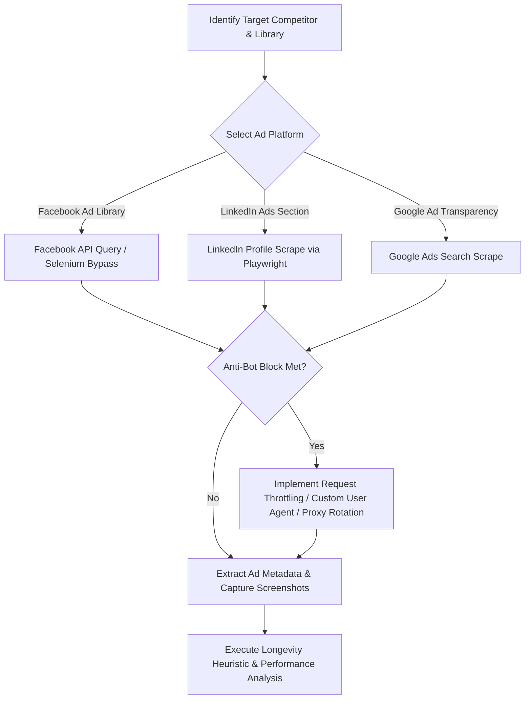

# Competitive Ads Extractor & Analyzer System

This skill manages the automated scraping, screenshot capture, and deep strategic analysis of competitor ads. It turns visual assets and copy into actionable growth marketing vectors.

## 📂 Progressive Disclosure & Runtime Triggers

Scraping dynamic ad networks requires configured browser binaries and proxies to bypass anti-bot shields. Before initiating an extraction task:

1. **Verify Browser Runner Status**: Validate if `Playwright` or `Puppeteer` packages are available in the runtime system.
2. **Examine Network Proxy Configurations**: Ensure residential proxies or rotational heads are configured when scraping Google or Facebook Ad Library to prevent immediate IP banning.

---

## 🧠 Growth Marketing & Analysis Mindset

When analyzing competitor ads, do not just summarize the text. Analyze the engine behind the creative:
* **The Longevity Heuristic**: Identify how long an ad has been running continuously. *An ad running for over 30 days is a proven winner;* the competitor is spending budget on it because it converts. Prioritize analyzing these.
* **Visual Hook Rate**: What happens in the first 3 seconds of the video, or what is the visual focal point of the image? (e.g., split-screen chaos vs. clean software interfaces).
* **The Core Emotional Drive**: Is the copy leveraging FOMO, anxiety, aspirational identity, or logical efficiency?

---

## 🧭 Decision Tree: Scraping Strategy & Anti-Bot Bypass

---

## ⚖️ Analysis Trade-offs: Quantitative vs. Qualitative Tracking

| Focus Area | Engineering/Analysis Cost | Visual Value | Limitation |
| :--- | :--- | :--- | :--- |
| **Ad Longevity Tracking** | High (Requires periodic polling across weeks to observe running states) | Extremely high (directly flags converting ads) | Ad libraries might hide historical dates for certain industries. |
| **Pixel Hook Analysis** | Medium (Requires human/AI-vision analysis of image elements) | High (provides layout rules for design) | Subjective interpretation; doesn't verify actual conversion rates. |
| **NLP Copy Sentiment** | Low (Text processing / simple sentiment categorizations) | Medium (shows tone breakdowns) | Ignores the visual context which carries ~70% of modern ad influence. |

---

## 🎯 Constraint & Freedom Calibration

* **LOW FREEDOM (Legal and Operations Constraints)**:
  * **Anti-Plagiarism Protection**: Under no circumstances should you generate ad templates that copy competitor copy verbatim.
  * **Scraping Limits**: You must adhere to throttling intervals (e.g., minimum 2-second sleep between scrolls) to avoid blacklisting.
* **HIGH FREEDOM (Strategic Analysis)**:
  * **Campaign Recommendations**: High freedom to suggest messaging hooks, pricing strategies, user personas, and positioning angles.

---

## 🚫 NEVER Anti-Patterns

| Action to NEVER Do | Consequence | Rationale |
| :--- | :--- | :--- |
| **NEVER run headless scraper runs without random delay limits** | Immediate IP blocking and CAPTCHA wall activation from the ad network. | Modern ad networks use behavioral heuristics to instantly spot robotic scroll patterns. |
| **NEVER base ad performance analysis on newly launched ads** | High risk of analyzing failed experiments; competitor may turn off the ad tomorrow. | Only ads with verified run durations can be assumed to have positive return on investment. |
| **NEVER plagiarize competitor assets or text direct to user campaigns** | Violates intellectual property, risks copyright suits, and hurts client brand trust. | The purpose is strategic extraction and motif modeling, not cloning assets. |
| **NEVER skip capturing the mobile viewport layouts** | Missing visual design failures on responsive devices where 85%+ of consumers click. | Ad assets often compress or clip on mobile devices; analysis must review mobile states. |

---

## 🛠️ Step-by-Step Extraction & Analysis Procedure

### Step 1: Query Setup
Navigate to the target platform’s library using the browser utility. Set inputs for company names, geographic targeting (e.g., US), and media type.

### Step 2: Extraction Loop
Scrape scroll heights, capture metadata cards (running dates, copy, CTA, target links). Capture element screenshots for visual archiving.

### Step 3: Run the Longevity Filter
Sort ads by `start_date` ascending. Tag ads running $> 30$ days as **"Proven Converters"**.

### Step 4: Map Messaging Frameworks
Analyze the copy hooks and group them into:
1. **Pain Point Focused** (e.g., "Tired of manual billing?")
2. **Outcome Focused** (e.g., "Deploy in 5 minutes.")
3. **Social Proof Focused** (e.g., "Loved by 10k+ devs.")

---

## 🚨 Scraping Failure Modes, Captchas, and Fallbacks

* **Issue: Bot detection triggers CAPTCHA wall**
  * *Cause*: Fast scrapers or bad IPs.
  * *Fallback*: Pause requests. Rotate User-Agents to mimic mobile browsers. If failures persist, prompt the user with a download link to save the page HTML manually so the parser can run locally.
* **Issue: Screenshots return blank/black canvases**
  * *Cause*: Shadow DOM elements, dynamic lazy-loading images, or cross-origin canvas settings.
  * *Fallback*: Inject browser delays (`page.waitForTimeout`), scroll elements into view before capturing, or take a viewport-wide snapshot instead of an element-specific screenshot.
* **Issue: Target competitor has hidden/private ads**
  * *Cause*: Platform privacy limits or account closures.
  * *Fallback*: Query secondary platforms (e.g., check Twitter/X posts, LinkedIn posts, or Google search ads) to rebuild the competitor's visual footprint.
