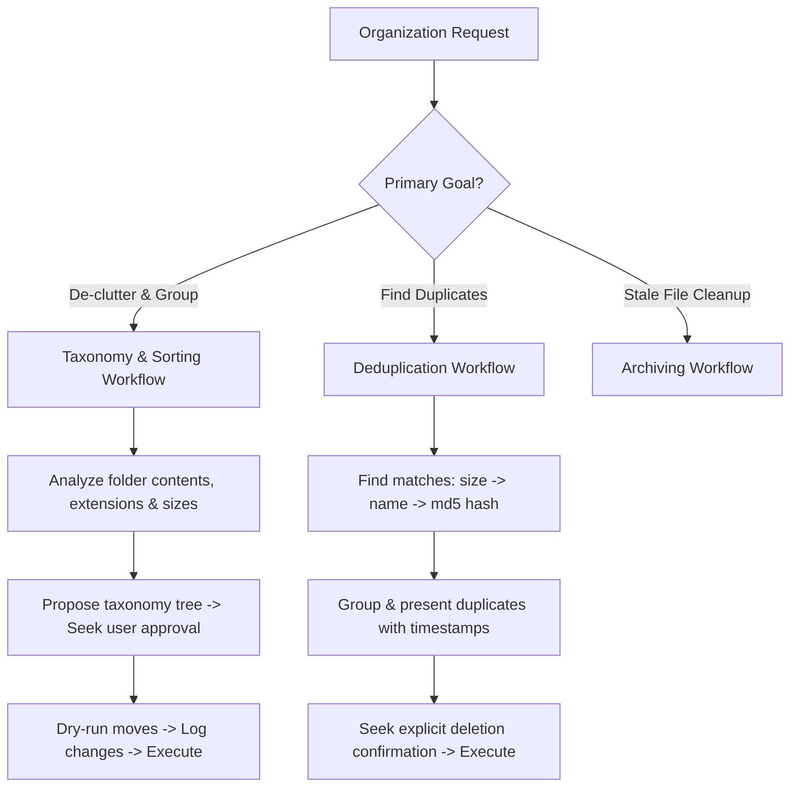

# File Organizer

This is a self-contained skill. Do NOT load external files or reference external directories unless specifically instructed by the user.

---

## 1. Trigger Scenarios & Decision Trees

### Workflow Decision Tree

---

## 2. Constraints & Freedom Calibration

*   **Destructive Actions (Low Freedom)**: Do not delete files or folders automatically. You must prompt the user for explicit confirmation before every single deletion or permanent cleanup command.
*   **Active Directory Structuring (Medium Freedom)**: When organizing work files or repositories, respect system directories (e.g., `.git`, `.vscode`, `node_modules`). Never move configuration folders or active development projects without verification.
*   **Folder Classification Hierarchy (High Freedom)**: Design classifications suited to the user's specific context (e.g., sorting by project phases, clients, file formats, or chronological order).

---

## 3. Expert-Level Knowledge Delta

### Duplicate Identification Tradeoffs

To optimize performance and accuracy when searching for duplicates:

| Matching Level | Computational Cost | Reliability | Edge Cases |
| :--- | :--- | :--- | :--- |
| **Name Match** | Very Low | Low (False Positives) | Different versions of files with default names (e.g., `invoice.pdf`). |
| **Size Match** | Low | Medium | Empty files (0 bytes) or placeholder files of identical size. |
| **MD5/SHA256 Hash** | High (Reads full file) | High (Definitive) | Extremely large video files; calculate hash on first 1MB for early exit. |

*Rule of Thumb*: Filter first by size, then by filename/extension, and finally calculate the file hash *only* for candidate matches of identical size.

---

## 4. Mindset & Actionable Procedures

### Self-Inquiry Checklist
*   *Am I about to run a move (`mv`) command? Have I checked if there are file name collisions in the destination directory?*
*   *Are there configuration files (e.g., `.env`, `.gitignore`) or application libraries that would break if moved?*
*   *Did I perform a dry-run log of changes before shifting the physical directory structure?*
*   *How does the proposed taxonomy reduce the user's future cognitive load for retrieving these files?*

### Step-by-Step Execution Sequence
1.  **Scope & Assessment**:
    *   Find file count and total size: `du -sh [directory]`.
    *   Analyze file type distribution: `find [dir] -type f | sed 's/.*\.//' | sort | uniq -c`.
2.  **Taxonomy Design**:
    *   Draft a proposed structure. Avoid deep nesting (limit folder depth to 3 levels max). Use prefix sorting (e.g., `01-active`, `02-archive`) where sequence matters.
3.  **Conflict Checks**:
    *   Search duplicates using candidate size filters first, then hashing.
    *   Check for name conflicts: if `file.pdf` already exists in `target/`, prepare a renaming suffix: `file_YYYY-MM-DD.pdf`.
4.  **Dry-run & Execution**:
    *   Show user: (1) Old layout vs. New layout, (2) Count of moves, (3) Candidates for deletion.
    *   Execute moves using clear, verbose scripts that log changes.

---

## 5. Anti-Patterns & Never-Lists

| Action | Why Avoid It | Correction/Alternative |
| :--- | :--- | :--- |
| **NEVER** run destructive commands (`rm`, `rm -rf`) without user approval. | Can cause irreversible data loss of valuable documents or configurations. | Always ask the user to confirm the files to delete, or move them to a temporary trash folder first. |
| **NEVER** move active programming repositories or git directories. | Breaks references, commits, relative imports, and pathing in build pipelines. | Exclude folders containing `.git`, `node_modules`, or build systems from automation. |
| **NEVER** run recursive organization on the entire system root or home directory. | Alters critical config paths, application profiles, and system defaults. | Limit scopes strictly to localized user folders (e.g., `Downloads`, `Desktop`, `Documents`). |
| **NEVER** write moving scripts without handling filename collisions. | Moving files with the same name into the same folder will silently overwrite content. | Write script logic that renames conflicting files with timestamps or unique numbers. |

---

## 6. Error Scenarios & Fallbacks

### Destination Name Collision
*   *Scenario*: Moving `report.docx` to `/Documents/Work/` but `/Documents/Work/report.docx` already exists.
*   *Fallback*: Use modification timestamps. Append the date or a sequence number to the new file: `report_2026-07-17.docx` or `report_1.docx`.

### Permission Denied
*   *Scenario*: Moving files fails due to file locks or user privilege restrictions.
*   *Fallback*: Skip the locked file, log the error path, continue organizing the remaining files, and report the skipped paths to the user.

### Broken Symlinks
*   *Scenario*: Moving target files breaks symlinks pointing to them.
*   *Fallback*: Find symlinks targeting the source files using `find -L . -xtype l` and update the symlink destinations to point to the new paths.

## 6) Memory Sync

Execute the following steps to sync knowledge to the memory system:
1. Use `capture_knowledge.py` to route information to the correct storage (OKF or ChromaDB).
2. Ensure that high-level architectural rules, policies, and decisions are stored in the OKF (Open Knowledge Format) directory.
3. Ensure that ephemeral data, logs, and specific technical notes are stored in the ChromaDB instance.
4. Verify that the `MEMORY_SYSTEM_ROOT` and `MEMORY_INBOX_DIR` environment variables are correctly configured.
