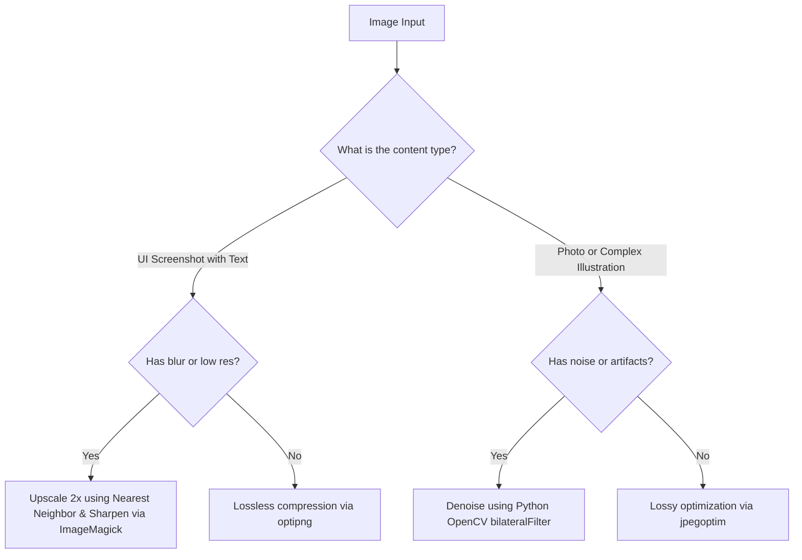

# Image Enhancer

This is a self-contained skill. Do NOT load external files or reference directories.

## Mindset & Philosophy
A professional screenshot or image in documentation represents the quality of the product itself. The goal of enhancement is maximizing clarity, readability of text, and visual appeal while minimizing file size. Do not rely on generic upscalers. Apply precise, surgical digital image processing techniques based on the source characteristics.

---

## Tool Selection & Decision Tree

Evaluate the image properties (resolution, type, format) and apply the correct approach:



### Choice Matrix

| Scenario | Primary Tool | Fallback / Alternative | Key Parameter Strategy |
| :--- | :--- | :--- | :--- |
| UI/Terminal Screenshot | `convert` (ImageMagick) | Python (Pillow) | Nearest-neighbor scaling (`-scale 200%`) to keep text pixel-perfect. Avoid bilinear scaling. |
| Blurry UI Text | `convert` | Python (Pillow) | Apply sharpening filter (`-unsharp 0x1+1.0+0.05` or `-sharpen 0x1.5`). |
| Photo/Denoising | Python (`cv2` bilateralFilter) | Python (`scipy` median filter) | Preserves edges while smoothing flat areas. |
| PNG Compression | `optipng` | `pngquant` | Lossless (`optipng -o7`) vs lossy PNG quantizing (`pngquant --quality=80-90`). |
| JPG Compression | `jpegoptim` | `convert` | Strip metadata (`--strip-all`) and target specific quality (`-m85`). |

---

## Domain-Specific Procedures & Commands

### 1. Enhancing UI Screenshots (Pixel-Perfect Text)
Standard resizing introduces blur. Use nearest-neighbor interpolation to double size, then apply a subtle unsharp mask to crisp the edges:

```bash
# Keep text crisp while upscaling UI screenshots
convert input.png -scale 200% -unsharp 0x0.75+0.75+0.008 output.png
```

### 2. Lossless Screenshot Size Reduction (Critical for Page Load)
Never ship raw screenshots. Compress losslessly to preserve alpha and visual quality:
```bash
# Level 7 lossless optimization (removes unnecessary chunks & metadata)
optipng -o7 -strip all input.png -out optimized.png
```

### 3. Edge-Preserving Denoising for Blurry/Compressed Images
If using a custom python script, prioritize Bilateral Filtering to clean background noise without blurring key edges:
```python
import cv2

# Load image
img = cv2.imread('input.jpg')
# d=9 (neighborhood diameter), sigmaColor=75, sigmaSpace=75
denoised = cv2.bilateralFilter(img, 9, 75, 75)
cv2.imwrite('output.jpg', denoised)
```

---

## NEVER Anti-Patterns

| Action | Why | Consequences | Correct Alternative |
| :--- | :--- | :--- | :--- |
| **NEVER** use default `-resize` in ImageMagick for pixel art or UI screenshots. | Standard lanczos/cubic resize interpolates pixels and introduces blur around text. | Blurry text, hard-to-read documentation. | Use `-scale` (nearest-neighbor) for exact percentage increments. |
| **NEVER** save UI screenshots as JPG. | JPG compression creates ringing artifacts around high-contrast text edges. | Ugly color noise, unreadable text, bloated file size. | Always use PNG format for screenshots. |
| **NEVER** overwrite original images. | Destructive editing cannot be undone if the parameter choice was sub-optimal. | Loss of source files, manual rework. | Always output to a new file suffix (e.g. `_enhanced.png`) and retain the source. |
| **NEVER** leave EXIF/GPS metadata in web images. | Exposes sensitive user information (location, device specs, creation dates). | Privacy leak, security violation. | Use `-strip` in ImageMagick or `--strip-all` in jpegoptim. |

---

## Freedom Calibration
* **Low Freedom (Strict Compliance):** For final output format optimization (must strip metadata, must use PNG for text screenshots, must preserve original as backup).
* **Medium Freedom (Operational Guidance):** Sharpening parameters (`-unsharp` values) and upscaling percentages can be tweaked based on visual checks and zoom level.

---

## Error Mitigation & Failure Modes

### 1. Tool Missing Errors
If CLI tools are not installed, fallback gracefully:
- **No `optipng`**: Fallback to python `Pillow` library to save with high optimization levels:
  ```python
  from PIL import Image
  img = Image.open('input.png')
  img.save('output.png', optimize=True)
  ```
- **No ImageMagick `convert`**: Check if `gm` (GraphicsMagick) is installed, otherwise run a Python script using `Pillow` with `Resampling.NEAREST` or `Resampling.LANCZOS` filters.

### 2. Output File Exceeds Original Size
Sometimes aggressive optimization or upscaling makes a file larger than the original.
- **Action**: Always run a size check. If the "enhanced" file is larger, and no significant visual gains were achieved, revert to the original or apply quantization (`pngquant` or lower quality setting).

