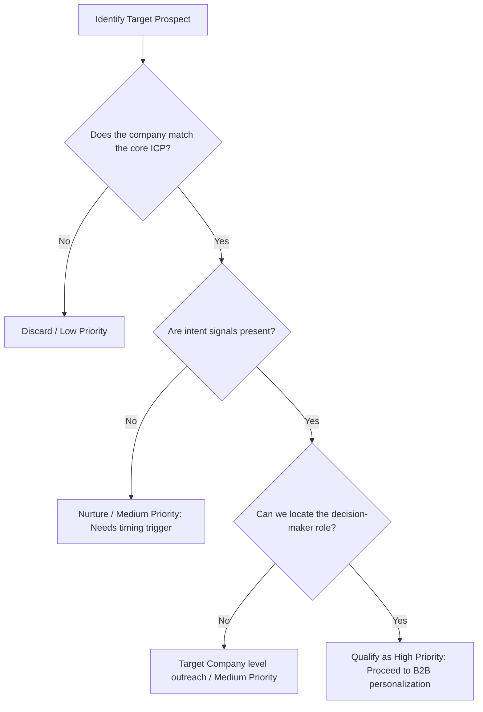

# Lead Research Assistant

This is a self-contained skill. Do NOT load external files or reference directories.

## Mindset & Philosophy
High-quality lead generation prioritizes relevance over quantity. Sending cold outreach to unqualified prospects is a waste of corporate reputation and domain authority. To qualify a lead, you must uncover specific **intent signals** (e.g., active hiring, technology stack changes, public initiatives) that prove their pain points align with the product's value proposition.

---

## Qualification Decision Tree

### Lead Fit & Priority Scoring Matrix

| Tier | ICP Alignment | Intent Signals | Action Plan |
| :--- | :--- | :--- | :--- |
| **Tier 1 (High)** | Perfect size, industry, & region. | Active hiring for relevant roles, recently raised funding, or explicit technical stack match. | Deep personalized research + multi-channel outreach draft. |
| **Tier 2 (Medium)** | Matches core ICP. | General industry growth, but no immediate explicit pain point signals. | Standard template outreach with mild personalization. |
| **Tier 3 (Low)** | Out-of-profile size or edge industry. | None. | Exclude or automate via generic marketing drip. |

---

## Technographic & Intent Signal Discovery Procedures

To investigate a target lead's tech stack and pain points without direct database access, execute these steps:
1. **Job Descriptions Analysis**: Search for the target company's job postings (e.g. "Software Engineer" at target company). Analyze the required skills block. If they ask for "React, AWS, PostgreSQL", you have successfully mapped their core stack.
2. **Technographic Search**: Look for script tags or header signatures (e.g. search for built-with signatures, DNS records, or subdomains like `docs.*`, `api.*`).
3. **Recent News & Leadership Changes**: Search for recent executive hires (e.g., new VP of Engineering or Head of Sales). New leaders usually audit existing tooling and purchase new software within their first 90 days.

---

## Outreach Personalization Framework

When drafting outreach, follow the **Hook-Problem-Value-CTA** sequence:
* **Hook**: Reference a specific, publicly verifiable fact about the company or the individual (e.g., a recent article, post, or open job listing).
* **Problem**: Highlight a common challenge companies in their position face (tied to the intent signal).
* **Value**: Briefly explain how the product/service solves this challenge (backed by a metric).
* **CTA (Call to Action)**: Keep it low-friction. Ask a simple open-ended question rather than booking a meeting immediately (e.g., "Are you currently experiencing bottleneck X?").

---

## NEVER Anti-Patterns

| Action | Why | Consequences | Correct Alternative |
| :--- | :--- | :--- | :--- |
| **NEVER** suggest general inbox emails (e.g. `info@company.com`, `sales@company.com`) as target contact endpoints. | General inboxes are black holes; outbound messages sent there are ignored or marked as spam. | Zero conversion rate, damaged domain sender score. | Research and target the exact decision-maker's role (e.g., "Director of Platform Engineering"). |
| **NEVER** write generic, hyper-templated emails ("Dear [First Name], I hope this email finds you well..."). | Generic emails are instantly recognized as automated spam and deleted. | Recipient lists block domain, low open rates. | Reference a specific company signal in the subject line and first sentence. |
| **NEVER** hallucinate or invent contact information (e.g. guessing emails using standard patterns without verification). | Bounced emails negatively impact the sender's domain authority and deliverability rates. | Domain blocklisting, wasted sales representative effort. | Provide standard formatting rules (e.g. `first.last@company.com`) but explicitly flag it as a guess. |
| **NEVER** qualify a lead solely based on company size or revenue. | Large companies may have zero budget or interest in your category, while small fast-growing ones may have acute pain. | Wasted enterprise sales cycles on dead-ends. | Require at least one active intent signal before marking a lead as Tier 1. |

---

## Freedom Calibration
* **Low Freedom (Strict Rules)**: Lead lists must contain verified company domains (HTTPS verified). Personalization drafts must NEVER mention generic AI placeholders or cliché greetings.
* **Medium Freedom (Operational)**: The prioritization scoring weights (e.g., weighting funding vs headcount growth) can be calibrated based on the specific B2B sales playbook.

---

## Error Handling & Fallback Strategies

### 1. Minimal Public Signals Available
* **Issue**: The target company has a stealth web presence or is pre-launch, with no job ads or news.
* **Fallback**: Map their competitors. If their direct competitor uses a specific technology or methodology, assume this company likely shares the same pain point. Pitch them on "how we helped [Competitor Name] achieve [Metric]".

### 2. Missing Key Decision-Maker
* **Issue**: The company is too small to have a dedicated role (e.g. no "VP of Security").
* **Fallback**: Map the closest parent role (e.g., CTO or founder). Adjust the tone of the message to address high-level business goals (revenue/risk) rather than granular department metrics.
