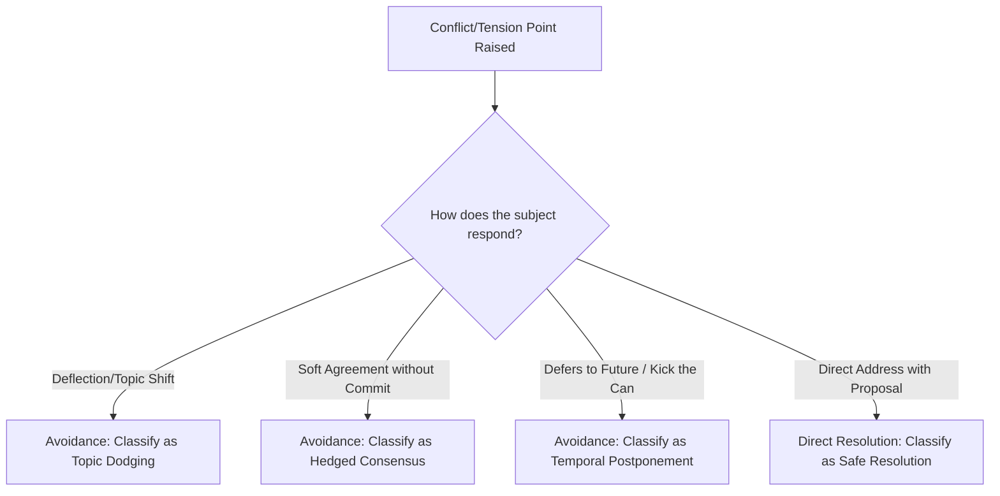

# Meeting Insights Analyzer

This is a self-contained skill. Do NOT load external files or reference directories.

## Mindset & Philosophy

Great meetings are balanced, direct, and psychologically safe. Communication analysis must move beyond basic word counts to evaluate the **strategic intent** behind speech patterns. An analyst's role is to locate micro-behaviors (e.g., deflection, passive agreement, conversation hogging) and translate them into concrete alternative phrasing.

---

## Conflict Avoidance Decision Tree

Analyze transcripts for signs of tension. When a critical issue or disagreement is introduced:



### Behavioral Analysis Matrix

| Behavior Pattern | Linguistic Indicators | Conversational Impact | Coaching Remediation |
| :--- | :--- | :--- | :--- |
| **Topic Dodging** | "That's a good point, and similarly..." "Wait, what about X?" | Deflects attention away from a difficult, unresolved problem. | Pivot back immediately: "Before we pivot, let's finalize our decision on X." |
| **Hedged Consensus** | "I guess we could..." "Probably fine..." "Whatever you think..." | Gives false agreement, leading to alignment cracks later. | Clarify commitment: "On a scale of 1-5, how confident are you in this plan?" |
| **Temporal Postponement** | "Let's take this offline." "Maybe we look at this next quarter." | Drags out decision-making; avoids taking responsibility. | Set a hard micro-deadline: "Let's schedule a 10-minute huddle by tomorrow EOD to resolve." |

---

## Quantitative Analysis Procedures

To compute speaking statistics from a raw text transcript (e.g., Zoom `.vtt` or Otter.ai export):

1. **Speaking Ratio Math**:
   $$\text{Speaking Ratio} = \left( \frac{\text{Target Speaker Word Count}}{\text{Total Transcript Word Count}} \right) \times 100$$
2. **Turn-Taking Interruption Index**:
   Scan for sentences ending in hyphens (`--`) immediately followed by another speaker's turn. Count these as interruptions. Calculate the ratio of interruptions initiated vs received.
3. **Hedging Frequency**:
   Count occurrences of high-probability hedging words: *maybe*, *potentially*, *kind of*, *sort of*, *I think*, and normalize to: "Hedging Words per 100 spoken words".

---

## NEVER Anti-Patterns

| Action | Why | Consequences | Correct Alternative |
| :--- | :--- | :--- | :--- |
| **NEVER** give generic, soft feedback (e.g. "You should listen more" or "Be more direct"). | General advice is not actionable. People cannot change their speech habits without concrete examples. | Zero professional improvement, low value analysis. | Provide a side-by-side comparison of the actual quote vs. the recommended phrasing. |
| **NEVER** calculate metrics without explaining your data basis. | Different files have different formats; raw file size does not equal talk time. | Discrepancies in data lead to users distrusting the report metrics. | State the exact math used (e.g. word count based vs timestamp duration based). |
| **NEVER** ignore the power dynamics of the speakers when evaluating turn-taking. | A manager speaking 50% of the time in a 1:1 is normal; speaking 90% in a group retro is toxic. | Misdiagnosed coaching priorities. | Contextualize the speaking ratio against the meeting type (e.g. 1:1, Standup, Retro, Board Meeting). |
| **NEVER** expose PII (Personally Identifiable Information) or sensitive financials in your summary reports. | Meeting transcripts contain private corporate information. | Confidentiality breach. | Redact email addresses, phone numbers, or passwords from quoted code snippets. |

---

## Freedom Calibration

* **Low Freedom (Strict Rules)**: Format of the Timestamped Examples section must remain structured (`What Happened` -> `Why This Matters` -> `Better Approach`) to maintain professional readability.
* **Medium Freedom (Operational)**: Metric selection can be customized. If timestamp metadata is missing, switch from speaking time to total word count metric.

---

## Failure Modes & Fallback Logic

### 1. Transcript Lacks Speaker Labels

* **Failure**: Transcripts are a raw block of text or fail to specify *who* said *what*.
* **Fallback**: Run a lexical clustering analysis. Look for distinct patterns or name references (e.g. "Hey [Name], what do you think?"). If speaker identity remains completely ambiguous, analyze the transcript at the group dynamic level, reporting on "General Group Consensus vs Group Conflict Avoidance".

### 2. Missing Timestamps

* **Failure**: The transcript contains text but no timing identifiers (VTT/SRT timestamps missing).
* **Fallback**: Report frequencies based on word counts or turn counts (e.g. "1 out of every 5 turns contained deflection language") rather than minute-based counts.

---

## 6) Memory Sync

After a meeting analysis, speaking ratio report, or communication coaching plan is completed, you **MUST** trigger the local memory capture. 

1. Save the final meeting analysis, speaking ratio report, or coaching plan as a Markdown file in the project directory.\n2. Invoke the capture script: \n   ```bash\n   python C:\\Users\\jsoehner\\memory_system\\capture_knowledge.py <file_path>\n   ```\n3. This ensures that meeting insights, communication patterns, and coaching notes are automatically routed to the correct storage (OKF or ChromaDB).
